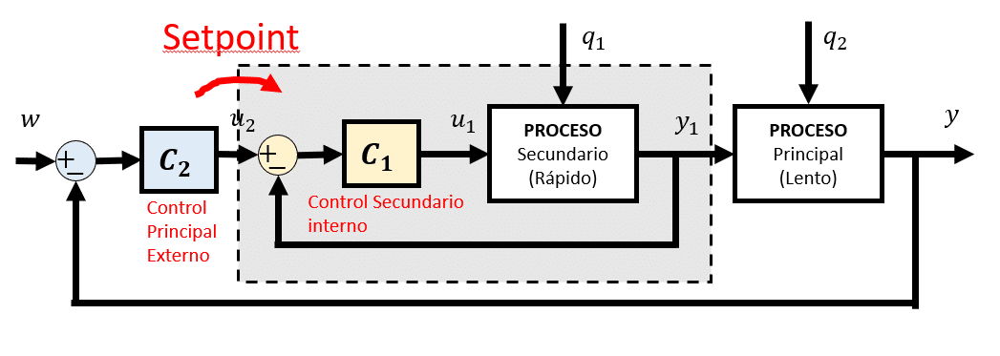
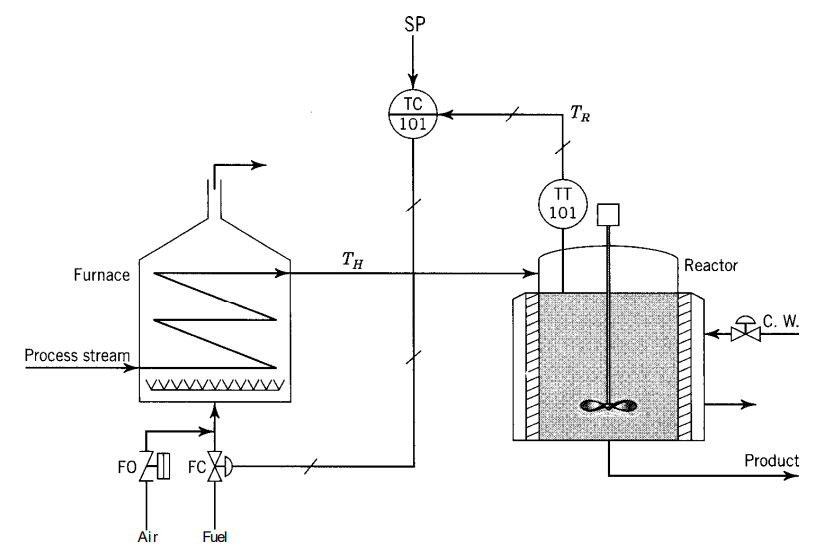
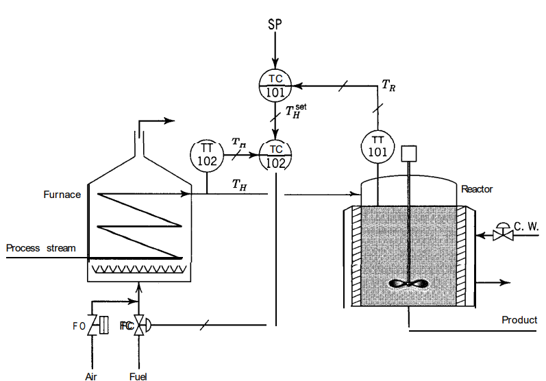
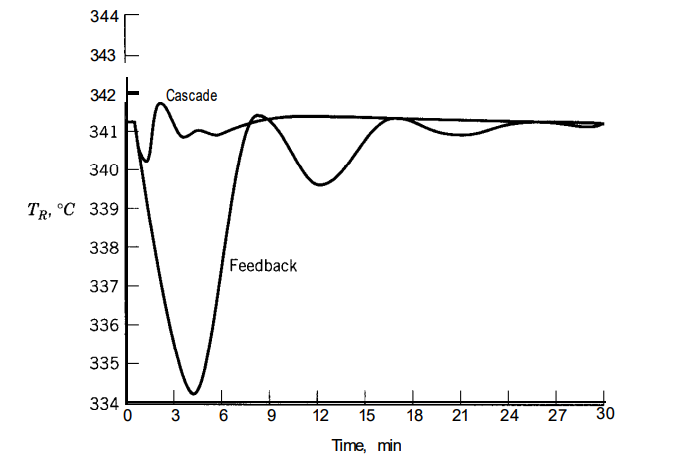
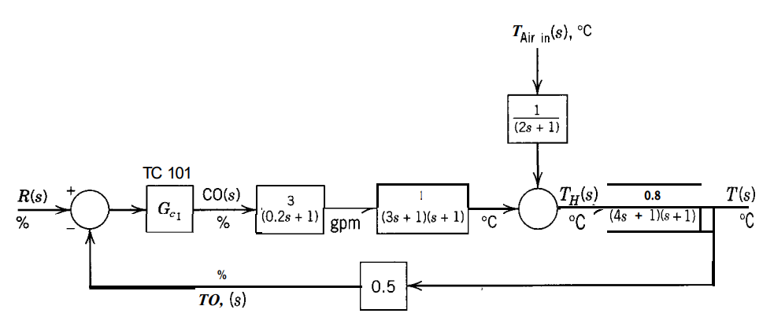

# Control Cascada
Clase 3, se llevo a cabo el dia 13 de Febrero del 2025, la cual estuvo dirigida a comprender el funcionamiento y esquema general del control casacda, adicional sus metodos de sintonizacion en lazo abierto y cerrado.

## 1. ¿Que es Control Cascada?
>🔑 *Control cascada:* El control en cascada, según Ogata, es una estrategia de control en la que se emplean dos lazos de control conectados en serie. El lazo primario, se encarga de la variable principal del proceso; su salida no actúa directamente sobre el proceso, sino que sirve de referencia para el lazo secundario. Este lazo secundario controla una variable intermedia que tiene una respuesta más rápida y se encarga de compensar las perturbaciones de manera inmediata. De esta forma, el lazo secundario reacciona rápidamente a los cambios, mientras que el lazo primario mantiene la estabilidad y precisión de la variable principal, mejorando el desempeño global del sistema.

💡**Ejemplo 1:**

Figura 1. Diagrama de bloques Control Cascada.

💡**Ejemplo 2:**

Figura 2. Control de retroalimentación del proceso del precalentador/reactor.

Figura 3. Control en cascada del proceso del precalentador/reactor.

El proceso comienza con el precalentamiento del reactivo A en un horno, ya que este reactivo suele llegar frío y necesita elevar su temperatura antes de entrar al reactor. La reacción A → B en el reactor es exotérmica, por lo que se utiliza una camisa de enfriamiento para controlar la temperatura \($$T_R$$\). Sin embargo, durante la puesta en marcha se detectó que la capacidad de enfriamiento no era suficiente, manteniendo la válvula de enfriamiento prácticamente abierta todo el tiempo. Como solución temporal, se decidió dejar la válvula de enfriamiento completamente abierta y, en su lugar, regular la temperatura del reactor manipulando el combustible que alimenta el horno. Esta estrategia funcionó inicialmente, pero se presentaron perturbaciones tanto en el horno (variaciones en la temperatura de entrada del reactivo, poder calorífico del combustible, temperatura del aire de combustión) como en el reactor (cambios en la temperatura y flujo del refrigerante), lo que provocaba desviaciones en la temperatura \($$T_R$$\) y un control lento con oscilaciones debido a los retardos acumulados. Para mejorar la respuesta ante estas perturbaciones, se implementó un control en cascada que emplea dos lazos de control: uno secundario que supervisa y regula la temperatura de salida del horno \($$T_H$$\), y otro primario que se encarga de la temperatura del reactor \($$T_R$$\). De esta forma, el lazo interno corrige rápidamente las alteraciones en \($$T_H$$\) antes de que afecten a \($$T_R$$\), brindando una respuesta más ágil y estable, y reduciendo las oscilaciones en la variable de control principal.

Figura 4. Respuesta de la temperatura del reactor a un cambio de -25°C en la temperatura de alimentación a calentador.

En la figura 4, al comparar el control de retroalimentación simple con el control en cascada para una perturbación de -25 °C en la temperatura de entrada, se observa una mejora muy notable en la respuesta del proceso gracias al control en cascada. Se explica que, al diseñar esta estrategia, el lazo interno debe ser más rápido que el lazo externo, y que en sistemas con varios lazos (primario, secundario, terciario, etc.), cada lazo “interno” debe ser más veloz que el siguiente “externo”.

Además, se aclara que el controlador más interno es el que actúa directamente sobre la válvula, mientras que los controladores externos ajustan el set point del lazo inmediatamente interno. Se subraya que esta forma de estructurar el control permite reaccionar más rápido ante perturbaciones que afectan primero a la variable intermedia, sin esperar a que la variable principal se desvíe.

Figura 5.  Diagrama de bloques del proceso de control de retroalimentación del precalentador/reactor.

Figura 6.  Diagrama de bloques del proceso de control cascada del precalentador/reactor.

## 2. Métodos de Sintonización
>🔑 *Método de Sintonización:*  Es un procedimiento sistemático para determinar los valores apropiados de los parámetros de un controlador, con el fin de lograr un rendimiento específico en el sistema controlado. Estos métodos establecen cómo ajustar las ganancias para que el sistema sea estable, responda de forma rápida y minimice el error en la variable que se desea regular.
>
>🔑 *Lazo Abierto:* Un sistema en lazo abierto es aquél que la salida sensada del proceso no es comparada con la señal de referencia.
>
>🔑 *Lazo Cerrado:* Un sistema en lazo cerrado toma la salida del proceso y la compara con la señal de referencia para conocer en todo momento la evolución de la variable.

### 1) Sintonización en Lazo Abierto

En este método se realizan pruebas de respuesta (por ejemplo, aplicando una señal rampa o escalón) para identificar las características dinámicas del sistema, sin utilizar la retroalimentación activa durante la sintonización. Esto permite ajustar los parámetros del controlador basándose en el comportamiento observado.

### Procedimiento:
#### Sintonización del Lazo Secundario:

- **Prueba de respuesta:**  
  Se aplica una señal de entrada al lazo interno y se observa la respuesta de la variable controlada.

- **Identificación de parámetros:**  
  Se extraen parámetros como el tiempo de respuesta, ganancia y constante de tiempo. Estos datos permiten modelar el comportamiento del lazo interno.

- **Ajuste del controlador:**  
  Con base en el modelo obtenido, se seleccionan los parámetros del controlador (por ejemplo, mediante métodos empíricos) para que el lazo interno responda de manera rápida y estable.

#### Sintonización del Lazo Primario:

- **Referencia al lazo secundario:**  
  Una vez sintonizado el lazo secundario, se procede a ajustar el controlador del lazo primario, considerando que la salida del lazo secundario es la entrada del lazo externo.

- **Prueba de sistema completo:**  
  Se aplica una perturbación o cambio en la variable principal y se observa la respuesta global del sistema en cascada.

- **Ajuste fino:**  
  Se realizan ajustes adicionales en el controlador externo para minimizar el error entre la variable principal y su referencia, optimizando la interacción con el lazo secundario.

#### 2) Sintonización en Lazo Abierto de Austin:

El método de sintonización en lazo abierto de Austin ofrece una forma práctica de ajustar sistemas en cascada, permitiendo calibrar tanto el controlador primario como el secundario a partir de una única prueba experimental. Esta técnica se basa en aplicar una señal de entrada al sistema y analizar la respuesta obtenida para determinar los parámetros dinámicos fundamentales, lo que elimina la necesidad de múltiples pruebas para cada lazo de control. Con los datos obtenidos, se desarrollan ecuaciones específicas para ajustar el controlador primario, que puede configurarse como PI o PID, considerando que el controlador secundario opera como P o PI. Estas ecuaciones permiten compensar las características del lazo secundario, asegurando que la respuesta del sistema sea rápida y estable, y facilitando una integración coherente entre ambos niveles de control. La principal ventaja de este método es su simplicidad y eficiencia, ya que reduce el tiempo y la complejidad del proceso de sintonización en sistemas donde las condiciones del proceso son relativamente estables. En definitiva, la metodología de Austin proporciona una solución robusta y práctica para optimizar el desempeño global de sistemas en cascada, coordinando de manera efectiva el ajuste de ambos controladores con una sola prueba.

**Usar esta tabla si** $$\(\frac{\tau_2}{\tau_1} > 0.38\)$$

| **PRIMARY** $$\( G_{c1}(s) \)$$ | PI | PID |
|-----------|-----------|-----------|
| **SECONDARY** $$\( G_{c2}(s) \)$$   | $$\(\tau_{I1} = \tau_{1}\)$$    $$\(K_{c1}\)$$ | $$\(\tau_{I1} = \tau_{1}\);$$ $$\(\tau_{D1} = \frac{t_{0,1} - \tau_{2}}{2}\)$$   $$\(K_{c1}\)$$ |
| P   | $$\( 1.4 \left[ \frac{1 + K_{c2} \ K_2}{K_{c2} \ K_1} \right] \left[ \frac{t_{o1}}{\tau_1} \right]^{-1.14} \left[ \frac{\tau_2}{\tau_1} \right]^{0.1} \)$$ | $$\( 1.4 \left[ \frac{1 + K_{c2} \ K_2}{K_{c2} \ K_1} \right] \left[ \frac{t_{o1}}{\tau_1} \right]^{-1.14} \left[ \frac{\tau_2}{\tau_1} \right]^{0.1} \)$$|
| PI    | $$\( 1.25 \left[ \frac{K_2}{K_1} \right] \left[ \frac{t_{o1}}{\tau_1} \right]^{-1.07} \left[ \frac{\tau_2}{\tau_1} \right]^{0.1} \)$$ | $$\( 1.25 \left[ \frac{K_2}{K_1} \right] \left[ \frac{t_{o1}}{\tau_1} \right]^{-1.07} \left[ \frac{\tau_2}{\tau_1} \right]^{0.1} \)$$ |
| Range   | $$\( 0.02 \le \frac{\tau_2}{\tau_1} \le 0.38 \)$$    $$\( t_{o2} \le t_{o1} \)$$ | $$\( 0.02 \le \frac{\tau_2}{\tau_1} \le 0.38 \)$$    $$\( t_{o2} \le t_{o1} \)$$     $$\frac{t_{o1} - \tau_2}{2} \ge 0.08\$$ |

Tabla 1. Tabla de Sintonización lazo abierto Austin para valores $$\(\frac{\tau_2}{\tau_1} > 0.38\)$$.

| **PRIMARY** $$\( G_{c1}(s) \)$$ | PI | PID |
|-----------|-----------|-----------|
| **SECONDARY** $$\( G_{c2}(s) \)$$ | $$\(\tau_{I1} = \tau_{1}\)$$    $$\(K_{c1}\)$$ | $$\(\tau_{I1} = \tau_{1}\);$$ $$\(\tau_{D1} = \frac{t_{0,1} - \tau_{2}}{2}\)$$   $$\(K_{c1}\)$$  |
| P   | $$\( 0.84 \left[ \frac{1 + K_{c2} \ K_2}{K_{c2} \ K_1} \right] \left[ \frac{t_{o1}}{\tau_1} \right]^{-1.14} \left[ \frac{\tau_2}{\tau_1} \right]^{0.1} \)$$ | $$\( 1.17 \left[ \frac{1 + K_{c2} \ K_2}{K_{c2} \ K_1} \right] \left[ \frac{t_{o1}}{\tau_1} \right]^{-1.14} \left[ \frac{\tau_2}{\tau_1} \right]^{0.1} \) $$ |
| PI    | $$\( 0.75 \left[ \frac{K_2}{K_1} \right] \left[ \frac{t_{o1}}{\tau_1} \right]^{-1.07} \left[ \frac{\tau_2}{\tau_1} \right]^{0.1} \)$$ |  $$\( 1.04 \left[ \frac{K_2}{K_1} \right] \left[ \frac{t_{o1}}{\tau_1} \right]^{-1.07} \left[ \frac{\tau_2}{\tau_1} \right]^{0.1} \)$$ |
| Range    | $$\( 0.02 \le \frac{\tau_2}{\tau_1} \le 0.65 \)$$    $$\( t_{o2} \le t_{o1} \)$$ | $$\( 0.02 \le \frac{\tau_2}{\tau_1} \le 0.35 \)$$    $$\( t_{o2} \le t_{o1} \)$$     $$\frac{t_{o1} - \tau_2}{2} \ge 0.08\$$ |

Tabla 2. Tabla de Sintonización lazo abierto Austin.

### 2) Sintonización en Lazo Cerrado
El método propuesto por Hang en 1994 ofrece una forma sistemática de sintonizar controladores en cascada mediante pruebas de lazo cerrado con relé. En un sistema de control en cascada, el lazo secundario se encarga de corregir perturbaciones rápidamente, mientras que el lazo primario regula la variable de proceso principal. La propuesta de Hang consiste en obtener la ganancia crítica y la frecuencia de oscilación del sistema a partir de las oscilaciones generadas por el relé, lo que permite ajustar los parámetros de ambos controladores de manera ordenada y con una base empírica sólida. El procedimiento comienza con la sintonización del lazo interno: se realiza una prueba de lazo cerrado con relé en la parte interna del sistema para determinar la ganancia crítica y la frecuencia de oscilación. Con estos valores, se ajusta el controlador secundario utilizando reglas de sintonización como Ziegler-Nichols modificadas o métodos de optimización específicos. Luego, se cierra el lazo secundario con el controlador recién ajustado y se repite la prueba de relé para el lazo externo, obteniendo así nuevos valores de ganancia crítica y frecuencia de oscilación que reflejan la dinámica del sistema con el lazo interno activo. Finalmente, se ajusta el controlador primario para asegurar un desempeño estable y robusto. Tanto la simntonizacion del lazo secundario como el primario se hace con respesto a la siguientre tabla:

| Controller | $$\(K_p\)$$        | $$\(T_i\)$$            | $$\(T_d\)$$              |
|------------|-----------------|------------------------|----------------------|
| **P**      | $$\(0.5\,K_{cr}\)$$ | $$\(\infty\)$$            | $$\(0\)$$                |
| **PI**     | $$\(0.45\,K_{cr}\)$$ | $$\(\frac{P_{cr}}{1.2}\)$$ | $$\(0\)$$               |
| **PID**    | $$\(0.6\,K_{cr}\)$$ | $$\(\frac{P_{cr}}{2}\)$$  | $$\(0.125\,P_{cr}\)$$    |

Tabla 3. Tabla de Sintonización lazo cerrado Hang.

## 3. Conclusiones
La clase de Control Cascada abordó en profundidad la estrategia de implementar dos lazos de control en serie, permitiendo que el lazo interno, de respuesta más rápida, suavize eficazmente las perturbaciones antes de que incidan en la variable principal, la cual es regulada por el lazo externo. De acuerdo con lo expuesto en el libro Principles and Practice of Automatic Process Control, este enfoque no solo mejora la estabilidad y precisión del sistema, sino que también optimiza su desempeño global al separar claramente las dinámicas rápidas y lentas del proceso. La implementación de métodos de sintonización en lazo abierto, como el método de Austin, y en lazo cerrado, basado en técnicas con relé (método de Hang), destaca la importancia de ajustar empírica y sistemáticamente los parámetros de ambos controladores, asegurando una operación coordinada que compensa de manera eficiente las perturbaciones y mantiene la estabilidad del sistema. La utilización del control en cascada es esencial para lograr un desempeño robusto en procesos complejos como lo son los mas comunes en diversas industrias, ya que permite una respuesta ágil ante variaciones en las condiciones del proceso y garantiza un control de alta precisión. Este enfoque, especialmente relevante en entornos de control digital, se fundamenta en la implementación de controladores PID en cada uno de los lazos: el lazo interno, con su controlador PID, actúa de forma rápida para atenuar las perturbaciones en las variables intermedias, mientras que el lazo externo, también gestionado por un PID, se enfoca en mantener la estabilidad y precisión de la variable principal del proceso.

## 4. Referencias
- [1] *Apuntes Clase - Jueves 13 Febrero 2025.*  
- [2] *Ingeniería de control moderna. Ogata, K.*  
- [3] *Diseño de sistemas de control analógicos y digitales. Chen.*  
- [4] *Controladores PID: Teoría, diseño y sintonización. Astrom, K.*
- [5] *E.P.2.Control digital y de mov-04948-2561. Aulas Ecci.*

