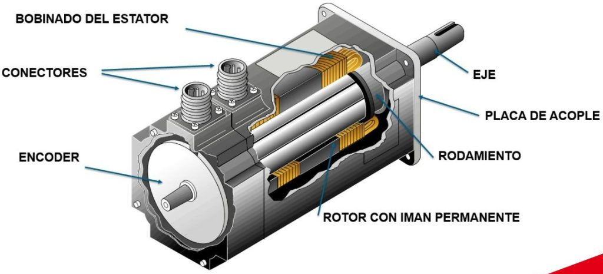
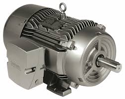
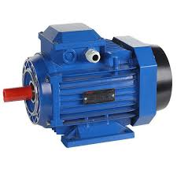
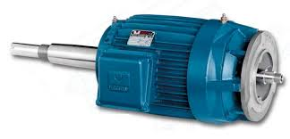
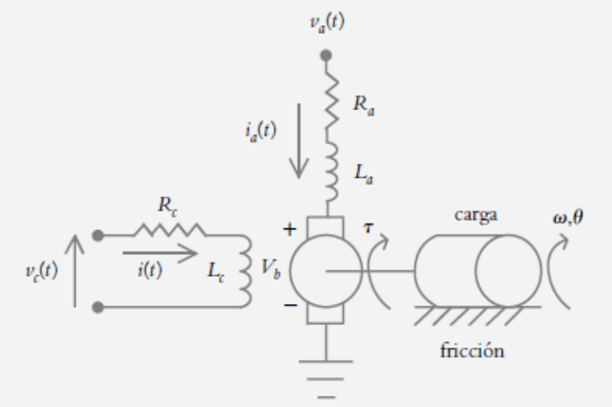
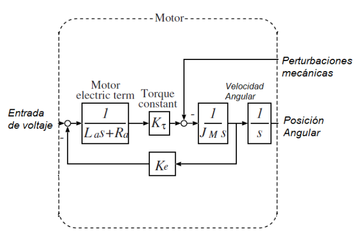
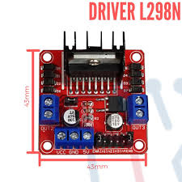
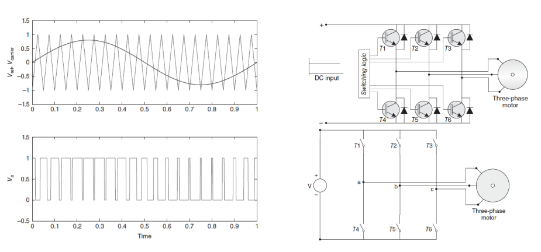

# Motores y Sensores
Esta clase se realizo el dia jueves 20 de Febrero de 2025, la clase estuvo dirigida a comprender los motores y sus carateristicas, adicional se trabajo un poco sobre el software Simscape realizando modelos y validaciones de los motores; ademas se analizo algunos sensores en servomecanismo como lo son los encoders.
## 1. ¿Que es un Servomotor?
>🔑 *Servomotor:* Es un tipo de motor diseñado para el control preciso de la posición, velocidad y aceleración.

Figura 1. Servomotor síncrono.

## 2. ¿Que es un Motor?
>🔑 *Motor:* Es un dispositivo que convierte una fuente de energía en movimiento mecánico.

Figura 2. Motor Eléctrico.

### Tipos de Motores:

### Motores DC:

Figura 3. Motor DC.

#### Partes de un Motor DC:

**1. Estator**  
  - Es la parte fija del motor que contiene los imanes permanentes o electroimanes.  
  - Proporciona el campo magnético necesario para el movimiento del rotor.
    
**2. Rotor (Inducido o Armadura)**  
  - Es la parte giratoria del motor.  
  - Contiene un núcleo de hierro laminado y devanados de alambre de cobre.  
  - Gira cuando se genera un campo magnético al aplicarse corriente eléctrica.
    
**3. Conmutador**  
  - Es un anillo segmentado de cobre unido al eje del rotor.  
  - Se encarga de cambiar la dirección de la corriente en los devanados del rotor, asegurando una rotación continua.
    
**4. Escobillas (Carbones)**  
  - Son piezas de grafito o carbón que hacen contacto con el conmutador.  
  - Permiten la transferencia de corriente eléctrica desde una fuente de alimentación hacia el rotor.
     
**5. Bobinas o devanados**  
  - Son hilos de cobre enrollados alrededor del núcleo del rotor.  
  - Generan un campo magnético cuando pasa corriente por ellos.
    
**6. Eje**  
  - Es el componente que transmite el movimiento de rotación del rotor hacia el exterior del motor.
      
**7. Carcasa**  
  - Protege los componentes internos y proporciona soporte estructural al motor.
    
**8. Cojinetes o rodamientos**  
  - Reducen la fricción entre el eje y la carcasa, permitiendo un giro suave del rotor.  

### Motores AC inducción:
  
  

Figura 4. Motor AC Inducción.

#### Partes de un Motor AC Inducción:

**1. Estator:**  
  - Es la parte fija del motor. Contiene las bobinas (o devanados) por las que circula la corriente eléctrica alterna, creando un campo magnético rotatorio.

**2. Rotor:**  
  - Es la parte móvil del motor y se encuentra dentro del campo magnético del estator. En la mayoría de los casos, se utiliza un diseño tipo "jaula de ardilla", donde las barras conductoras (generalmente de aluminio o cobre) están conectadas en sus extremos mediante anillos.

**3. Núcleo magnético:**  
  - Tanto en el estator como en el rotor se utilizan núcleos compuestos de láminas de acero, que concentran y guían el flujo magnético, aumentando la eficiencia del motor.

**4. Carcasa:**  
  - Protege los componentes internos del motor y suele integrar elementos para la disipación de calor, como ventiladores o sistemas de refrigeración.

**5. Terminales y conexiones eléctricas:**  
  - Permiten la conexión del motor a la fuente de alimentación y a los circuitos de control, facilitando el paso de la corriente a los devanados del estator.

### Motores AC Síncronos:
  

Figura 5. Motor AC Síncrono.

#### Partes de un Motor Síncronos:

**1. Estator:**  
  - Contiene los devanados alimentados por corriente alterna que generan un campo magnético rotatorio.

**2. Rotor:**  
  - Es la parte móvil del motor. Puede ser:
  - **Rotor con polos salientes:** Utilizado en aplicaciones de bajas velocidades y alta eficiencia en el uso de la excitación.
  - **Rotor cilíndrico:** Con forma lisa, normalmente empleado en aplicaciones de alta velocidad.  
  En ambos casos, el rotor se excita mediante corriente continua en sus devanados o mediante imanes permanentes, creando un campo magnético que se alinea con el del estator.

**3. Sistema de excitación:**  
  - En motores con rotor electromagnético, se utiliza un sistema que suministra corriente continua a los devanados del rotor para generar el campo magnético.

**4. Carcasa y componentes mecánicos:**  
  - Incluyen el bastidor, los cojinetes y los sistemas de refrigeración, que protegen y facilitan el funcionamiento del motor.

**5. Terminales y conexiones eléctricas:**  
  Permiten la conexión del motor al suministro eléctrico y a los sistemas de control.

### Comparación entre Tipos de Motores:

| Característica               | Motor DC                                                                                                                                                          | Motor AC Síncrono                                                                                                                                                         | Motor AC de Inducción                                                                                                                                                  |
|------------------------------|-------------------------------------------------------------------------------------------------------------------------------------------------------------------|---------------------------------------------------------------------------------------------------------------------------------------------------------------------------|------------------------------------------------------------------------------------------------------------------------------------------------------------------------|
| **Velocidad de Operación**   | Variabilidad amplia y controlable mediante ajustes de voltaje y resistencia.                                                                                      | Opera a velocidad fija determinada por la frecuencia y el número de polos.                                                                          | Funciona a una velocidad algo inferior a la sincrónica debido al deslizamiento, que varía con la carga.                                                                 |
| **Principio de Funcionamiento** | Convierte energía eléctrica en mecánica mediante la interacción de campos magnéticos generados por corriente continua.                                             | El rotor se sincroniza con el campo magnético del estator, utilizando una fuente de excitación para generar su campo.          | El campo magnético rotatorio del estator induce corrientes en el rotor , generando su propio campo y movimiento.                  |
| **Control y Variabilidad**   | Ofrece control preciso de velocidad y par, especialmente en motores sin escobillas.                                                                              | Requiere dispositivos auxiliares para el arranque y control, pero mantiene una velocidad constante; se puede ajustar el factor de potencia mediante la excitación.      | Es autoarrancable; su velocidad varía ligeramente con la carga, lo que puede requerir convertidores o ajustes en aplicaciones específicas.                            |
| **Mantenimiento**            | Los motores con escobillas requieren mantenimiento periódico por desgaste; los sin escobillas tienen menor mantenimiento.                                            | Generalmente requieren más cuidado debido a sistemas de excitación y la necesidad de dispositivos de arranque específicos.                                                  | Menor mantenimiento en comparación con los motores DC, ya que no utilizan escobillas y su construcción es robusta y sencilla.                                          |
| **Aplicaciones**             | Empleados en robótica, vehículos eléctricos, electrodomésticos y sistemas que demandan variabilidad y respuesta rápida de velocidad y par.                          | Utilizados en aplicaciones donde se requiere velocidad constante y control del factor de potencia, como en generadores y grandes equipos industriales.                 | Ampliamente usados en aplicaciones industriales y comerciales, como bombas, ventiladores, compresores y otros equipos de gran potencia debido a su robustez y bajo costo. |
| **Costo y Complejidad**      | Pueden implicar mayor costo y complejidad en sistemas de control preciso, en particular los sin escobillas.                                                         | Su costo y complejidad son mayores por la necesidad de sistemas de excitación y control, lo que puede aumentar la inversión inicial y el mantenimiento.                  | Generalmente más económicos y robustos, siendo la opción preferida para muchas aplicaciones industriales a pesar de requerir controladores en ciertos casos.          |

Tabla 1. Tabla de comparación entre tipos de motores AC y DC.

## 3. Modelo por corriente de armadura

Es un enfoque matemático para describir y analizar el comportamiento dinámico de un motor DC centrándose en la corriente que circula por la armadura. Este modelo utiliza las leyes fundamentales de circuitos eléctricos y mecánicos para establecer las relaciones entre:

- **Voltaje aplicado:** La tensión que se aplica al motor.
- **Corriente de armadura:** La corriente que circula por los devanados del rotor (armadura) y que genera el campo magnético responsable de producir el torque.
- **Resistencia e inductancia de la armadura:** Que afectan cómo varía la corriente en función del tiempo.
- **Fuerza contraelectromotriz (back EMF):** Una tensión generada por el movimiento del rotor en el campo magnético, que se opone al voltaje aplicado y depende de la velocidad de rotación.
- **Torque:** El resultado mecánico que impulsa el movimiento del motor.

💡**Ejemplo 1:**

**Parte Eléctrica:**
$$v_a = L_a \frac{d i_a}{dt} + R_a \, i_a + V_b$$

**Parte Magnética:**

$$T_m = (K_a \, K_c \, I_c)\, i_a(t) = K_\tau \, i_a(t)$$

$$V_b = K_e  \omega$$

$$T_m = T_c + T_p$$

**Parte Mecánica:**

$$J \frac{d^2 \theta}{dt^2} + b \frac{d \theta}{dt} + k \theta = \tau(t)$$

$$
L_a \frac{d \Bigl(\frac{J \ddot{\theta} + b \dot{\theta} + k \theta}{K_\tau}\Bigr)}{dt}
\+\
R_a \Biggl(\frac{J \ddot{\theta} + b \dot{\theta} + k \theta}{K_\tau}\Biggr)
\+\
K_e \dot{\theta}
\=\
v_a
$$

Figura 1. Modelo de Motor DC.

Figura 2. Modelo de Motor DC.

Este modelo es especialmente útil en aplicaciones de control, ya que permite predecir la respuesta del motor a cambios en el voltaje o en la carga y facilita el diseño de sistemas de control que aseguren un funcionamiento preciso y estable del motor DC.

## 4. Sensores
>🔑 *Sensor:* Es un dispositivo que detecta el cambio en el entorno y responde a alguna salida en el otro sistema. Un sensor convierte un fenómeno físico en un voltaje analógico medible

En un servomecanismo, el objetivo es controlar con precisión variables como la posición, la velocidad o el par (torque) de un actuador (generalmente un motor). Para lograrlo, se emplean sensores que retroalimentan el sistema de control con información sobre el estado real del movimiento. Algunos sensores que se utilizan en motores son:

### 1. Sensores de Posición:

- **Potenciómetro:**  
  - **Ventajas**: Económico, fácil de implementar.  
  - **Limitaciones**: Desgaste mecánico, resolución y precisión relativamente bajas.

- **Encoder Óptico:**  
  - **Ventajas**: Alta resolución y precisión, muy común en aplicaciones industriales.  
  - **Limitaciones**: Sensible a la suciedad, precio mayor que un potenciómetro.

- **Encoder Magnético:**  
  - **Ventajas**: Más robusto ante vibraciones y polvo, buena resolución.  
  - **Limitaciones**: Resolución algo menor que algunos encoders ópticos de alta gama, costo intermedio.

- **Resolver**  
  - **Ventajas**: Muy robusto (temperatura, vibraciones), confiable en entornos exigentes.  
  - **Limitaciones**: Coste más elevado, requiere electrónica de decodificación especializada.

### 2. Sensores de Velocidad:

- **Tacómetro (Generador):**  
  - **Ventajas**: Salida analógica proporcional a la velocidad, simple y con buena respuesta dinámica.  
  - **Limitaciones**: Desgaste mecánico, menor precisión que métodos digitales.

- **Encoder (Conteo de Pulsos):**  
  - **Ventajas**: Se usa el mismo encoder de posición para obtener velocidad midiendo la frecuencia de los pulsos.  
  - **Limitaciones**: A bajas velocidades la medición puede ser imprecisa por recuento de pulsos.

- **Sensores Hall en Motores BLDC:**  
  - **Ventajas**: Integrados en el motor, simplicidad en sistemas sin escobillas.  
  - **Limitaciones**: Resolución menor comparada con un encoder de alta resolución.

### 3. Sensores para medición de torque:

- **Shunt (Resistencia de derivación):**
  - **Ventajas**: Bajo costo, implementación sencilla utilizando la ley de Ohm, respuesta rápida en la medición. 
  - **Limitaciones**: Pérdida de potencia debido a la caída de tensión, sensibilidad a efectos térmicos que pueden afectar la precisión; posible interferencia en el circuito, especialmente en aplicaciones de alta precisión.

- **Sensor de Efecto Hall:**
  - **Ventajas**: Medición sin contacto, sin interrumpir el circuito, capacidad para medir tanto corrientes continuas (DC) como alternas (AC), aislamiento eléctrico, lo que incrementa la seguridad.
  - **Limitaciones**: Costo mayor en comparación con el shunt, requiere calibraciones precisas y puede ser sensible a interferencias magnéticas y térmicas, la respuesta y linealidad pueden ser inferiores en aplicaciones de alta precisión.

## 5. Driver de Potencia 
>🔑 *Driver de Potencia:* Es un dispositivo electrónico esencial que actúa como intermediario entre el sistema de control y el motor, transformando señales de bajo voltaje en impulsos de alta potencia. Esto permite ajustar con precisión la velocidad, dirección y aceleración del motor, adaptándolo a las demandas específicas de cada aplicación. Además, incorpora mecanismos de protección que gestionan y limitan la corriente para prevenir sobrecargas y daños en el motor, garantizando un funcionamiento seguro y eficiente. En resumen, el driver de potencia no solo impulsa el motor, sino que también optimiza su desempeño y prolonga su vida útil mediante una adecuada conversión y control de la energía eléctrica.

Figura 3. Puente H L298N.

## 6. SPWM e Inversores

Los SPWM (Modulación por Ancho de Pulso Sinusoidal) son una técnica de control que permite generar una forma de onda senoidal a partir de pulsos de tensión modulados, siendo muy utilizada en aplicaciones de conversión de energía para mejorar la calidad de la señal de salida. Por otro lado, los inversores son dispositivos electrónicos que convierten la energía de corriente continua (DC) en corriente alterna (AC). En conjunto, el SPWM se emplea comúnmente en inversores para controlar la forma de la onda de salida, facilitando el funcionamiento de motores y otros sistemas eléctricos con características de eficiencia y precisión en la conversión de energía.

Figura 4. Sinusoidal Pulse Width Modulation.

## 7. Conclusiones
En conclusión, la clase sobre Motores y Sensores ofreció un alcance integral al analizar en profundidad tanto los fundamentos teóricos como las aplicaciones prácticas en el diseño y control de motores eléctricos, apoyándose en conceptos fundamentales presentados en *Fundamentos de máquinas eléctricas rotativas* (Serrano Iribarnegaray, 1989). Se exploraron las características esenciales y componentes de motores de corriente continua y alterna tales como estator, rotor, conmutador y devanados para comprender cómo se transforma la energía eléctrica en movimiento mecánico. Además, se destacó el modelado mediante la corriente de armadura, una herramienta crucial que permite predecir el comportamiento dinámico y facilitar el diseño de sistemas de control precisos, validado y optimizado mediante simulaciones en entornos como Simscape. Adicional a esto se destaco la importancia de los sensores en servomecanismos, tales como encoders, potenciómetros y sensores Hall, para proporcionar retroalimentación precisa en la medición de variables críticas como posición, velocidad y torque. Finalmente, se subrayó la relevancia de los drivers de potencia y las técnicas de modulación por ancho de pulso sinusoidal (SPWM) en la conversión y control eficiente de la energía, elementos indispensables para asegurar un funcionamiento seguro, eficiente y duradero en aplicaciones y entornos industriales.

## 8. Referencias
- [1] *Apuntes Clase - Jueves 20 Febrero 2025.*  
- [2] *CHAPMAN. 2005. Maquinas eléctricas. Madrid: McGraw-Hill Interamericana.*  
- [3] *LANGSDORF. 1968. Principios de las maquinas de corriente continua. McGrawHill.*  
- [4] *SERRANO IRIBARNEGARAY. 1989: Fundamentos de maquinas eléctricas rotativas. Marcombo.*
- [5] *E.P.2.Control digital y de mov-04948-2561. Aulas Ecci.*

