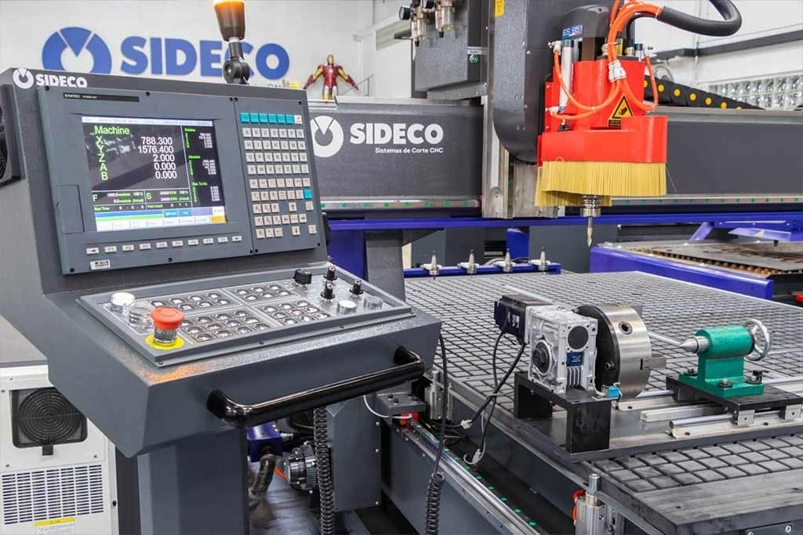
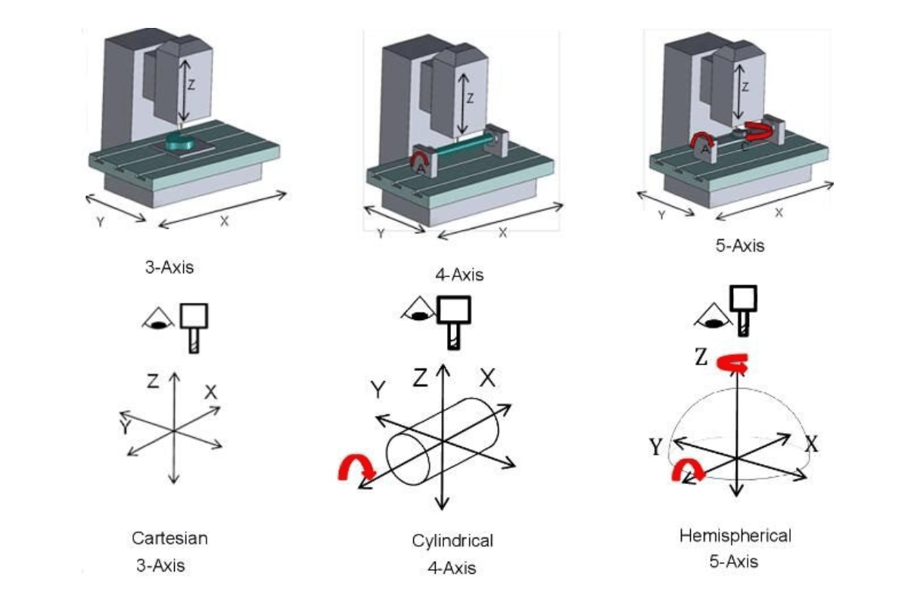
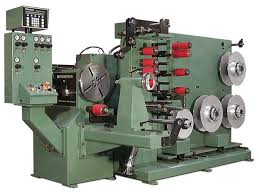
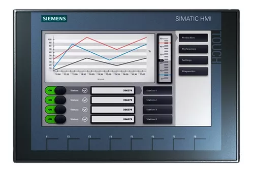
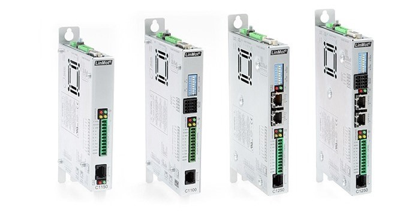
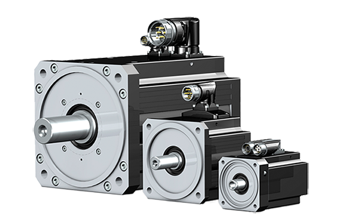
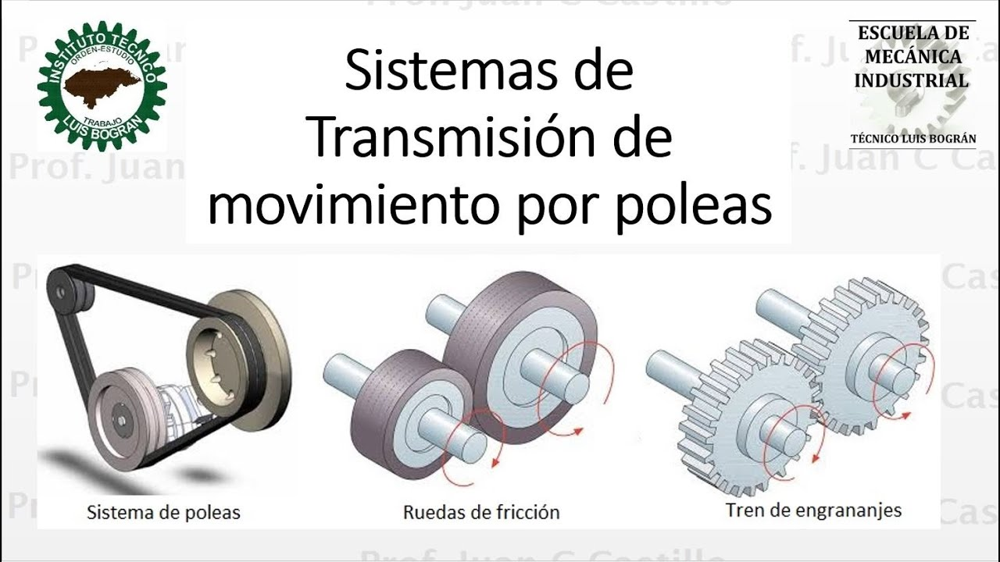
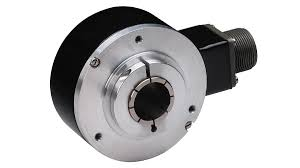

# Control de Movimiento
Esta clase se llevo a cabo el dias 6 de Febrero de 2025, la cual estuvo dirigida a comprender como el control de movimiento es de gran importancia en las diversas industrias, se comprendió mejor su uso y las aplicaciones que este tiene, adicional se hizo un recorrido breve de como ha avanzado este tipo de control con el pasar del tiempo.

## 1. ¿Que es control de Movimiento?
>🔑 *Control de Movimiento:*  Es una disciplina dentro del campo de la automatización y el control que se encarga encarga de regular cómo se mueve un sistema mecánico, asegurando que alcance la posición, velocidad, aceleración o torque deseadas de manera precisa y estable.

El control de movimiento se usa ampliamente en todo tipo de industrias, incluidas las de embalaje, ensamblaje, textil, papel, impresión, procesamiento de alimentos, productos de madera, maquinaria, electrónica y fabricación de semiconductores. Es el corazón de casi cualquier maquinaria y proceso automatizado. El control de movimiento implica controlar los movimientos mecánicos de una carga.

💡**Ejemplo 1:**

Figura 1. Máquina CNC.

## 2. Ejes de Movimiento
>🔑 *Ejes de Movimiento:* En el control de movimiento y la automatización, los ejes de movimiento (o motion axes en inglés) son las direcciones en las que una máquina o sistema puede moverse. Cada eje representa un grado de libertad. Por ejemplo, un robot industrial con tres ejes lineales puede moverse hacia adelante y atrás (eje X), de un lado a otro (eje Y) y arriba y abajo (eje Z). Además de los movimientos lineales, también existen ejes rotacionales, que permiten que un sistema gire alrededor de un eje en lugar de solo desplazarse.

💡**Ejemplo 2:**

Figura 2. Axis en máquina CNC.

## 3. Control de Movimiento con el pasar del tiempo
Antes de los sistemas digitales modernos, el control de movimiento se realizaba principalmente mediante métodos mecánicos y análogos en donde se usaban sistemas de engranajes, levas, poleas y palancas para crear movimientos precisos, como en los relojes antiguos o las cajas de música. También se empleaban sistemas hidráulicos y neumáticos que utilizaban la presión de líquidos o aire para mover maquinaria industrial, eran principlamnete diseñados por la ingeniería industrial y mecánica.

💡**Ejemplo 3:**

Figura 3. Bobinadora de cables y láminas de alta tensión y baja tensión serie 400, Broomfield.

## 4. Control de Movimiento en la actualidad
El control de movimiento en la actulaidad es electronico, el cual permite que coordine y gestione todos los elementos del sistema para lograr que cada eje se mueva de manera sincronizada y exacta. En un sistema completo se integran varios componentes que trabajan en conjunto, y a continuación se describen de forma sencilla:

- Interfaz Hombre-Máquina (HMI)

>🔑 *Interfaz Hombre-Máquina (HMI):* Es el punto de conexión entre el operador y el sistema. A través de esta interfaz, el usuario puede programar, ajustar y supervisar el comportamiento de la máquina, facilitando la configuración y el monitoreo en tiempo real.

💡**Ejemplo 4:**

Figura 4. HMI Siemens. 

- Controlador de Movimiento
  
>🔑 *Controlador de Movimiento:* Este es el "cerebro" del sistema. Se encarga de procesar las instrucciones de la HMI y ejecutar algoritmos de control que determinan las trayectorias y velocidades de cada eje. Gracias a su capacidad de procesamiento en tiempo real, puede corregir desviaciones y asegurar que los movimientos sean precisos. Posee CPU, salidas de potencia, entradas para sensores y puertos de comunicacion.

💡**Ejemplo 5:**

Figura 5. Controlador de Movimiento Linmot.

- Drivers de Potencia

>🔑 *Driver de Potencia:* Son intermediarios entre el controlador y los actuadores. Estos dispositivos amplifican las señales de control para que sean capaces de mover los actuadores con la fuerza y precisión necesarias. Funcionan controlando la corriente y el voltaje que se suministran a los motores o servomotores, permitiendo así un manejo fino de la velocidad y el par motor. Su correcto funcionamiento es clave para traducir las órdenes del controlador en acciones mecánicas efectivas.

💡**Ejemplo 6:**

Figura 6. Driver de Potencia Yaskawa serie Sigma.

- Actuadores

>🔑 *Actuadores:* Son los dispositivos físicos (como motores eléctricos o servomotores) que transforman las señales del controlador en movimientos reales. Su rapidez y precisión son fundamentales para cumplir con las demandas de alta velocidad y precisión del sistema.

💡**Ejemplo 7:**

Figura 7. Servomotores DC.

- Mecanismos de Transmisión

>🔑 *Mecanismos de Transmisión:* Estos elementos, como engranajes, correas o husillos, se encargan de transmitir el movimiento generado por los actuadores a las partes mecánicas del sistema. Su diseño y precisión determinan en gran medida la exactitud con la que se mueve cada eje.

💡**Ejemplo 8:**

Figura 8. Sistemas de transmisión.

- Sensores

>🔑 *Sensores:* Los sensores son esenciales para el control de movimiento, ya que proporcionan la retroalimentación necesaria para ajustar y corregir el funcionamiento del sistema en tiempo real. Con estos datos, el controlador de movimiento puede ajustar de manera dinámica las señales enviadas a los drivers y actuadores, corrigiendo errores y asegurando que el sistema mantenga la sincronización y precisión esperadas. Los sensores pueden incluir encoders, tacómetros, y otros dispositivos de medición que monitorean continuamente el estado del sistema.

💡**Ejemplo 9:**

Figura 9. Sensor encoder Allen-Bradley.

## 5. Conclusiones
Agregue unas breves conclusiones sobre los temas trabajados en cada clase, puede ser a modo de resumen de lo trabajado o a indicando lo aprendido en cada clase

## 6. Referencias

