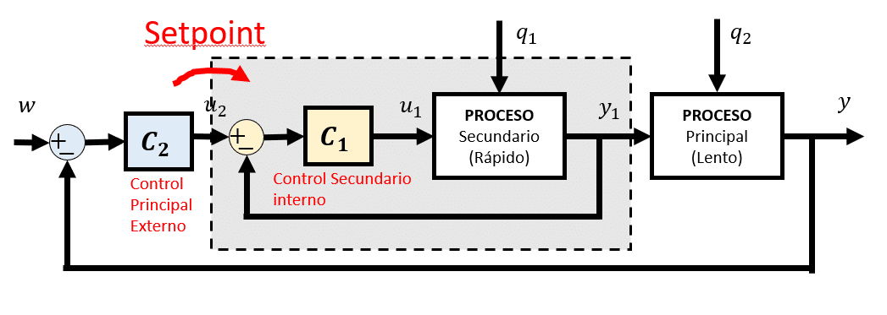
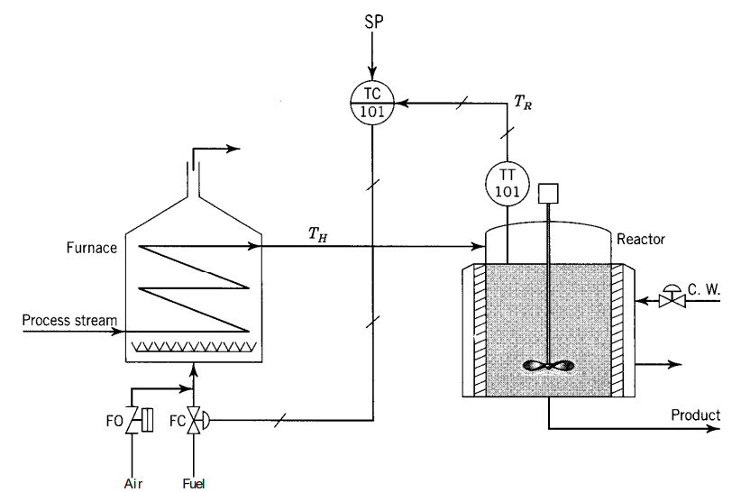
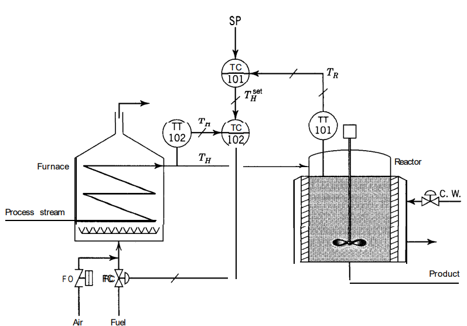
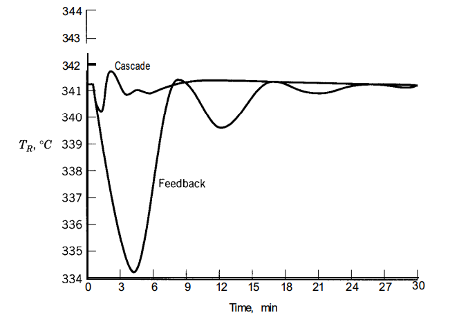
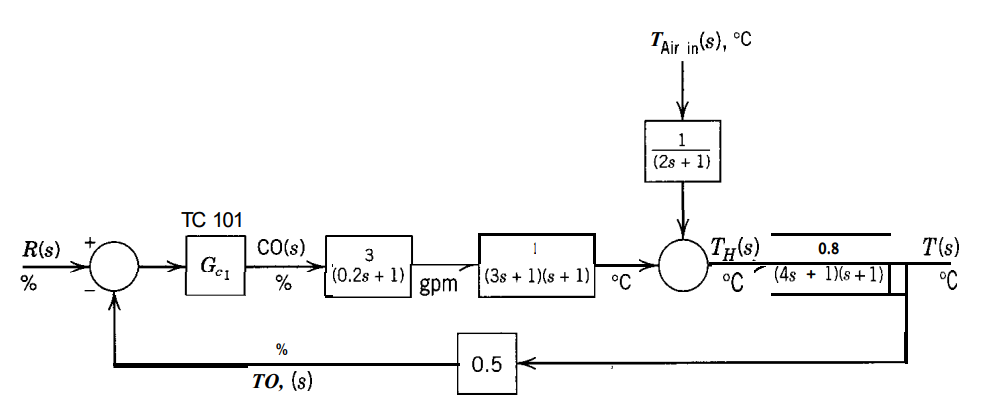
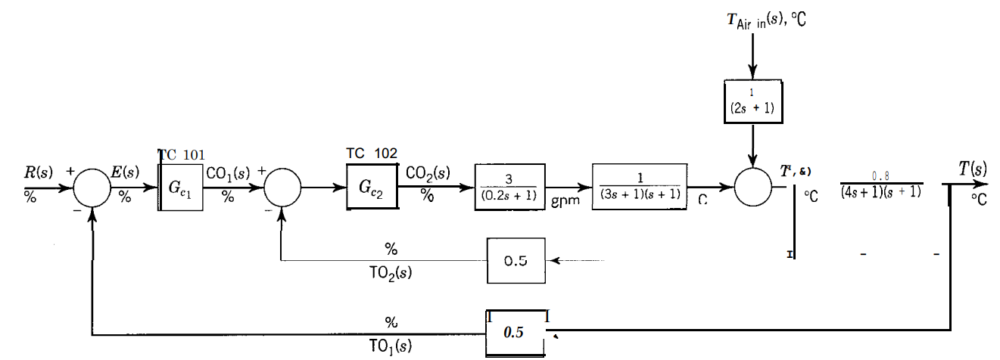

# Control Cascada
Clase 3, se llevo a cabo el dia 13 de Febrero del 2025, la cual estuvo dirigida a comprender el funcionamiento y esquema general del control casacda, adicional sus metodos de sintonizacion en lazo abierto y cerrado.

## 1. ¿Que es Control Cascada?
>🔑 *Control cascada* El control en cascada, según Ogata, es una estrategia de control en la que se emplean dos lazos de control conectados en serie. El lazo primario, se encarga de la variable principal del proceso; su salida no actúa directamente sobre el proceso, sino que sirve de referencia para el lazo secundario. Este lazo secundario controla una variable intermedia que tiene una respuesta más rápida y se encarga de compensar las perturbaciones de manera inmediata. De esta forma, el lazo secundario reacciona rápidamente a los cambios, mientras que el lazo primario mantiene la estabilidad y precisión de la variable principal, mejorando el desempeño global del sistema.

💡**Ejemplo 1:**



Figura 1. Diagrama de bloques Control Cascada.


💡**Ejemplo 2:**



Figura 2. Control de retroalimentación del proceso del precalentador/reactor.



Figura 3. Control en cascada del proceso del precalentador/reactor.

El proceso comienza con el precalentamiento del reactivo A en un horno, ya que este reactivo suele llegar frío y necesita elevar su temperatura antes de entrar al reactor. La reacción A → B en el reactor es exotérmica, por lo que se utiliza una camisa de enfriamiento para controlar la temperatura \($$T_R$$\). Sin embargo, durante la puesta en marcha se detectó que la capacidad de enfriamiento no era suficiente, manteniendo la válvula de enfriamiento prácticamente abierta todo el tiempo. Como solución temporal, se decidió dejar la válvula de enfriamiento completamente abierta y, en su lugar, regular la temperatura del reactor manipulando el combustible que alimenta el horno. Esta estrategia funcionó inicialmente, pero se presentaron perturbaciones tanto en el horno (variaciones en la temperatura de entrada del reactivo, poder calorífico del combustible, temperatura del aire de combustión) como en el reactor (cambios en la temperatura y flujo del refrigerante), lo que provocaba desviaciones en la temperatura \($$T_R$$\) y un control lento con oscilaciones debido a los retardos acumulados. Para mejorar la respuesta ante estas perturbaciones, se implementó un control en cascada que emplea dos lazos de control: uno secundario que supervisa y regula la temperatura de salida del horno \($$T_H$$\), y otro primario que se encarga de la temperatura del reactor \($$T_R$$\). De esta forma, el lazo interno corrige rápidamente las alteraciones en \($$T_H$$\) antes de que afecten a \($$T_R$$\), brindando una respuesta más ágil y estable, y reduciendo las oscilaciones en la variable de control principal.



Figura 4. Respuesta de la temperatura del reactor a un cambio de -25°C en la temperatura de alimentación a calentador.

En la figura 4, al comparar el control de retroalimentación simple con el control en cascada para una perturbación de -25 °C en la temperatura de entrada, se observa una mejora muy notable en la respuesta del proceso gracias al control en cascada. Se explica que, al diseñar esta estrategia, el lazo interno debe ser más rápido que el lazo externo, y que en sistemas con varios lazos (primario, secundario, terciario, etc.), cada lazo “interno” debe ser más veloz que el siguiente “externo”.

Además, se aclara que el controlador más interno es el que actúa directamente sobre la válvula, mientras que los controladores externos ajustan el set point del lazo inmediatamente interno. Se subraya que esta forma de estructurar el control permite reaccionar más rápido ante perturbaciones que afectan primero a la variable intermedia, sin esperar a que la variable principal se desvíe.



Figura 5.  Diagrama de bloques del proceso de control de retroalimentación del precalentador/reactor.



Figura 6.  Diagrama de bloques del proceso de control cascada del precalentador/reactor.


## 3. Metodos de Sintonización
>🔑 *Control cascada*  Es un procedimiento sistemático para determinar los valores apropiados de los parámetros de un controlador, con el fin de lograr un rendimiento específico en el sistema controlado. Estos métodos establecen cómo ajustar las ganancias para que el sistema sea estable, responda de forma rápida y minimice el error en la variable que se desea regular.


## 2. Definiciones
Utilice el símbolo '>' para crear bloques de texto. En la presente plantilla estas cajas están reservadas para resaltar las definiciones, las cuales deben ser breves, y la palabra o frase que se está definiendo debe estar en letra itálica. El inicio del bloque de texto debe realizarse con el emoji 🔑 .
>🔑 *Definición:* descripción precisa y clara del significado de una palabra, término, concepto o fenómeno. Es una explicación que establece los límites y el alcance de aquello que se está definiendo, aclarando su naturaleza, características esenciales y, en algunos casos, su relación con otros conceptos.

## 3. Subsecciones
Las subsecciones pueden utilizarse para sub dividir ciertos temas que se tienen en clases, por ejemplo si se está trabajandolos conversores D/A, puede ser necesario subdividir este en circuito de resistencias ponderadas y circuito de escalera R2R. 
### 3.1. Título de subsecciones
Para la creación de estas subsecciones debe utilizar un tamaño de letra más pequeño, por lo tanto utilice la etiqueta '###' 
### 3.2. Numeración de subsecciones
Siga la numeración de la sección seguida de un punto y luego el número de la subsección.

## 4. Ejemplos
Si en algún caso pretende dar un ejemplo explicativo ya sea a través de texto o através de ecuaciones matemáticos, utilizar la palabra 'Ejemplo' seguido de una numeración consecutiva dentro de la clase. Utilice el emoji 💡 antecediendo la palabra.

## 5. Ecuaciones
Para la edición de ecuaciones debe utilizar la etiqueta '$$' al comienzo y final de la ecuación para que la ecuación quede centrada ocupando una línea. Si se quiere que la ecuación quede integrada en el texto debe utilizar la etiqueta '$' al comienzo y final de la ecuación. Las ecuaciones pueden ser editadas utilizando el código LATEX, en el siguiente enlace encuentran un editor de ecuaciones que les genera el código. http://www.alciro.org/tools/matematicas/editor-ecuaciones.jsp . Sin embargo hay muchas otras herramientas que pueden utilizar para esto.

$$
1.4 \left[\frac{1 + K_{c2} K_2}{K_{c2} K_1}\right]
\left[\frac{t_{0.1}}{\tau_1}\right]^{-1.14}
\left[\frac{\tau_2}{\tau_1}\right]^{0.1}
$$

💡**Ejemplo 1:** si se va a representar la ecuación de la ley de Ohm se puede mostrar así $R=\frac{V}{I}$ o también,

$$R=\frac{V}{I}$$

## 6. Figuras
Todas las figuras que incluya deben ser generadas por ustedes, **no utilizar las figuras de las presentaciones**. Para incluir figuras puede seguir los siguientes pasos:
* Primero escribimos .
* Después escribimos, dentro de los corchetes, el texto alternativo. Este es opcional y solo entra en acción cuando no se puede cargar la imagen correctamente.
* Después escribimos, dentro de los paréntesis, la ubicación del archivo (ya sea una url o una ubicación dentro de algun folder local). Se recomienda poner las imágenes en una carpeta que se llame imágenes dentro del repositorio github para que no tengan problemas al cargar las imágenes.

💡**Ejemplo 2:**


Figura 1. Figura de prueba

Incluya la respectiva etiqueta a modo de descripción de la figura y mantenga numeración consecutiva para todas las figuras de la clase.

## 7. Tablas
En caso de necesitar la inclusión de tablas para organizar información se recomienda el uso de la herramienta del siguiente enlace https://www.tablesgenerator.com/markdown_tables , la cual permite organizar la información dentro de la tabla y genera el código markdown automáticamente:

💡**Ejemplo 3:** 

| **Resultado** | **x = número de intentos hasta primer éxito** |
|---------------|-----------------------------------------------|
|       S       |                       1                       |
|       FS      |                       2                       |
|      FFS      |                       3                       |
|      ...      |                      ...                      |
|    FFFFFFS    |                       7                       |
|      ...      |                      ...                      |

Tabla 1. Tabla de ejemplo

Cada tabla debe llevar la etiqueta que describa su contenido y numeración consecutiva para todas las tablas

## 8. Código
Teniendo en cuenta que el curso requiere del desarrollo de código matlab, c, c++ u otro. Si requiere incluir pequeños segmentos de código en los apuntes hágalos de la siguiente manera:

💡**Ejemplo 4:**
```
var sumar2 = function(numero) {
  return numero + 2;
}
```

## 9. Ejercicios
Deben agregar 2 ejercicios con su respectiva solución, referentes a los temas tratados en cada una de las clases. Para agregar estos, utilice la etiqueta #, es decir como un nuevo título dentro de la clase con la palabra 'Ejercicios'. Cada uno de los ejercicios debe estar numerado y con su respectiva solución inmediatamente despues del enunciado. Antes del subtitulo de cada ejercicio incluya el emoji 📚

## Rúbrica
| 0-1                                                                                   | 1-2                                                                                  | 2-3                                                                                                                                                                               | 3-4                                                                                                                                                                       | 4-5                                                                                                                                                                               |
|---------------------------------------------------------------------------------------|--------------------------------------------------------------------------------------|-----------------------------------------------------------------------------------------------------------------------------------------------------------------------------------|---------------------------------------------------------------------------------------------------------------------------------------------------------------------------|-----------------------------------------------------------------------------------------------------------------------------------------------------------------------------------|
| Presenta menos del 10% de los temas o no presenta por  el medio y formato  solicitado | Presenta menos del 40% de los temas solicitados, y  cumple parcialmente la plantilla | Presenta menos del 60% de los temas solicitados (con descripciones, gráficos tablas, etc), y cumple  parcialmente la plantilla. No presenta la totalidad  de ejercicios resueltos | Presenta menos del 80% de los temas solicitados (con descripciones, gráficos, tablas, etc) y cumple con  la plantilla. No presenta  la totalidad de ejercicios  resueltos | Presenta el 100% de los temas vistos en clase (con descripciones, gráficos, tablas, etc), siguiendo totalmente la plantilla. presenta la  totalidad de los ejercicios solicitados |

## 10. Conclusiones
Agregue unas breves conclusiones sobre los temas trabajados en cada clase, puede ser a modo de resumen de lo trabajado o a indicando lo aprendido en cada clase

## 11. Referencias
Agregue un subtítulo al final donde pueda poner todas las referencias consultadas incluyendo
