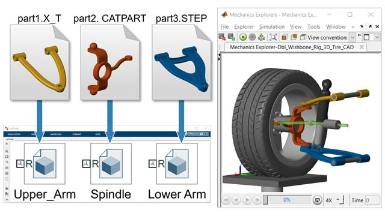
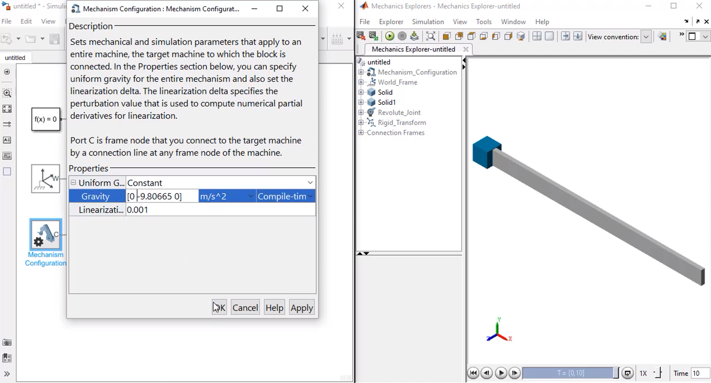
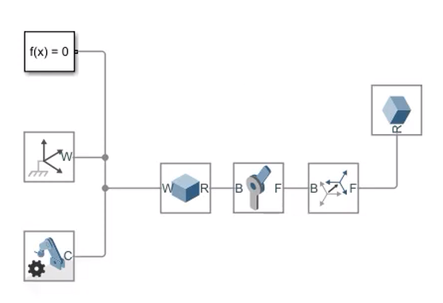
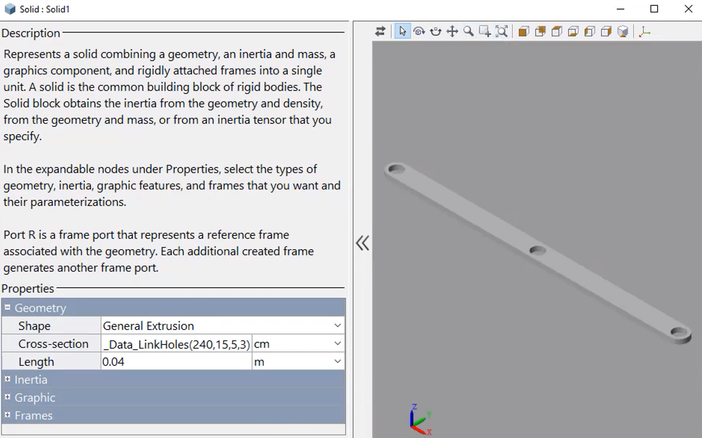
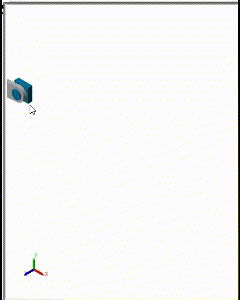

# Simscape Multibody
Esta clase se realizo el dia 27 de Febrero de 2025, la clase estuvo diridgida a hacer una introducción al software Simscape Multibody en el entorno de desarrollo y programación de Matlab.
## 1. ¿Qué es?
>🔑 *Simscape Multibody:* Es un entorno de modelado y simulación que forma parte de MATLAB/Simulink, desarrollado por MathWorks.

El cual permite a los ingenieros y científicos crear modelos de sistemas mecánicos en 3D de forma gráfica, a partir de bloques que representan cuerpos rígidos, uniones (juntas), engranajes, resortes, amortiguadores, entre otros componentes. Gracias a esta aproximación basada en bloques, se facilita la comprensión y la colaboración multidisciplinaria, permitiendo construir sistemas complejos sin necesidad de programar cada ecuación de manera explícita. Además, Simscape Multibody se integra con otras bibliotecas de Simscape (eléctrica, térmica, hidráulica, etc.), brindando la posibilidad de simular sistemas multidominio de manera coherente en un mismo entorno. En este entorno, los usuarios pueden analizar el comportamiento dinámico de sus modelos, visualizar en 3D los movimientos y calcular esfuerzos, torques y restricciones en tiempo real. Esto resulta especialmente útil en el diseño de robots, maquinaria industrial, mecanismos automotrices y cualquier sistema donde la dinámica mecánica sea relevante. Asimismo, la herramienta ofrece opciones de postprocesado y generación de informes, facilitando la interpretación de resultados y la toma de decisiones en etapas tempranas del diseño.

Figura 1. Simscape Multibody.

## 3. Ejercicios

📚Ejercicio 1:

Figura 2. Simscape Multibody.

Figura 3. Simscape Multibody.

Figura 4. Simscape Multibody.

Figura 5. Simscape Multibody.

Figura 5. Simscape Multibody.
## 10. Conclusiones
Agregue unas breves conclusiones sobre los temas trabajados en cada clase, puede ser a modo de resumen de lo trabajado o a indicando lo aprendido en cada clase

## 11. Referencias
- [1] *Apuntes Clase - Jueves 20 Febrero 2025.*  
- [2] *E.P.2.Control digital y de mov-04948-2561. Aulas Ecci.*
- [3] *MathWorks, Simscape Multibody*
