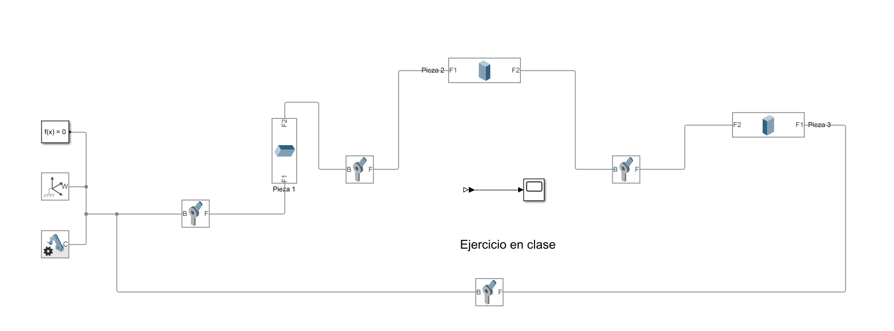
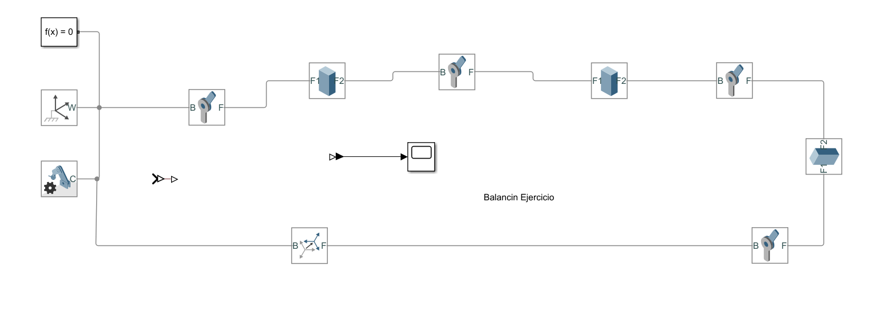
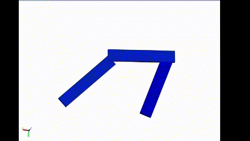
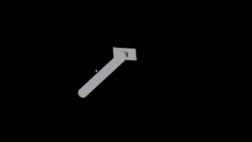
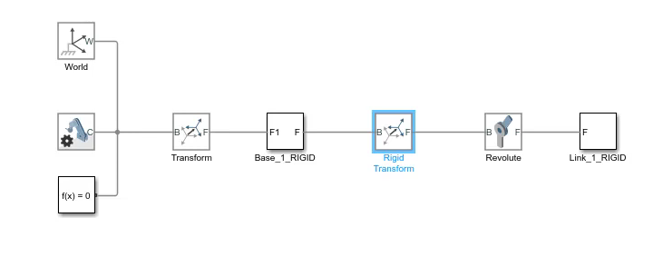
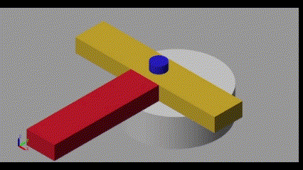
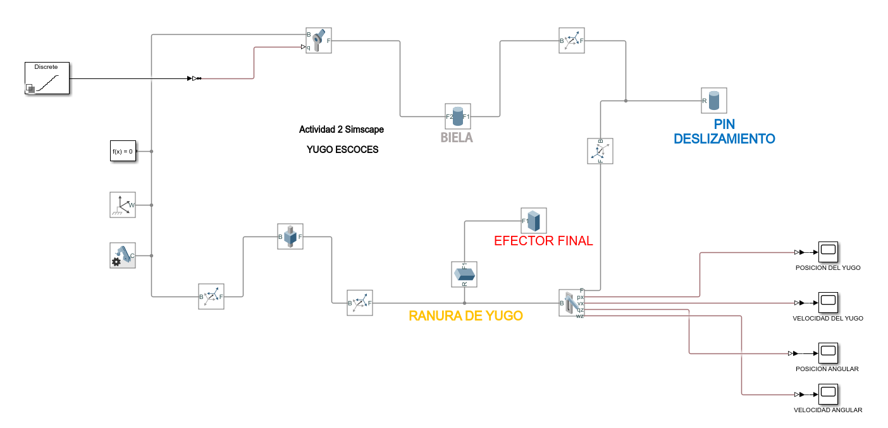

# Simscape Multibody - Mecanismos

La clase se realizo el dia 13 de Marzo, en la cual se presenta continua el tema del modelado de eslabones y mecanismo en el software Simscpae Multibody, se realizaron algunos ejemplos y jercicios para complemnetar la explicacion y poder apropiar los conceptos.

## 1. Mecanismos

Para que un mecanismo funcione correctamente en Simscape Multibody, es importante tener en cuenta varios aspectos técnicos y estructurales del modelo. En primer lugar, definir correctamente los grados de libertad del sistema, evitando tanto restricciones excesivas como movimientos indeseados. Para ello, se deben utilizar bloques de articulación (como revolute, prismatic, etc.) adecuados para cada conexión, y comprobar la movilidad general del sistema usando el bloque Mechanism Configuration. Además, cada componente del mecanismo debe estar representado por un bloque Solid, con su geometría, masa y centro de masa bien definidos, y conectado correctamente mediante transformaciones rígidas o articulaciones. La posición inicial del mecanismo también debe ser geométricamente válida para evitar errores de ensamblaje; el Mechanics Explorer permite visualizar y verificar esta configuración antes de simular.

En el caso de mecanismos con lazos cinemáticos cerrados, como cadenas de eslabones, es fundamental cerrar correctamente el circuito usando bloques de engranajes, restricciones de cierre de lazo o conexiones cinemáticas equivalentes, ya que estos sistemas tienden a generar redundancias o problemas de rigidez numérica si no se modelan adecuadamente. Asimismo, es importante asignar parámetros físicos realistas a todos los elementos del modelo: masas, momentos de inercia, dimensiones, fricción, fuerzas externas, entre otros. Valores extremos o poco realistas pueden llevar a simulaciones inestables o poco representativas.

Si el modelo incluye actuadores o sensores, se deben usar de forma coherente. Los actuadores permiten aplicar movimiento o fuerza en las articulaciones, mientras que los sensores permiten medir variables como posición, velocidad o esfuerzo; no se deben aplicar múltiples actuadores sobre el mismo grado de libertad sin un control adecuado. Finalmente, se recomienda utilizar un solver apropiado y revisar constantemente el Mechanics Explorer durante la simulación para observar el comportamiento del sistema y diagnosticar posibles errores. Con estas consideraciones, se puede lograr una simulación precisa, estable y representativa del mecanismo en estudio.

💡**Ejemplo 1:**

Figura 1. Diagrama de Bloques Balancin Triangular.

La figura 1 representa el diagrama de bloques del mecanismo de balancin triangular.

El balancín triangular es un eslabón articulado que funciona como punto de retorno y estabilización en mecanismos de tres barras. Está fijado en uno de sus vértices, que actúa como punto de apoyo, permitiendo que el resto de la pieza oscile en un movimiento de vaivén limitado por los ángulos definidos en las juntas revolutas. Al recibir el impulso de la manivela a través del eslabón acoplador, el balancín convierte el giro continuo en un recorrido oscilatorio entre dos posiciones extremas, manteniendo siempre la geometría triangular del sistema. 
Su diseño y dimensiones determinan tanto el ángulo de oscilación como la relación de transmisión de fuerzas: un balancín más largo oscila con menor amplitud pero con mayor fuerza de reacción, mientras que uno más corto ofrece mayor recorrido con menor fuerza.

Figura 2. Balancin Triangular.

La figura 2 representa el movimiento del mecanismo de balancin triangular.

💡**Ejemplo 2:**

Figura 3. Diagrama de Bloques Balancin.

La figura 3 representa el diagrama de bloques del mecanismo de balancin.

Esta mecanismo mostrado en la fihura 4 se realizo con base en el baancin triangular sin embargo se le realizafron modificaciones en los frames de los eslabones y con ayuda de los bloques rigid transform se logro ese movimiento caracteritico del balancin.

Figura 4. Balancin.

La figura 4 representa el movimiento del mecanismo de balancin.

## 2. Ejercicios

### 📚Ejercicio 1:

El primer ejercicio fue un mecanismo de pendulo que consiste en una barra rígida unida a una base fija mediante una junta revoluta, lo que le permite girar libremente en un plano. Al aplicarse un impulso inicial o un par motor, la barra describe un movimiento oscilatorio alrededor de su punto de apoyo, comportándose como un péndulo rígido. La amplitud y la frecuencia de las oscilaciones dependen de la longitud de la barra, de la distribución de su masa y de cualquier fuerza de amortiguamiento o fricción presente en la articulación.

En términos generales, se trata de un sistema de un solo grado de libertad, donde la energía cinética y potencial se intercambian continuamente, en donde la barra acelera al descender y desacelera al ascender, deteniéndose momentáneamente en los extremos de su recorrido antes de invertir el sentido de giro. Este tipo de mecanismo se emplea frecuentemente para estudiar dinámicas de oscilación, para medir periodos en relojes de péndulo o como componente básico en sistemas de control de vibraciones y amortiguación.

Figura 5. Meacanismo Pendulo.

La figura 5 representa el movimiento del mecanismo de pendulo.

Figura 6. Diagrama de bloques mecanismo Pendulo.

La figura 6 representa el diagrama de bloques del mecanismo de pendulo.

### 📚Ejercicio 2:

El segundo ejercicio propuesto fue de yugo escoces, el cual esta diseñado para convertir movimiento rotativo continuo en un desplazamiento lineal alternativo. En la imagen, el disco giratorio lleva un perno excéntrico que está encajado en la ranura longitudinal del yugo. A medida que el disco rota, el perno describe un círculo cuyo centro está desplazado respecto al eje de giro, forzando al yugo a deslizarse hacia adelante y hacia atrás a lo largo de la ranura, manteniendo siempre contacto con el perno.

Figura 7. Mecanismo Yugo Escoces.

La figura 7 representa el movimiento del mecanismo de un Yugo Escoces.

Desde el punto de vista cinemático, la relación entre el ángulo de rotación θ del disco y la posición x del yugo viene dada por:

$$
x = e \cos(\theta)
$$

donde 
𝑒 es la distancia del perno al eje de giro. Esto produce un movimiento armónico simple, con velocidad y aceleración del yugo que se pueden obtener derivando respecto al tiempo:

$$
v = -e \omega \sin(\theta), \quad a = -e \omega^2 \cos(\theta)
$$

siendo ω la velocidad angular constante del disco. La aceleración máxima ocurre en los puntos de retorno del recorrido lineal, lo que implica picos de esfuerzo en los componentes de guía.
En cuanto a dinámica y aplicaciones, el yugo escocés ofrece una conversión de movimiento muy precisa y suave cuando la rotación es uniforme, pero genera fuerzas de inercia considerables en los extremos del recorrido debido a la rápida inversión de aceleración. Por ello se utiliza comúnmente en compresores de pistón, bombas de diafragma y mecanismos de prensa ligeros, donde se valora la simplicidad constructiva y la exactitud del recorrido lineal, siempre teniendo en cuenta el diseño robusto de guías y rodamientos para soportar los picos de carga.

Figura 8. Diagrama de bloques Yugo Escoces.

La figura 8 representa el digaram de bloques para un mecanismo de yugo escoces.

Este diagrama de bloques representa un modelo del mecanismo Yugo Escocés implementado en Simulink utilizando la librería de Simscape Multibody. El sistema comienza con un actuador rotacional (bloque "Discrete") que genera un movimiento angular continuo sobre un eje. Este eje está conectado a un bloque de articulación rotacional que transmite el par a un componente giratorio (disco o manivela), el cual está unido a la biela a través de un pivote. Esta biela convierte el movimiento circular en un movimiento lineal alternativo del yugo, mediante el acoplamiento en una ranura que restringe su desplazamiento a una sola dirección.

El bloque identificado como "RANURA DE YUGO" (en amarillo) es el componente clave para transformar el movimiento de la biela. La biela está unida al bloque "EFECTOR FINAL" (en rojo), que representa el punto donde el movimiento combinado de la rotación y el deslizamiento se transmite directamente al yugo. Este yugo es un bloque que se desliza en línea recta gracias al montaje de guía, representado aquí con una unión prismática (deslizamiento lineal). A su vez, el "PIN DESLIZAMIENTO" (en azul) está montado dentro del yugo, restringido a moverse únicamente en dirección lineal, siguiendo una trayectoria dictada por el giro de la manivela.

El sistema se completa con bloques de sensado que permiten visualizar y registrar variables del sistema dinámico. En la parte inferior derecha se encuentran las salidas del modelo: posición del yugo, velocidad del yugo, posición angular y velocidad angular. Estos datos permiten realizar un análisis cuantitativo del comportamiento del mecanismo, como la validación del modelo respecto a las ecuaciones teóricas del yugo escocés y sus derivadas respecto al tiempo. En conjunto, este modelo permite estudiar con precisión la cinemática y dinámica del mecanismo, incluyendo los efectos de inercia, restricciones de movimiento y acoplamiento entre elementos móviles.

## 3. Conclusiones

En la clase de Simscape Multibody, se exploraron aspectos fundamentales del modelado y simulación de mecanismos, destacando la importancia de definir correctamente los grados de libertad de un sistema y aplicar restricciones adecuadas a las articulaciones. En el contexto de ingeniería mecatrónica, estos principios son esenciales para garantizar que los mecanismos no solo operen con precisión, sino también con estabilidad y eficiencia. La correcta implementación de bloques de articulación y la validación geométrica mediante el uso del Mechanics Explorer permiten asegurar la funcionalidad del modelo antes de proceder con simulaciones más complejas. Estos conceptos son cruciales cuando se diseñan sistemas con múltiples grados de libertad y en los que el comportamiento dinámico debe ser controlado de manera precisa.

La simulación de mecanismos con lazos cinemáticos cerrados, como los mecanismos de balancín triangular o el yugo escocés, ilustra cómo las interacciones entre componentes afectan directamente el rendimiento del sistema. La capacidad de modelar y analizar estos mecanismos permite optimizar diseños, prever posibles fallas y ajustar los parámetros de funcionamiento para obtener el mejor desempeño. En aplicaciones de ingeniería mecatrónica, tales modelos son fundamentales para el desarrollo de sistemas automatizados, robots y maquinaria de precisión, donde cada componente debe operar con alta exactitud para cumplir con los requisitos de funcionalidad y control dinámico.

Finalmente, los ejercicios prácticos, como los modelos del péndulo y el yugo escocés, subrayan la importancia de la dinámica en los sistemas mecatrónicos. Estos ejemplos permiten estudiar cómo las variables como la inercia, la fricción y la aceleración afectan el comportamiento del sistema a lo largo del tiempo. La simulación en plataformas como Simscape Multibody no solo ofrece una forma de visualizar estos efectos, sino que también facilita el ajuste y optimización de parámetros en tiempo real, lo que es crucial para la implementación de sistemas con control de movimiento avanzado. Así, la comprensión profunda de la cinemática y dinámica de estos mecanismos permite a los ingenieros diseñar soluciones más eficientes y funcionales para una amplia gama de aplicaciones industriales y tecnológicas.

## 4. Referencias
- [1] *MathWorks, Simscape Multibody. [2025]*
- [2] *E.P.2.Control digital y de Mov. Aulas Ecci. [2025]*
- [3] *Apuntes Clase - Jueves 13 de Marzo. [2025]*
