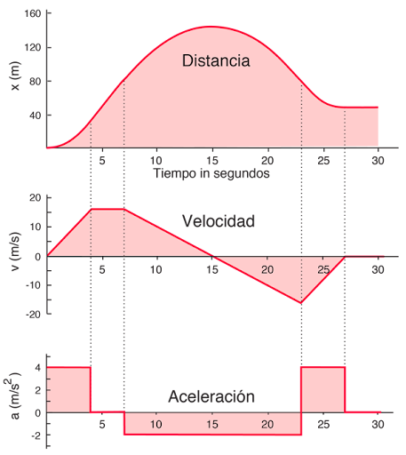
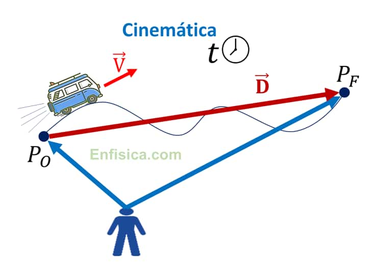
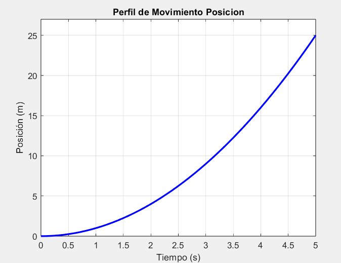

# Perfiles de Movimiento
La clase sobre perfiles de mvomiento se realizo los dias 20 y 27 de Marzo de 2025, en donde se trato la descripcion los tipos de perfiles con sus caracteristicas analiticas y matematicas, adicional se analizaron varios ejemplos que permitieron profundizarar y apropiar conceptos pra ser aplicados a control de movimiento, el cual es muy importante en la formación del ingeniero mecatronico.

## 1. ¿Qué son perfiles de Movimiento?
>🔑 *Perfiles de Movimiento:*  Los perfiles de movimiento son curvas planificadas que describen cómo varían la posición, velocidad y aceleración de un objeto en el tiempo, optimizando eficiencia y precisión en sistemas mecánicos o robóticos.

La posición, la velocidad y la aceleración son tres magnitudes importantes en la descripción de perfiles de movimiento, especialmente en contextos donde el análisis detallado del desplazamiento de un objeto es crucial, como en robótica, vehículos automatizados o sistemas mecánicos complejos. Estas tres variables, cuando se consideran de manera conjunta, proporcionan una representación completa y dinámica de cómo varía la ubicación de un cuerpo en el tiempo. Su interrelación permite no solo entender el comportamiento del movimiento, sino también anticiparlo y optimizarlo.

- Posición: La posición se refiere al lugar exacto que ocupa un objeto en el espacio en un instante determinado. Es el punto de partida para cualquier análisis de movimiento, ya que permite determinar si un objeto se encuentra donde debería estar según los requerimientos del sistema. En aplicaciones prácticas, como un brazo robótico o un vehículo autónomo, conocer la posición en tiempo real es fundamental para asegurar que el objeto siga una trayectoria predeterminada o alcance un destino específico. Además, el monitoreo continuo de la posición es esencial para detectar desviaciones y corregirlas de manera oportuna.

>🔑 *Posición:* $$s(t)$$ es la función de posición: nos dice exactamente dónde está el objeto en el instante t. En su forma integral es $$s = \int v(t)\,dt$$
>

- Velocidad: La velocidad expresa la rapidez con la que cambia la posición de un objeto, así como la dirección en la que ocurre ese cambio. Es una variable clave para entender el ritmo del movimiento y cómo este se ajusta en función del entorno o las condiciones de operación. En el diseño de perfiles de movimiento, la velocidad permite prever comportamientos, evitar cambios bruscos y garantizar una transición fluida entre diferentes fases del desplazamiento. Por ejemplo, en procesos industriales automatizados, controlar la velocidad adecuadamente puede minimizar el desgaste de componentes mecánicos y aumentar la precisión en tareas repetitivas.

>🔑 *Velocidad:* $$v(t) = \frac{ds}{dt}$$ es la velocidad: calcula la pendiente de s(t), es decir, cuánto y con qué dirección cambia la posición por unidad de tiempo. En su forma integral es $$v = \int a(t)\,dt$$
>

- Aceleración: La aceleración mide la variación de la velocidad a lo largo del tiempo. Esta magnitud es particularmente relevante para analizar el impacto de fuerzas aplicadas sobre el sistema. Una aceleración constante o variable puede indicar la necesidad de adaptar el control del movimiento para lograr mayor eficiencia o suavidad. Comprender la aceleración también es crucial para identificar momentos en los que se aplican grandes esfuerzos o tensiones, lo que permite ajustar los parámetros del sistema para evitar vibraciones, fallos mecánicos o pérdida de control.

>🔑 *Aceleración:* $$a(t) = \dfrac{dv}{dt}$$ es la aceleración: mide la variación de la velocidad en el tiempo, o sea, cómo de rápido aumenta o disminuye la velocidad.
>

En conjunto, estas tres variables no solo describen el movimiento, sino que constituyen una herramienta para el dieño y planificación de trayectorias de manera eficiente y segura. A través de su análisis, es posible anticipar comportamientos futuros, optimizar el consumo de energía, mejorar la precisión y prolongar la vida útil de los componentes involucrados. Por ello, el estudio coordinado de posición, velocidad y aceleración es indispensable en cualquier sistema que requiera control preciso del movimiento.

Figura 1. Perfiles de Movimiento.

En la figura 1 se muestra el perfil de movimiento de un mecanismo, estas graficas representan el comportamiento del mismo y son fundamentales para el anlisis y control de estos movimientos en mecanismos. 

## 2. Cinematica

En el estudio y diseño de perfiles de movimiento, la cinemática es fundamental, ya que proporciona las herramientas necesarias para describir con precisión cómo se desplaza un objeto en función del tiempo. Esta rama de la física se enfoca exclusivamente en el cómo del movimiento, sin tener en cuenta las fuerzas que lo generan. Su análisis se basa en tres conceptos esenciales: posición, velocidad y aceleración, los cuales están directamente relacionados entre sí a través de derivadas e integrales.

>🔑 *Cinematica:*  Es la rama de la física que estudia el movimiento de los cuerpos sin considerar las fuerzas que lo causan. Analiza cómo varían la posición, la velocidad y la aceleración en el tiempo para describir trayectorias y predecir el comportamiento del movimiento.

Figura 2. Cinematica.

En la figura 2 se muestra de manera general que estudia la cinematica, en donde se evidencia los movimientos y trayectorias de los cuerpos.

  

## Reglas Geométricas

La relación entre posición, velocidad y aceleración es vital para comprender el movimiento de un objeto desde un enfoque analítico. La posición en un momento determinado puede obtenerse calculando el área bajo la curva de velocidad en un gráfico de velocidad vs tiempo; esto implica que al integrar la velocidad en un intervalo dado se obtiene el desplazamiento total del objeto durante ese tiempo. Por otro lado, la aceleración se relaciona directamente con la velocidad, ya que representa la pendiente de la curva de velocidad. En términos matemáticos, esto significa que al derivar la velocidad respecto al tiempo, se obtiene la aceleración en cada instante. Estas relaciones muestran cómo las tres magnitudes están conectadas a través del cálculo diferencial e integral, permitiendo analizar y predecir con precisión el comportamiento dinámico de sistemas en movimiento.

$$
v = v_0 + a(t - t_0)
$$

$$
s = s_0 + \frac{1}{2}(t - t_0)\left(v_0 + a(t - t_0)\right)
$$

Donde $$𝑡_0$$ es el tiempo inicial, $$𝑣_0$$ es la velocidad inicial y $$𝑠_0$$ es la posición inicial. La aceleración es constante “a”.

💡**Ejemplo 1:**

Encuentre la posición y la aceleración en t=5 s

La aceleración sería la pendiente de la velocidad: 

$$
a = \frac{10}{5} \\ = 2\text{in}/s^2
$$ 

mientras que el área bajo la curva de velocidad es hasta t=5 s es la posición alcanzada en t=5 s 

$$
s = \frac{1}{2}(10 \cdot 5) = 25 \text{in/s}
$$

💡**Ejemplo 2:**

Un eje está viajando a una velocidad de 10 cm/s. En t=5 s empieza a disminuir la velocidad como se ve en el perfil. Cual es la posición del eje cuando se detiene? Asuma que empieza a desacelerar a 25 cm

La pendiente de la velocidad es la aceleración: 

$$
a = \frac{-10\ \text{cm/s} \cdot \frac{1\ \text{m}}{100\ \text{cm}}}{15\ \text{s} - 5\ \text{s}}  
$$ 

$$
a = \frac{-0.1\ \text{m/s}}{10\ \text{s}}
$$

$$
a = -0.01\ \text{m/s}^2
$$

mientras que el área del perfil de velocidad triangular es la posición alcanzada en t=15 s, 

$$
S_0 = \frac{1}{2} \cdot (15\text{s} - 5\text{s}) \cdot 0.1\frac{\text{m}}{\text{s}} 
$$

$$
S_0 = 0.5\ \text{m}$$
$$

## 3. Perfiles de Movimiento Trapezoidal

Un perfil de movimiento trapezoidal es una forma bastante común de controlar cómo se mueve un objeto, como el eje de un robot o una máquina. Se divide en tres etapas claras: la primera es que el objeto acelera de forma constante, luego mantiene una velocidad fija durante un tiempo y finalmente, desacelera también de manera constante hasta detenerse. Si dibujamos la velocidad a lo largo del tiempo, el gráfico toma forma de trapecio, de ahí su nombre. Este tipo de perfil es útil porque ayuda a que el movimiento sea fluido y eficiente, sin exigirle demasiado al motor o sistema, respetando los límites de aceleración que se pueden manejar con seguridad. Una de las razones por las que se usa tanto este perfil es que es fácil de calcular y lo suficientemente preciso para muchas tareas industriales. Aunque no es tan suave como un perfil en "S", que reduce aún más los cambios bruscos de aceleración, el perfil trapezoidal ofrece un buen equilibrio entre velocidad, control y facilidad de implementación. Es ideal cuando se necesita mover algo rápido y de forma repetitiva, como en impresoras 3D, máquinas CNC o sistemas automatizados de producción.

Las principales caracteristicas del perfil trapezoidal son:

- **Forma del perfil:**  
  Tiene forma de trapecio en la gráfica de velocidad vs. tiempo.

- **Fases del movimiento:**  
  1. Aceleración constante  
  2. Velocidad constante  
  3. Desaceleración constante

- **Nivel de suavidad:**  
  Es un perfil moderadamente suave. Más suave que una aceleración instantánea, pero menos suave que un perfil en "S".

- **Facilidad de cálculo:**  
  Se basa en fórmulas básicas de cinemática, por lo que es fácil de implementar.

- **Tiempo total del movimiento:**  
  Se reparte entre las tres fases (aceleración, velocidad constante y desaceleración).

- **Ventajas:**  
  - Fácil de implementar  
  - Eficiente  
  - Buen equilibrio entre rapidez y control  
  - Ideal para movimientos repetitivos

- **Limitaciones:**  
  - Cambios bruscos en la aceleración pueden generar vibraciones o mayor desgaste mecánico

- **Aplicaciones comunes:**  
  - Robótica  
  - Impresoras 3D  
  - Máquinas CNC  
  - Sistemas de automatización industrial

💡**Ejemplo 3:**

El eje X de un robot Gantry debe moverse una distancia de 10 cm. La aceleración máxima permitida en este eje es de 1 cm/s², y se desea mover el eje a una velocidad máxima de 2 cm/s. cuanto tiempo tomará hacer este movimiento

$$
t_a = t_d = \frac{v_m}{a} = \frac{2\ \text{cm/s}}{1\ \text{cm/s}^2} = 2\ \text{s}
$$

$$
t_m = \frac{L}{v_m} - t_a = \frac{10\ \text{cm}}{2\ \text{cm/s}} - 2\ \text{s} = 3\ \text{s}
$$

$$
t_{\text{total}} = t_a + t_m + t_d = 2 + 3 + 2 = 7\ \text{s}
$$

Figura 2. Perfil de movimiento Robot Gantry.

## 4. Ejercicios

### 📚Ejercicio 1:
Un eje (axis) lineal comienza su movimiento desde el reposo en la posición 0, con una aceleración de 2 m/s2. Después de moverse durante 5 s, cual es la posición del eje (axis)?

- Posición inicial:
  $$\( s_0 = 0\ \text{m} \)$$  
- Velocidad inicial:
  $$\( v_0 = 0\ \text{m/s} \)$$
- Aceleración:
  $$\( a = 2\ \text{m/s}^2 \)$$  
- Tiempo:
  $$\( t = 5\ \text{s} \)$$

$$
s = s_0 + \frac{1}{2} a t^2
$$

$$
s = 0 + \frac{1}{2}(2)(5^2) = \frac{1}{2} \cdot 2 \cdot 25 = 25\ \text{m}
$$

Figura X. Perfil de Movimiento Posicion Ejercicio 1.

La posición del eje después de 5 segundos es $$\boxed{25\ \text{m}}$$

### 📚Ejercicio 2:

Dado el perfil de velocidad de la figura,calcule 𝑠𝐴, 𝑠𝐵, 𝑠𝐶 usando las reglas geométricas y el método analítico del perfil de movimiento.

## 5. Conclusiones

- El diseño de perfiles de movimiento eficientes es fundamental para optimizar la precisión y el tiempo de ciclo en sistemas automatizados, porque en industrias como la manufactura avanzada y la robótica, usar perfiles como el trapezoidal o el perfil en S permite movimientos suaves y controlados que reducen el desgaste mecánico y aumentan la vida útil de los componentes.

- El entendimiento de los conceptos básicos de cinemática (posición, velocidad y aceleración) permite diseñar trayectorias predecibles y seguras, esto es clave en sistemas donde el movimiento interactúa con humanos o procesos sensibles como de ensamble fino o corte de alta precisión.

- El control digital facilita la implementación práctica de perfiles de movimiento complejos mediante algoritmos en microcontroladores, PLCs y sistemas embebidos, debido al procesamiento digital, se pueden integrar sensores y retroalimentación para ajustar dinámicamente los perfiles de movimiento en tiempo real.

- La correcta selección del perfil de movimiento depende del tipo de aplicación: perfiles trapezoidales para movimientos rápidos y repetitivos; perfiles en S para suavidad y menor impacto, esto permite adaptar soluciones a sectores diversos como la industria alimentaria, farmacéutica, automotriz, textil o aeroespacial.

- Integrar el control de movimiento dentro de sistemas de automatización más amplios mejora la eficiencia global de la línea de producción porque a través de protocolos industriales, interfaces digitales y control distribuido, los perfiles de movimiento pueden sincronizarse con visión artificial, sensores de carga o control de calidad automatizado.

## 6. Referencias
[1] R. Kelly, V. Santibáñez, and A. Loria, Control of Robot Manipulators in Joint Space, Springer, 2005
[2] K. J. Åström and R. M. Murray, Feedback Systems: An Introduction for Scientists and Engineers, Princeton University Press, 2008.
[3] H. Goldstein, C. Poole, and J. Safko, Classical Mechanics, 3rd ed. San Francisco, CA, USA: Addison-Wesley, 2002.
[4] M. Alonso and E. J. Finn, Fundamental University Physics: Volume 1 - Mechanics, 2nd ed. Reading, MA, USA: Addison-Wesley, 1973
[5] K. Ogata, Discrete-Time Control Systems, 2nd ed. Upper Saddle River, NJ, USA: Prentice Hall, 1995.
[6] M. Gopal, Digital Control and State Variable Methods, 4th ed. New Delhi, India: McGraw-Hill Education, 2012.
