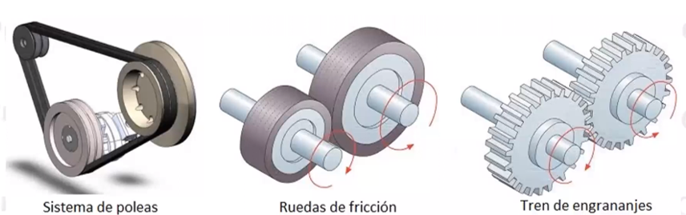
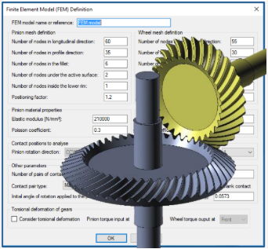
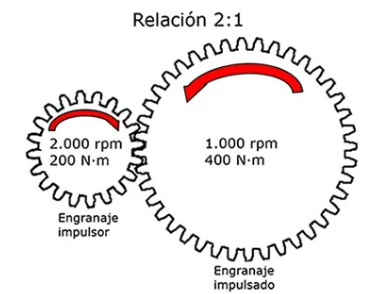
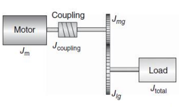

# Elementos de Transmisión
Esta clase se llevó a cabo el día 3 de abril de 2025, la cual estuvo dirigida a comprender los sistemas de transmisión, abordando temas como el diseño de transmisión, los sistemas de engranajes, así como los conceptos de inercia y torque reflejado, fundamentales para el análisis y optimización del movimiento en sistemas mecánicos.

## 1. ¿Que es un sistema de Transmisión?
>🔑 *Sistema de Transmision:* Un sistema de transmisión es un conjunto de elementos mecánicos que transfieren potencia desde una fuente de energía, como un motor, hacia un componente receptor, controlando velocidad, torque y dirección del movimiento.
>

Los diseños de transmisión son fundamentales porque permiten adaptar la potencia generada por un motor a las necesidades específicas de una máquina o sistema. A través del diseño adecuado, se puede controlar la velocidad, el torque y la eficiencia del movimiento, optimizando el rendimiento general del mecanismo. Esto es especialmente importante en aplicaciones donde se requiere precisión o donde las condiciones de carga varían constantemente, como en la robótica, la manufactura o los vehículos eléctricos.

Además, un buen diseño de transmisión contribuye a la durabilidad y seguridad del sistema. Al seleccionar correctamente componentes como engranajes, correas o cadenas, se minimizan las pérdidas de energía y se reducen los esfuerzos mecánicos innecesarios, lo que alarga la vida útil de los equipos. También permite prever y compensar factores como la inercia o las vibraciones, haciendo que el funcionamiento sea más estable y confiable incluso en condiciones exigentes.
Los perfiles son esenciales porque definen de forma precisa la trayectoria, la velocidad y la aceleración que debe seguir un sistema para moverse de un punto a otro. Esto permite programar transiciones suaves y evitar movimientos bruscos, lo que reduce el desgaste mecánico y mejora la precisión. Ajustar estos parámetros es clave para adaptar el comportamiento del sistema a diferentes condiciones o tareas, facilitando la corrección en tiempo real de desviaciones y asegurando un rendimiento óptimo y seguro en aplicaciones tan diversas como la robótica, la manufactura, etc.

Figura 1. Sistemas de transmision por poleas.

La importancia de los diseños de transmisión también está estrechamente relacionada con los perfiles de movimiento, ya que estos determinan cómo varía la velocidad y aceleración a lo largo del tiempo en un sistema mecánico. Un diseño de transmisión bien ajustado permite seguir de manera precisa el perfil de movimiento deseado, lo cual es esencial en aplicaciones donde se requiere un control exacto, como en sistemas automatizados o maquinaria de alta precisión.

Al incorporar los perfiles de movimiento en el diseño de transmisión, se logra una correspondencia precisa entre las exigencias dinámicas del sistema y la respuesta mecánica de sus componentes. Esta integración permite controlar de forma más efectiva la aceleración, el desaceleramiento y la estabilidad del movimiento, lo que resulta en una operación más eficiente y fluida. Además, una transición cuidadosamente diseñada entre distintas fases del movimiento minimiza picos de carga y esfuerzos transitorios, reduciendo significativamente la fatiga y el desgaste prematuro de los elementos mecánicos. Esto no solo prolonga la vida útil del sistema, sino que también garantiza un desempeño más confiable en condiciones variables o exigentes, donde pequeñas desviaciones en el perfil de movimiento pueden traducirse en fallas críticas o pérdidas de precisión operativa.

## 2. Diseño de Transmisión

En el diseño de sistemas de transmisión, uno de los requerimientos fundamentales es garantizar que el torque proporcionado por el motor, incluso a su máxima velocidad, sea mayor al exigido por la aplicación. Esto no solo asegura un funcionamiento eficiente, sino que previene el sobreesfuerzo del motor ante condiciones variables o inesperadas. Para ello, se recomienda siempre incorporar un margen de seguridad, que actúe como una reserva de capacidad ante incrementos imprevistos de carga o pérdidas por fricción. Asimismo, es crucial mantener una relación adecuada de inercia entre el motor y la carga, ya que una inercia mal equilibrada puede generar respuestas lentas, inestabilidad en el control del sistema y desgaste acelerado de los componentes.

Figura 2. Software para diseño de Transmisiones.

No atender correctamente estos requerimientos puede derivar en diversos problemas de diseño en las transmisiones. Por ejemplo, un motor subdimensionado puede operar constantemente cerca de sus límites, elevando su temperatura y reduciendo su vida útil. De igual forma, una mala gestión de la inercia puede causar oscilaciones o vibraciones indeseadas, afectando la precisión del sistema, especialmente en aplicaciones que requieren alta repetibilidad o ciclos de tiempo muy controlados. Además, ignorar aspectos como el costo, la facilidad de mantenimiento o la compatibilidad entre componentes puede traducirse en soluciones poco sostenibles, tanto en términos técnicos como económicos. Por ello, el diseño de una transmisión debe abordarse de forma integral, considerando no solo los parámetros mecánicos, sino también el contexto operativo completo del sistema.

### Inercia y Torque reflejado

>🔑 *Inercia:* s una medida de la fuerza que causa un giro o rotación alrededor de un eje. Depende de la magnitud de la fuerza y la distancia desde el punto de aplicación al eje de rotación.
>

>🔑 *Torque:* es la fuerza aplicada a una distancia del eje de rotación, que genera un movimiento giratorio. Se expresa en Newton-metro (Nm) y determina la capacidad para hacer girar un objeto alrededor de un eje.
>

En el contexto del diseño de sistemas de transmisión y control de movimiento, la inercia juega un papel esencial al representar la resistencia de un cuerpo a los cambios en su velocidad angular. De acuerdo con las leyes de Newton, esta propiedad es la contraparte rotacional de la masa en los sistemas lineales. En aplicaciones de control, tanto rotacionales como lineales, se hace referencia a la inercia para describir la dificultad que tiene el sistema para acelerar o desacelerar. Esta característica influye directamente en la capacidad del motor para seguir un perfil de movimiento con precisión, ya que una inercia mal dimensionada puede provocar retrasos en la respuesta, oscilaciones o incluso pérdida de control.

El concepto de torque reflejado está estrechamente ligado a la inercia y al diseño de transmisión. A través de un sistema de engranajes o cualquier medio de acoplamiento mecánico, la carga externa impone una resistencia que es "reflejada" hacia el motor, y esta resistencia incluye tanto el torque como la inercia equivalente. Si esta carga reflejada es demasiado alta respecto a la capacidad del motor, el sistema no podrá seguir adecuadamente el perfil de movimiento programado, comprometiendo el rendimiento del control y la eficiencia energética. Por ello, es fundamental ajustar las relaciones de transmisión para adecuar el valor de inercia reflejada, logrando un equilibrio entre rapidez de respuesta y estabilidad del sistema.

Por leyes de Newton el comportamiento es:

$$
∑T = Jα
$$

Desde el punto de vista del control de movimiento, el manejo adecuado de la inercia y el torque reflejado permite un seguimiento más preciso de los perfiles de velocidad, aceleración y posición, aspectos críticos en sistemas automatizados de alta exigencia como robots industriales, CNC o impresoras 3D. Un diseño optimizado facilita que el controlador aplique los comandos de forma más efectiva, minimizando errores y mejorando la dinámica general del sistema. En resumen, la comprensión y correcta aplicación de estos conceptos no solo aseguran el funcionamiento mecánico, sino también la fidelidad en la ejecución del perfil de movimiento deseado.

## 3. Conceptos de transmisión Engranajes

### Relacion de Engranajes

Una relación de engranajes es una medida que describe cómo se transmite el movimiento entre dos o más engranajes, en función de sus tamaños y número de dientes. Es un concepto fundamental en la ingeniería mecánica, pues determina la velocidad de rotación y la fuerza aplicada a través de los engranajes. La relación de engranajes se define generalmente como la razón entre el número de dientes de los engranajes involucrados, y tiene un impacto directo en la eficiencia de las máquinas. Dependiendo de cómo estén conectados los engranajes, esta relación puede ser de aumento o reducción de velocidad, lo que influye en la funcionalidad y rendimiento de sistemas complejos como motores, transmisiones o mecanismos de reloj.

Figura 3. Relación de Engranajes.

Una de las propiedades clave de las relaciones de engranajes es que permiten alterar la velocidad y el par motor en un sistema mecánico sin necesidad de modificar directamente los motores. En una relación de engranajes reductora, el engranaje conductor (el que está impulsando el sistema) tiene más dientes que el engranaje conducido, lo que resulta en una disminución de la velocidad de salida pero un aumento en el par motor. Por el contrario, una relación multiplicadora aumenta la velocidad de salida, pero a costa de reducir el par motor. Estas relaciones son cruciales para optimizar el funcionamiento de vehículos, maquinaria industrial y dispositivos que requieren control preciso sobre la velocidad y fuerza de movimiento.

Desde una perspectiva más técnica, el diseño de una relación de engranajes involucra factores como la geometría de los engranajes (módulo, diámetro de paso, y ángulos de presión), la precisión en el corte de dientes, y la sincronización de los engranajes para evitar deslizamientos y desgastes prematuros. En aplicaciones donde se busca alta eficiencia y durabilidad, se deben considerar materiales resistentes al desgaste y al calor, además de una lubricación adecuada para minimizar la fricción. Los avances tecnológicos han permitido crear engranajes más compactos y eficientes, mejorando así la capacidad de las máquinas modernas para operar a mayores velocidades y con mayor fuerza sin comprometer su fiabilidad.

### Inercia Reflejada

La inercia reflejada es un concepto que describe cómo la inercia de un componente en un sistema se traslada o se refleja en otro componente al momento de conectar diferentes partes de un mecanismo, como engranajes o ejes. Este fenómeno se refiere al efecto de la inercia de un cuerpo, como un volante de inercia, cuando se transmite a través de un sistema de transmisión o a otro componente mecánico, afectando la dinámica de todo el sistema.

- Acople directo

$$
T_m = J_{\text{load}} \, \ddot{\theta}_m
$$

- Desplazamiento tangencial

$$
r_l \theta_l = r_m \theta_m
$$

- Acople con engranajes

$$
T_l = J_{\text{load}} \, \ddot{\theta}_l
$$

$$
\frac{\omega_m}{\omega_l} = \frac{r_l}{r_m}
$$

$$
\frac{r_l}{r_m} T_m = J_{\text{load}} \, \ddot{\theta}_l
$$

$$
r_l \ddot{\theta}_l = r_m \ddot{\theta}_m
$$

$$
\frac{r_l}{r_m} T_m = J_{\text{load}} \frac{r_m}{r_l} \ddot{\theta}_m
$$

- Por leyes de Newton

$$
T_m = J_{\text{load}} \left( \frac{r_m}{r_l} \right)^2 \ddot{\theta}_m
$$

$$
T_m = J_{\text{load}} \frac{1}{N_{\text{GB}}^2} \ddot{\theta}_m
$$

$$
J_{\text{ref}} = \frac{J_{\text{load}}}{N_{\text{GB}}^2}
$$

En un sistema de engranajes o de transmisión de potencia, la inercia de un componente puede influir en la velocidad y el comportamiento del sistema. Por ejemplo, si un motor está conectado a una carga a través de engranajes, la inercia reflejada del sistema de carga puede hacer que el motor necesite trabajar más para acelerar o desacelerar el sistema completo. En otras palabras, la inercia de la carga, aunque no forme parte directamente del motor, se "refleja" sobre él, haciendo que el esfuerzo necesario para cambiar su velocidad de rotación aumente.

### Torque Reflejado

De la relación definida anteriormente en inercia reflejada:

$$
\frac{\omega_m}{\omega_l} = \frac{T_l}{T_m}
$$

$$
T_m = \frac{\omega_l}{\omega_m} T_l
$$

$$
T_m = \frac{T_l}{N_{\text{GB}}}
$$

La relación de engranajes también está en el denominador, pero no se eleva al cuadrado.

El torque reflejado es el concepto que describe cómo el par motor (torque) aplicado en un componente de un sistema se "transmite" o "refleja" en otro componente conectado, como un engranaje, eje o carga. Este fenómeno ocurre debido a la relación de transmisión de los componentes del sistema, y refleja cómo las fuerzas se distribuyen en función de las características geométricas de los elementos involucrados, como el número de dientes de los engranajes. Dependiendo de esta relación, el torque experimenta una variación al pasar de un componente a otro, lo que puede aumentar o disminuir en magnitud, afectando el comportamiento dinámico de todo el sistema.

### Eficiencia

>🔑 *Eficiencia:* La eficiencia en control de movimiento se refiere a la capacidad de un sistema para maximizar la conversión de energía en trabajo útil, minimizando las pérdidas de energía durante el proceso de funcionamiento.
>

*Recordando que:*

$$
P = T \cdot \omega
$$

$$
\eta = \frac{P_{\text{output}}}{P_{\text{input}}}
$$

$$
T_l \omega_l = \eta T_m \omega_m
$$

$$
T_m = \frac{T_l}{\eta N_{\text{GB}}}
$$

*Siguiendo la inercia reflejada:*

$$
J_{\text{ref}} = \frac{J_{\text{load}}}{\eta N_{\text{GB}}^2}
$$

### Inercia Total

La inercia total es la medida global de la resistencia que presenta un sistema a los cambios en su estado de movimiento, considerando todos los componentes involucrados. Esta propiedad es la suma de las inercias individuales de cada componente, ponderadas por su distribución en el sistema, es decir, su masa y la distancia de cada masa respecto al eje de rotación o al centro de masa. En sistemas rotacionales, la inercia total se calcula considerando no solo la masa de los componentes, sino también su forma y la ubicación de las masas respecto al eje de rotación. A mayor distancia de la masa respecto al eje, mayor será su contribución a la inercia total.

En aplicaciones prácticas, como en maquinaria o vehículos, la inercia total determina cuánta energía es necesaria para acelerar o desacelerar el sistema. Si un sistema tiene una inercia total alta, se requiere más esfuerzo (torque) para cambiar su velocidad de rotación, lo que implica mayor consumo de energía y tiempo. Por el contrario, una inercia total baja facilita los cambios rápidos en el movimiento, pero puede resultar en un sistema menos estable o más susceptible a fluctuaciones de velocidad. Por lo tanto, comprender y controlar la inercia total es fundamental para diseñar sistemas eficientes y bien equilibrados, optimizando tanto su rendimiento como su consumo energético.

- Lo recomendable es reflejar toda la inercia hacia el eje del motor, de tal manera que:

$$
J_{\text{total}} = J_m + J_{\text{on motor shaft}} + J_{\text{ref}}
$$

- Donde:
  - $$J_m$$: Inercia del eje del motor (según datasheet)
  - $$J_{\text{on motor shaft}}$$: Inercia del acople y transmisión
  - $$J_{\text{ref}}$$: Inercia reflejada desde la carga

💡**Ejemplo 1:**

Para el Sistema de la figura encuentre la inercia total vista en el eje del motor

Figura 4. Ejemplo 1.

$$
J_{\text{total}} = J_m + J_{\text{on motor shaft}} + J_{\text{ref}}
$$

$$
J_{\text{on motor shaft}} = J_{\text{coupling}} + J_{mg}
$$

$$
J_{\text{ref}} = \frac{1}{\eta N_{\text{GB}}^2} \left[ J_{lg} + J_{\text{load}} \right]
$$

$$
J_{\text{total}} = J_m + J_{\text{coupling}} + J_{mg} + \frac{1}{\eta N_{\text{GB}}^2} \left[ J_{lg} + J_{\text{load}} \right]
$$

Figura 5. Ejemplo 1.

## 2. Ejes de Movimiento
>🔑 *Ejes de Movimiento:* En el control de movimiento y la automatización, los ejes de movimiento (o motion axes en inglés) son las direcciones en las que una máquina o sistema puede moverse. Cada eje representa un grado de libertad. Por ejemplo, un robot industrial con tres ejes lineales puede moverse hacia adelante y atrás (eje X), de un lado a otro (eje Y) y arriba y abajo (eje Z). Además de los movimientos lineales, también existen ejes rotacionales, que permiten que un sistema gire alrededor de un eje en lugar de solo desplazarse.

💡**Ejemplo 2:**

Figura 2. Axis en máquina CNC.

## 3. Control de Movimiento con el pasar del tiempo
Antes de los sistemas digitales modernos, el control de movimiento se realizaba principalmente mediante métodos mecánicos y análogos en donde se usaban sistemas de engranajes, levas, poleas y palancas para crear movimientos precisos, como en los relojes antiguos o las cajas de música. También se empleaban sistemas hidráulicos y neumáticos que utilizaban la presión de líquidos o aire para mover maquinaria industrial, eran principlamnete diseñados por la ingeniería industrial y mecánica.

💡**Ejemplo 3:**

Figura 3. Bobinadora de cables y láminas de alta tensión y baja tensión serie 400, Broomfield.

## 4. Control de Movimiento en la actualidad
El control de movimiento en la actulaidad es electronico, el cual permite que coordine y gestione todos los elementos del sistema para lograr que cada eje se mueva de manera sincronizada y exacta. En un sistema completo se integran varios componentes que trabajan en conjunto, y a continuación se describen de forma sencilla:

- Interfaz Hombre-Máquina (HMI)

>🔑 *Interfaz Hombre-Máquina (HMI):* Es el punto de conexión entre el operador y el sistema. A través de esta interfaz, el usuario puede programar, ajustar y supervisar el comportamiento de la máquina, facilitando la configuración y el monitoreo en tiempo real.

💡**Ejemplo 4:**

Figura 4. HMI Siemens. 

- Controlador de Movimiento
  
>🔑 *Controlador de Movimiento:* Este es el "cerebro" del sistema. Se encarga de procesar las instrucciones de la HMI y ejecutar algoritmos de control que determinan las trayectorias y velocidades de cada eje. Gracias a su capacidad de procesamiento en tiempo real, puede corregir desviaciones y asegurar que los movimientos sean precisos. Posee CPU, salidas de potencia, entradas para sensores y puertos de comunicacion.

💡**Ejemplo 5:**

Figura 5. Controlador de Movimiento Linmot.

- Drivers de Potencia

>🔑 *Driver de Potencia:* Son intermediarios entre el controlador y los actuadores. Estos dispositivos amplifican las señales de control para que sean capaces de mover los actuadores con la fuerza y precisión necesarias. Funcionan controlando la corriente y el voltaje que se suministran a los motores o servomotores, permitiendo así un manejo fino de la velocidad y el par motor. Su correcto funcionamiento es clave para traducir las órdenes del controlador en acciones mecánicas efectivas.

💡**Ejemplo 6:**

Figura 6. Driver de Potencia Yaskawa serie Sigma.

- Actuadores

>🔑 *Actuadores:* Son los dispositivos físicos (como motores eléctricos o servomotores) que transforman las señales del controlador en movimientos reales. Su rapidez y precisión son fundamentales para cumplir con las demandas de alta velocidad y precisión del sistema.

💡**Ejemplo 7:**

Figura 7. Servomotores DC.

- Mecanismos de Transmisión

>🔑 *Mecanismos de Transmisión:* Estos elementos, como engranajes, correas o husillos, se encargan de transmitir el movimiento generado por los actuadores a las partes mecánicas del sistema. Su diseño y precisión determinan en gran medida la exactitud con la que se mueve cada eje.

💡**Ejemplo 8:**

Figura 8. Sistemas de transmisión.

- Sensores

>🔑 *Sensores:* Los sensores son esenciales para el control de movimiento, ya que proporcionan la retroalimentación necesaria para ajustar y corregir el funcionamiento del sistema en tiempo real. Con estos datos, el controlador de movimiento puede ajustar de manera dinámica las señales enviadas a los drivers y actuadores, corrigiendo errores y asegurando que el sistema mantenga la sincronización y precisión esperadas. Los sensores pueden incluir encoders, tacómetros, y otros dispositivos de medición que monitorean continuamente el estado del sistema.

💡**Ejemplo 9:**

Figura 9. Sensor encoder Allen-Bradley.

## 5. Control Cascada

### Esquema de Control Cascada

Figura 10. Diagrama de bloques control cascada.

La figura 10 representa un sistema de control en cascada.

- **Primer controlador (bucle externo)**:  
  - Observa la salida real del proceso (lo que en verdad está pasando) y la compara con la meta o referencia (lo que queremos lograr).  
  - A partir de esa comparación, genera una señal que servirá como la referencia para el segundo controlador.

- **Segundo controlador (bucle interno)**:  
  - Toma la señal del primer controlador como su entrada principal.  
  - Se encarga de controlar directamente una variable interna del proceso, ajustándola rápido cuando ocurren cambios o perturbaciones.

- **Proceso**:  
  - Es el sistema físico que queremos manejar (por ejemplo, un motor, un tanque o un horno).  
  - Su salida se envía de vuelta al primer controlador, cerrando el lazo externo de retroalimentación.

En pocas palabras, el **bucle interno** corrige y estabiliza de manera rápida una variable intermedia (como la velocidad de un motor), mientras que el **bucle externo** se ocupa de la variable final que realmente nos importa (como la posición del eje o el nivel en un tanque). Este enfoque “en cascada” hace que el sistema sea más estable y preciso.

## 6. Ejercicios

### 📚Ejercicio 1:

Figura 11. Máquina de Clasificación de Huevos Zenyer.

#### Componentes:

- HMI: Teach Pendant.
- Control de Movimiento: Controller Box.
- Driver de Potencia: Integrado junto a los motores.
- Actuadores: Motores tipo  Brushless.
- Sistema de Transmisión: Reducción de engranajes.
- Sensores: Presencia, posicion, torque, corriente, seguridad.

## 7. Aplicaciones en diversas Industrias

__- Empaque y Paletizado__
  

Figura 12. Planta de empaque y paletizado.

__- Ensamble de PCB__
  

Figura 13. Diagrama de bloques control cascada.

__- Etiquetado__
  

Figura 14. Máquina de Etiquetado.

## 8. Conclusiones
Se observa que el control de movimiento ha evolucionado significativamente, pasando de sistemas mecánicos y analógicos, que dependían de mecanismos físicos como engranajes, levas y poleas, a soluciones digitales y electrónicas que permiten un control mas preciso de parámetros críticos como la posición, velocidad, aceleración y torque. Esta transformación ha posibilitado la implementación de estrategias de control más sofisticadas, como el control en cascada, que divide el proceso en bucles internos y externos para corregir rápidamente las perturbaciones y mantener la estabilidad del sistema. La integración de algoritmos de procesamiento en tiempo real ha mejorado la capacidad de respuesta y la adaptabilidad, facilitando la optimización de procesos en aplicaciones industriales complejas. Además, es importante destacar la importancia de la convergencia de diversos componentes tecnológicos en el control de movimiento moderno. La incorporación de interfaces hombre-máquina (HMI), controladores avanzados, drivers de potencia, actuadores precisos, mecanismos de transmisión y sensores ha permitido no solo la supervisión en tiempo real, sino también ajustes continuos y la corrección dinámica de errores. Este enfoque integrado garantiza una operación más eficiente, flexible y segura, satisfaciendo las demandas de industrias tan variadas como el embalaje, ensamblaje, etiquetado y fabricación de semiconductores, y posicionando el control de movimiento como un pilar fundamental en la automatización industrial actual.

## 9. Referencias  
- [1] *H. Goldstein, C. Poole, and J. Safko, Classical Mechanics, 3rd ed. San Francisco, CA, USA: Addison-Wesley, 2002.*
- [2] *R. Kelly, V. Santibáñez, and A. Loria, Control of Robot Manipulators in Joint Space, Springer, 2005*
- [3] *E.P.2.Control digital y de Mov. Aulas Ecci. [2025]*
- [4] *Apuntes Clase - Jueves 3 de Abril. [2025]*
- [5] *M. Gopal, Digital Control and State Variable Methods, 4th ed. New Delhi, India: McGraw-Hill Education, 2012.*
- [6] *M. Alonso and E. J. Finn, Fundamental University Physics: Volume 1 - Mechanics, 2nd ed. Reading, MA, USA: Addison-Wesley, 1973*
- [7] *K. Ogata, Discrete-Time Control Systems, 2nd ed. Upper Saddle River, NJ, USA: Prentice Hall, 1995.*
