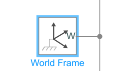
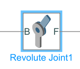
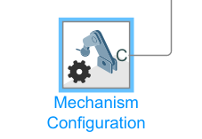
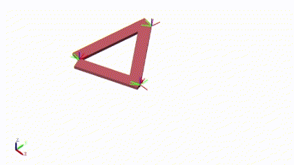

# Simscape Multibody - Mecanismos

Para la clase de hoy se presenta continua el tema del modelado de esalabones y mecanismo en el software Simscpae Multibody, el cual es una herramienta dentro de MATLAB y Simulink que permite modelar y simular sistemas mecánicos tridimensionales de forma visual y dianmica. Está pensada para representar mecanismos complejos como robots, vehículos, grúas, estructuras articuladas o cualquier sistema que involucre cuerpos rígidos en movimiento, uniones, actuadores y sensores.

## 1. Ejercicios

### 📚Ejercicio 1:
El primer ejercicio fue un mecanismo que está compuesto por tres sólidos rígidos que forman un triángulo cerrado, con tres articulaciones revolutas que permiten que los eslabones giren entre sí. Al ser impulsado desde uno de sus vértices, se genera un movimiento rotacional continuo en una de las barras, lo que obliga a las otras dos a seguir un movimiento coordinado, preservando la forma triangular del conjunto. Este tipo de movimiento se conoce como movimiento de rotación acoplada, en donde todos los eslabones están unidos de tal manera que la rotación de uno condiciona el movimiento de los demás; uno de los eslabones actúa como manivela, otro como eslabón acoplador y el último como balancín.

- World Frame: Define el sistema de coordenadas global (referencia absoluta) desde el cual se mide la posición y orientación de todos los cuerpos del modelo.

Figura 1. World Frame.

- Solver Configuration: Bloque obligatorio que permite al simulador resolver las ecuaciones físicas del sistema. Controla aspectos como el tipo de solver, tolerancia numérica y configuración local/global del solver.

Figura 2. Solver Configuration.

- Revolute Joints: Articulaciones que permiten la rotación relativa entre dos cuerpos alrededor de un eje. En el modelo se usan para conectar las piezas entre sí y al marco global.

Figura 3. Revolute Joint.

- Mechanism Configuration: Se utiliza para ajustar propiedades globales del entorno de simulación física de Simscape Multibody. Específicamente, te permite definir cómo se gestionan ciertos aspectos clave del modelo, como el manejo de los sensores, la visualización del entorno 3D, la gravedad y otras opciones avanzadas que afectan el comportamiento del mecanismo completo.

Figura 4. Mechanism Configuration.

- Solid Blocks: Representan cuerpos rígidos tridimensionales que forman parte de un sistema mecánico. Estos bloques son fundamentales para construir modelos físicos realistas, ya que permiten definir las propiedades físicas de los objetos que se van a simular, como su forma, masa, color, momento de inercia y posición relativa respecto a otros componentes del sistema.

Figura 5. Solid Blocks.

- Fuerza Externa (`f(x) = 0`): Fuente de fuerza aplicada al sistema, que puede ser modificada para estudiar la respuesta dinámica ante diferentes excitaciones.

- Joint Sensor: Mide variables físicas en las articulaciones (como posición angular, velocidad o torque) y entrega esos datos a bloques de visualización.

- Scope: Muestra en tiempo real los resultados de la simulación, permitiendo visualizar las variables medidas por el sensor.

Figura 6. Ejemplo 1 Simulacion Mecanismo.

Figura 7. Ejemplo 1 Diagrama de Bloques.

Para la realización de este ejercicio se hizo siguiendo estos patrametros:
- Modelado de los sólidos (Solid Blocks): Cada uno de los tres eslabones se representa con bloques tipo Solid, en los que se definen dimensiones físicas, color, masa y eje de referencia.

- Configuración del sistema de coordenadas: Se añade un bloque de World Frame para definir el sistema de referencia global. Además, cada articulación se alinea con los extremos de los sólidos mediante bloques de Rigid Transform, para asegurar la correcta orientación espacial.

- Articulaciones (Revolute Joints): Entre cada par de sólidos se colocan Revolute Joints, permitiendo la rotación relativa entre ellos. Estas juntas se configuran para estar alineadas con los extremos de los eslabones.

- Actuación del sistema
Uno de los Revolute Joints recibe una entrada de torque constante o señal periódica, aplicada mediante un bloque de actuador. Esto induce el movimiento que se propaga al resto del mecanismo.

- Gravedad y entorno físico: Se activa la gravedad en el eje deseado, lo que afecta el comportamiento dinámico del sistema. El movimiento resultante puede ser influenciado por el peso de los eslabones.

### 📚Ejercicio 2:

El segundo ejercicio se el solido realiza un movimiento oscilante lineal en una sola dirección, empujado hacia adelante y hacia atrás. Esto se debe a la entrada senoidal que modifica la posición de la articulación prismática a lo largo del tiempo. Como resultado, el sólido sigue esa señal de entrada desplazándose dentro de los límites definidos por la amplitud de la onda.

Figura 8. Ejemplo 2 Diagrama de Bloques.

Figura 9. Ejemplo 2 Simulacion Mecanismo.

## 5. Conclusiones

- La aplicación de señales a través de actuadores en joints  demuestra cómo Simscape Multibody unifica la especificación de trayectorias deseadas con el cálculo automático de fuerzas y torques internos. Esto facilita evaluar no solo si un mecanismo alcanza la posición deseada, sino también el esfuerzo real necesario para hacerlo.
- La integracion de perfiles de movimiento en Simscape Multibody junto con controladores desarrollados en Simulink establece un flujo de trabajo dinamico por el cual se diseña un perfil, se simula, se mide el error, se ajusta el controlador y se valida de nuevo. Esta metodología reduce el tiempo de desarrollo de sistemas mecatrónicos al permitir validar estrategias de control, asegurando que el perfil de movimiento se cumpla bajo condiciones reales de carga y dinámica acoplada.
- En mecanismos de múltiples eslabones, un perfil de movimiento aplicado en una articulación genera reacciones dinámicas en las juntas adyacentes. El análisis de los torques de reacción y las fuerzas internas revela la distribución de cargas a lo largo del sistema, información crucial para el dimensionamiento estructural y la selección de componentes mecánicos adecuados segun la necesidad (rodamientos, ejes, servomotores).
- La herramienta Matlab Simulink, permite simular diversos mecanismo, en esta clase se pudo analizar que mientras la articulación revoluta convierte un torque o gravedad en un movimiento pendular, la prismática traduce directamente el perfil de posición en un desplazamiento lineal. El análisis comparativo de ambos casos revela las diferencias en respuesta dinámica (inercia rotacional; inercia traslacional) y en la necesidad de dimensionar actuadores distintos según el tipo de movimiento.
- La representación visual y modular de mecanismos quer permite el software Simscape Multibody por medio de los perfiles de movimiento facilita la enseñanza de conceptos de cinemática, dinámica y control en entornos académicos e industriales, acelerando el aprendizaje y la adopción de buenas prácticas de modelado y simulación que son muy comunes y de vital imporatncia en la ingenieria. 

## 6. Referencias
[1] MathWorks, Simscape Multibody [2025]
[2] E.P.2.Control digital y de Mov. Aulas Ecci. [2025]
