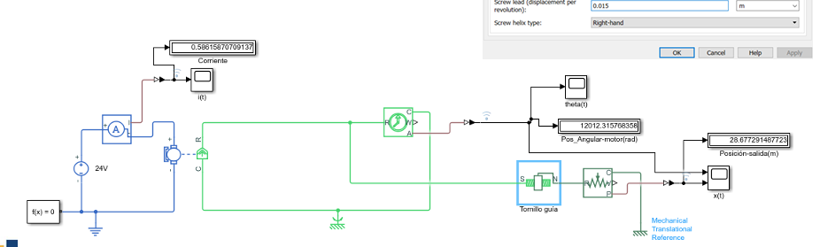
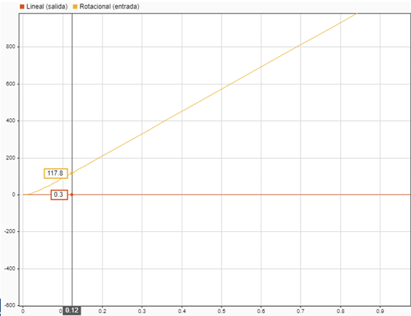
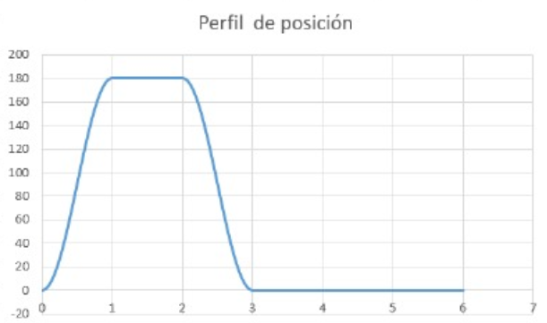
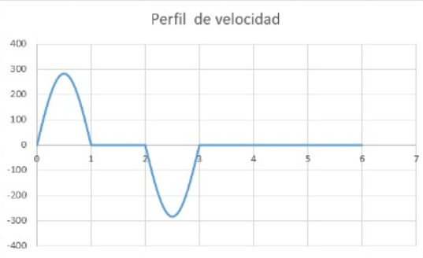

# ADRC
Esta clase se llevó a cabo el día 13 de Mayo de 2025, 

## 1. ADRC

>🔑 *ADRC:* es una técnica de control desarrollada para enfrentar una de las mayores limitaciones en el diseño de controladores, la cual es la necesidad de conocer de forma precisa el modelo matemático de la planta

ADRC se basa en el marco de espacio de estados, lo que le permite representar dinámicamente el comportamiento del sistema utilizando un conjunto de variables de estado, pero introduce un elemento innovador: el observador de estados extendido (ESO).

A diferencia de los observadores convencionales como el de Luenberger que solo estiman los estados internos del sistema, el ESO incorpora como estado adicional una representación de la "perturbación total". Esta perturbación total no es simplemente ruido externo, sino una combinación de múltiples factores: perturbaciones externas reales, errores de modelado, incertidumbre paramétrica, y sobre todo, dinámica no modelada (por ejemplo, no linealidades que no fueron incluidas en el modelo). El observador entonces estima esta perturbación total en tiempo real y la entrega al controlador para que pueda cancelarla activamente en su acción de control.

Desde el punto de vista conceptual, esto convierte al ADRC en un controlador adaptativo generalizado, ya que no necesita conocimiento exacto de las ecuaciones diferenciales del sistema. El diseño del controlador se reduce a conocer:

El orden del sistema, es decir, el número de derivadas necesarias para describir la dinámica de salida.

La ganancia estática (o ganancia crítica), que puede ser constante o incluso una función, pero que no necesita conocerse con precisión.

Por tanto, el ADRC externaliza la complejidad del sistema en el observador, lo que permite controlar sistemas lineales, no lineales, con parámetros variables e incluso con estructuras desconocidas de manera eficaz.

Figura 1. Gao Zhiqiang.

Zhiqiang Gao es un investigador clave en el desarrollo del Active Disturbance Rejection Control (ADRC), un enfoque de control que busca mejorar la estabilidad y precisión de sistemas dinámicos sin depender de modelos matemáticos exactos

### Principales características del ADRC

#### 1. Independencia del modelo riguroso

El ADRC no requiere un modelo detallado de la planta. Solo necesita:

- El orden del sistema (número de derivadas de salida).
- La ganancia crítica o estática (relación entre entrada y salida).

Incluso si la ganancia es variable (como en sistemas no lineales), esta se integra como parte de la perturbación total.

#### 2. Agrupación de perturbaciones y no linealidades

Todo lo desconocido del sistema se agrupa en una o dos variables de estado adicionales estimadas por el ESO. Esto incluye:

- Perturbaciones externas
- Modelado incompleto
- No linealidades

Este enfoque reduce significativamente la carga de modelado y facilita el control.

#### 3. Comportamiento integrador natural del sistema

En el ADRC, el error de seguimiento es parte de la perturbación estimada, lo que significa que no se requiere acción integral explícita para eliminar el error permanente. El controlador se encarga automáticamente de este comportamiento gracias al diseño del observador.

### Importancia de ADRC

El ADRC responde a uno de los desafíos más persistentes del control automático: la incertidumbre del modelo. En muchos sistemas reales tales como robótica, procesos industriales,etc en donde modelar con precisión es costoso o inviable. El ADRC:

- Permite prescindir de modelos detallados, reduciendo costos de ingeniería.
- Compensa activamente cambios en la dinámica del sistema.
- Funciona bien bajo condiciones cambiantes o desconocidas.
- Tiene un diseño simple, con ganancias proporcionales y ubicación de polos.
- Se implementa fácilmente, lo cual lo hace ideal tanto en investigación como en la industria.

## Diferencias con otros métodos de control

| Aspecto                           | PID Tradicional                      | Control Basado en Modelo (LQR, MPC) | ADRC                                      |
|-----------------------------------|--------------------------------------|--------------------------------------|-------------------------------------------|
| **Dependencia del modelo**        | Alta                                 | Muy alta                             | Muy baja (solo orden y ganancia estimada) |
| **Gestión de perturbaciones**     | Reactiva (acción integral)           | Requiere modelarlas explícitamente  | Activa y en tiempo real                   |
| **Capacidad frente a no linealidades** | Limitada a un rango lineal         | Requiere linealización o modelos complejos | Naturalmente absorbidas por el observador |
| **Rechazo de incertidumbre**      | No explícito                         | Requiere robustez o adaptabilidad   | Sí, a través del ESO                       |
| **Diseño e implementación**       | Empírico, por prueba y error         | Matemáticamente complejo             | Sistemático y proporcional                |
| **Comportamiento integrador**     | Requiere término I                   | Según diseño                         | Surge naturalmente del modelo             |

💡**Ejemplo 1:**

Simulación Tornillo Guía Simulink:

Figura 4. Ejemplo 1.

Resultados:

Figura 5. Resultados Ejemplo 1.

La conversión de desplazamiento angular a lineal se puede expresar como:

$$
117.8 \, \text{rad} \cdot \frac{1 \, \text{rev}}{2\pi \, \text{rad}} \cdot 0.015 = 0.28 \, \text{m}
$$

### Inercia Reflejada

La inercia reflejada es un concepto que describe cómo la inercia de un componente en un sistema se traslada o se refleja en otro componente al momento de conectar diferentes partes de un mecanismo, como engranajes o ejes. Este fenómeno se refiere al efecto de la inercia de un cuerpo, como un volante de inercia, cuando se transmite a través de un sistema de transmisión o a otro componente mecánico, afectando la dinámica de todo el sistema.

La inercia reflejada en un tornillo guía es una forma de expresar cómo la masa lineal de una carga se traduce en una resistencia al cambio de velocidad angular del motor que mueve el tornillo. En otras palabras, aunque la carga se desplaza de forma lineal, esa masa genera un efecto inercial que se "refleja" en el eje del motor como si fuera una masa rotacional. Esto es importante porque el motor no solo necesita superar la fricción o el peso, sino también la inercia que representa esa masa al convertir el movimiento de rotación en movimiento lineal.

- Sabiendo que la carga tiene un movimiento lineal, su energía cinética sería:

$$
KE = \frac{1}{2} m \dot{x}^2
$$

- A partir de la relación de transmisión: $$\frac{\dot{\theta}}{\dot{x}} = 2 \pi p$$  se puede reemplazar en la expresión de energía cinética:

$$
KE = \frac{1}{2} m \frac{1}{(2\pi p)^2} \dot{\theta}^2
$$

- Ahora se tiene la energía cinética en términos de la velocidad angular, por lo tanto, el término que multiplica la velocidad es la inercia reflejada:

$$
J_{ref} = \frac{m}{(2\pi p)^2} = \frac{m}{N_s^2}
$$

### Inercia Reflejada Total

$$
m = \frac{W_L + W_C}{g}
$$

Donde:
- m = Masa Total
- $$W_C$$ = Cama

$$
J_{\text{ref}}^{\text{trans}} = J_{\text{screw}} + J_{\text{load} \rightarrow \text{in}} + J_{\text{carriage} \rightarrow \text{in}} = J_{\text{screw}} + \frac{1}{\eta N_S^2} \left( \frac{W_L + W_C}{g} \right)
$$

La inercia reflejada total es la equivalente inercial que ve el motor cuando tiene que mover no solo su propio eje, sino también todos los componentes mecánicos conectados mediante mecanismos de transmisión (como tornillos guía, engranajes, poleas, etc.).

En otras palabras, es la suma de:

- La inercia propia del tornillo u otro componente rotatorio conectado directamente al motor.
- La inercia equivalente de las masas lineales (como la carga útil y la cama móvil), convertida a una forma rotacional, considerando la eficiencia del sistema y la relación de transmisión.

$$
J_{\text{ref}}^{\text{trans}} = J_{\text{screw}} + \frac{1}{\eta N_S^2} \left( \frac{W_L + W_C}{g} \right)
$$

Donde:

- $$\(J_{\text{ref}}^{\text{trans}}\)$$ : Inercia reflejada total al motor  
- $$\(J_{\text{screw}}\)$$ : Inercia del tornillo  
- $$\(W_L, W_C\)$$ : Pesos de la carga y la cama (carro móvil)  
- $$\(g\)$$ : Aceleración de la gravedad  
- $$\(\eta\)$$ : Eficiencia del sistema de transmisión  
- $$\(N_S\)$$ : Relación de paso del tornillo

Esta inercia es fundamental en el diseño y control de sistemas mecatrónicos, ya que influye directamente en la aceleración, el torque requerido y la estabilidad del sistema.

### Torque Reflejado

## Cálculo de la Fuerza Externa y el Torque Reflejado

La fuerza externa total que debe vencer el sistema incluye la fricción, la componente gravitacional y cualquier fuerza aplicada externamente:

$$
F_{\text{ext}} = F_f + F_g + F_p
$$

Donde:

- $$\(F_f = \mu (W_L + W_C) \cos \beta\)$$: fuerza de fricción  
- $$\(F_g = (W_L + W_C) \sin \beta\)$$: componente de fuerza gravitacional  
- $$\(F_p\)$$: fuerza externa adicional

Por lo tanto, la fuerza total queda:

$$
F_{\text{ext}} = F_p + (W_L + W_C)(\sin \beta + \mu \cos \beta)
$$

Si el sistema se encuentra en posición horizontal, entonces $$\(F_g = 0\)$$.

Ahora, para calcular el torque reflejado al motor debido a la carga, se puede utilizar el trabajo realizado:

Desde la rotación:

$$
\text{Work} = F_{\text{ext}} \cdot \frac{1}{2\pi p} \cdot \Delta \theta
$$

Desde el desplazamiento lineal:

$$
\text{Work} = F_{\text{ext}} \cdot \Delta x
$$

Igualando ambos trabajos:

$$
\text{Work} = T_{\text{load} \rightarrow \text{in}} \cdot \Delta \theta
$$

Por lo tanto, el torque reflejado al motor es:

$$
T_{\text{load} \rightarrow \text{in}} = \frac{F_{\text{ext}}}{N_S}
$$

Si se considera la eficiencia del sistema:

$$
T_{\text{load} \rightarrow \text{in}} = \frac{F_{\text{ext}}}{\eta N_S}
$$

Donde:
- $$\(\mu\)$$: coeficiente de fricción  
- $$\(W_L, W_C\)$$: pesos de la carga y la cama  
- $$\(\beta\)$$: ángulo de inclinación  
- $$\(N_S\)$$: relación de paso del tornillo  
- $$\(\eta\)$$: eficiencia mecánica del sistema

💡**Ejemplo 2:**

Una carga de 50 kg debe ser posicionada usando un tornillo esferado de acero. El tornillo tiene una densidad de 0.14 kg/cm³, un diámetro de 0.182 cm y una longitud de 36 cm. El paso del tornillo es de 0.75 cm por revolución y el sistema tiene una eficiencia del 90%. Además, el carro que sostiene la carga pesa 0.23 kg. Con esta información, se solicita calcular la inercia reflejada por la transmisión hacia su eje de entrada.

Solución:

- La inercia reflejada sería:

$$ J_{ref}^{trans} = J_{screw} + J_{load \rightarrow in} + J_{carriage \rightarrow in} $$

$$ = J_{screw} + \frac{1}{\eta N_S^2} \left( \frac{W_L + W_C}{g} \right) $$

Resultado: 386 in/s²

- Relación de transmisión
La relación de transmisión es:

$$ N_S = 2 \pi p $$

$$ = 2 \pi \left( \frac{1}{0.75} \right) = 8.38 $$

- Se calcula suponiendo que el tornillo es un cilindro alargado.

$$
J_{\text{ref}}^{\text{trans}} = J_{\text{screw}} + \frac{1}{\eta N_S^2} \left( \frac{W_L + W_C}{g} \right)
$$

- Por lo tanto:

$$
J_{\text{ref}}^{\text{trans}} = 5.42 \times 10^{-8} + \frac{1}{0.9 \cdot 8.38^2} \left( \frac{50 + 0.23}{9.89} \right) = 8.1 \\text{Kgm}
$$

$$
J_{\text{screw}} = \frac{\pi L \rho D^4}{32g}
$$

- Cuando se trabaja en Sistema Inglés

$$
J_{\text{screw}} = \frac{\pi L \rho D^4}{32}
$$

$$
J_{\text{screw}} = \frac{\pi \cdot 0.36 \cdot 140000 \cdot 0.00182^4}{32} = 5.42 \times 10^{-8} \ \text{Kgm}
$$

**Simulación Simscape Multibody:**

Figura 6. Simulación Ejemplo 2.

**Resultados Posición:**

Figura 7. Simulación Posición Ejemplo 2.

**Resultados Velocidad:**

Figura 8. Simulación Velocidad Ejemplo 2.

## 2. Conceptos de Transmisión Piñon - Cremallera

Un mecanismo piñón-cremallera es un sistema que transforma movimiento rotativo en movimiento lineal, y viceversa, mediante el engrane de un piñón con una cremallera. Este mecanismo es ampliamente utilizado en sistemas mecatrónicos por su simplicidad y precisión al generar desplazamientos lineales a partir de motores rotativos, facilitando así la integración con actuadores eléctricos. Su capacidad de convertir la rotación continua del motor en un movimiento lineal controlado lo hace ideal para aplicaciones como ejes de máquinas CNC, brazos robóticos o sistemas de dirección asistida.

Figura 9. Mecanismo Piñon-Cremallera.

El piñón-cremallera permite implementar trayectorias lineales suaves y predecibles, esenciales para lograr movimientos tipo trapezoidal o tipo S, comunes en el diseño de perfiles de velocidad, aceleración y posición. Al vincularse con sistemas de control (como servomotores o controladores PID), se puede garantizar que el movimiento lineal responda con precisión a las órdenes del sistema, cumpliendo requisitos de tiempo, exactitud y dinámica del proceso.

### Relación de Transmisión

La relación de transmisión en un mecanismo piñón-cremallera describe cómo se convierte el movimiento rotacional del piñón en movimiento lineal de la cremallera. Específicamente, esta relación se determina por el radio del piñón: a mayor radio, mayor desplazamiento lineal por cada vuelta del piñón. Matemáticamente, se expresa como: $$N_{RP} = \frac{1}{r_{\text{pinion}}}$$ cuando se trabaja con velocidades angulares en radianes por segundo. Esta relación es fundamental en sistemas mecatrónicos, ya que permite diseñar perfiles de movimiento lineal precisos a partir del control de velocidad rotacional del actuador (motor).

$$
N = \frac{\text{Velocidad motor}}{\text{Velocidad carga}}
$$

$$
V_{\text{rack}} = r_{\text{pinion}} \, \omega_{\text{pinion}}
$$

$$
N_{RP} = \frac{1}{r_{\text{pinion}}}
$$

💡**Ejemplo 3:**

**Simulación Simulink:**

Figura 10. Mecanismo Piñon-Cremallera Simulink.

**Resultados:**

Figura 10. Resultados mecanismo Piñon-Cremallera Simulink.

### Inercia Reflejada

La inercia reflejada en un sistema piñón-cremallera es la inercia equivalente que el motor siente debido a las masas que está moviendo, una vez que se toma en cuenta la conversión del movimiento rotacional a lineal. Es decir, no solo se considera la inercia del piñón que gira, sino también cómo las masas lineales (como la carga o el carro) afectan el esfuerzo que debe hacer el motor, ajustadas por la relación de transmisión del sistema.

La inercia reflejada al motor se calcula como:

$$
J_{\text{ref}}^{\text{trans}} = J_{\text{pinion}} + J_{\text{load} \rightarrow \text{in}} + J_{\text{carriage} \rightarrow \text{in}}
$$

Reemplazando los términos, se tiene:

$$
J_{\text{ref}}^{\text{trans}} = J_{\text{pinion}} + \frac{1}{\eta N_{\text{RP}}^2} \left( \frac{W_L + W_C}{g} \right)
$$

Su importancia radica en que esta inercia reflejada impacta directamente en el rendimiento del sistema de control del motor. Si no se considera correctamente, el sistema puede volverse lento, inestable o impreciso. Al calcularla adecuadamente, se pueden seleccionar motores y controladores más eficientes, diseñar perfiles de movimiento óptimos y evitar problemas como vibraciones, sobrecargas o errores de posicionamiento. En mecatrónica, especialmente en aplicaciones de automatización y robótica, conocer la inercia reflejada es esencial para lograr movimientos suaves, rápidos y precisos.

### Torque de Carga

- La fuerza externa total aplicada sobre el sistema es la suma de:

$$
F_{\text{ext}} = F_f + F_g + F_p
$$

El torque reflejado al motor debido a esta fuerza externa es:

$$
T_{\text{load} \rightarrow \text{in}} = \frac{F_{\text{ext}}}{\eta N_{\text{RP}}}
$$

Donde:
- $$\( \eta \)$$: eficiencia del sistema  
- $$\( N_{\text{RP}} \)$$: relación de transmisión del sistema piñón-cremallera

💡**Ejemplo 4:**

**Simulación Simscape Multibody:**

Figura 11. Mecanismo Piñon-Cremallera Simscape.

**Resultados de Posición:**

Figura 12. Resultados Posición mecanismo Piñon-Cremallera Simscape.

**Resultados de Velocidad:**

Figura 13. Resultados Velocidad mecanismo Piñon-Cremallera Simscape.

## 3. Conceptos de Transmisión Banda Transportadora

La transmisión por banda en sistemas de transportadoras es un mecanismo muy utilizado para convertir el movimiento rotacional de un motor en movimiento lineal continuo, permitiendo el desplazamiento eficiente de objetos a lo largo de un trayecto. Este tipo de transmisión emplea una banda (de caucho, poliuretano u otros materiales) que se mueve sobre poleas, impulsada por un motor, logrando trasladar cargas con suavidad, precisión y bajo mantenimiento.

Figura 14. Mecanismo Banda transportadora.

Su importancia en la mecatrónica y la automatización industrial radica en su capacidad para integrar el transporte de materiales en procesos secuenciales, como ensamblado, empaque o clasificación. Al ser compatible con sensores, actuadores y controladores, la transmisión por banda facilita la sincronización de operaciones, mejora la eficiencia del sistema y reduce tiempos muertos en líneas de producción automatizadas.

### Relación de transmisión banda transportafdora 2 rodillos

La relación de transmisión se define como:

$$
N = \frac{\text{Velocidad motor}}{\text{Velocidad carga}}
$$

La velocidad lineal de la banda está dada por:

$$
V_{\text{belt}} = r_{\text{ip}} \, \omega_{\text{ip}}
$$

Y la relación de transmisión específica para sistemas con polea impulsora es:

$$
N_{\text{BD}} = \frac{1}{r_{\text{ip}}}
$$

Donde:
- $$\( r_{\text{ip}} \)$$: radio de la polea impulsora  
- $$\( \omega_{\text{ip}} \)$$: velocidad angular de la polea impulsora  

### Inercia Reflejada y Torque de carga:

La inercia reflejada en una banda transportadora es la inercia equivalente que el motor experimenta debido a las masas que está moviendo a través del sistema de transmisión por banda. Aunque la carga se desplaza linealmente, su efecto dinámico se traduce en el eje del motor como una resistencia rotacional, dependiendo del radio de la polea impulsora y la relación de transmisión. Esta inercia reflejada influye directamente en la aceleración, el torque requerido y la respuesta del sistema de control, por lo que es un parámetro clave al dimensionar motores y diseñar perfiles de movimiento en sistemas automatizados.

- La inercia reflejada total al eje del motor en un sistema con banda transportadora es:

$$
J_{\text{ref}}^{\text{trans}} = J_{\text{IP}} + J_{\text{load} \rightarrow \text{in}} + J_{\text{carriage} \rightarrow \text{in}} + J_{\text{belt} \rightarrow \text{in}} + J_{\text{LP}}
$$

- Dado que $$\( J_{\text{IP}} = J_{\text{LP}} = J_p \)$$, la expresión se simplifica a:

$$
J_{\text{ref}}^{\text{trans}} = 2J_p + \frac{1}{\eta N_{\text{BD}}^2} \left( \frac{W_L + W_C + W_{\text{belt}}}{g} \right)
$$

- La ecuación del torque reflejado al motor por la carga externa es:

$$
T_{\text{load} \rightarrow \text{in}} = \frac{F_{\text{ext}}}{\eta N_{\text{BD}}}
$$

Donde:
- $$\( J_p \)$$: inercia de la polea  
- $$\( N_{\text{BD}} \)$$: relación de transmisión de la banda  
- $$\( \eta \)$$: eficiencia del sistema  
- $$\( W_L, W_C, W_{\text{belt}} \)$$: peso de la carga, el carro y la banda  
- $$\( g \)$$: aceleración gravitacional  

### Relación de transmisión e inercia reflejada banda transportadora inclinada

En los sistemas de transporte por banda, es común encontrar configuraciones que incluyen uno o varios rodillos locos, es decir, rodillos que no están conectados directamente al motor y que giran libremente. Estos rodillos permiten guiar, tensar o soportar mejor la banda a lo largo de su trayectoria. La presencia de rodillos locos implica que la longitud total de la banda aumenta, lo cual puede impactar en la dinámica del sistema, pero también permite distribuir mejor la carga y mantener la tensión adecuada. Como resultado, este tipo de configuración suele emplearse con cargas más ligeras, ya que una banda más larga con muchos puntos de soporte no está diseñada para transportar pesos elevados sin deformarse o comprometer la eficiencia del movimiento.

### Relación entre rodillos en bandas transportadoras inclinada

- La relación de transmisión entre el motor y el rodillo conductor (DR) se define como:

$$
N_{CV} = \frac{1}{r_{DR}}
$$

- La inercia reflejada de un rodillo intermedio hacia el eje del motor se calcula mediante:

$$
J_{ID \rightarrow in} = \frac{J_{ID}}{\eta \left( \frac{r_{ID}}{r_{DR}} \right)^2}
$$

- La inercia total reflejada al eje del motor se expresa como:

$$
J_{ref}^{trans} = J_{DR} + J_{load \rightarrow in} + J_{belt \rightarrow in} + J_{ID \rightarrow in} + J_{BR \rightarrow in}
$$

- Reemplazando los términos, se tiene:

$$
J_{ref}^{trans} = J_{DR} + \frac{1}{\eta N_{CV}^2} \left( \frac{W_L + W_{belt}}{g} \right) + \frac{J_{ID}}{\eta \left( \frac{r_{ID}}{r_{DR}} \right)^2} + \frac{J_{BR}}{\eta \left( \frac{r_{BR}}{r_{DR}} \right)^2}
$$

### Torque de Carga de bandas transportadoras inclinadas:

Figura 15. Mecanismo Banda transportadora inclinada.

- Cuando se aplica el caso general en el que la banda transportadora se encuentra inclinada, la fuerza externa se determina como:

$$
F_{ext} = F_p + (W_L + W_{belt})(\sin \beta + \mu \cos \beta)
$$

- Luego, el torque reflejado en el eje del motor se calcula mediante:

$$
T_{load \rightarrow in} = \frac{F_{ext}}{\eta N_{CV}}
$$

Aplicando caso general donde la banda tiene un ángulo.

## 4. Ejercicios

### 📚Ejercicio 1:

Figura 16. Mecanismo Piñon Cremallera

En este mecanismo se busco emular el funcionamiento de un sistema de sellado de un proceso industrial por medio de piñon cremallera, se uso el software solidworks y Matlab para la simulacion de este mecanismo.

Figura 17. Perfil de Posición

Figura 18. Perfil de Velocidad

## 5. Conclusiones

El análisis de los sistemas de transmisión, particularmente aquellos basados en tornillo guía y mecanismos piñón-cremallera, constituye un eje fundamental en la formación del ingeniero mecatrónico, al representar la intersección crítica entre el diseño mecánico, la dinámica de sistemas y el control automatizado. Desde una perspectiva analítica, estos mecanismos no solo permiten la conversión eficiente de movimiento rotacional a lineal, sino que, más profundamente, condicionan la respuesta dinámica del sistema completo, afectando aspectos clave como la aceleración, el consumo energético, la precisión de posicionamiento y la estabilidad del movimiento. En el caso del tornillo guía, el alto grado de reducción y la posibilidad de autobloqueo lo hacen idóneo para aplicaciones de posicionamiento estático y carga sostenida. Sin embargo, estas ventajas están asociadas a una alta inercia reflejada, que debe ser cuidadosamente modelada e integrada en el sistema de control. La correcta estimación de esta inercia junto con el torque reflejado permite transformar una necesidad física (mover una masa) en una demanda de torque que el motor pueda gestionar con eficiencia, evitando así errores de seguimiento, sobrecalentamiento o comportamientos oscilatorios.

Del mismo modo, el mecanismo piñón-cremallera, aunque más simple estructuralmente, presenta desafíos distintos: requiere un control más fino del perfil de aceleración para compensar la ausencia de autobloqueo, y su capacidad para generar trayectorias lineales predecibles lo convierte en un componente clave para el diseño de perfiles de movimiento optimizados. Estos perfiles especialmente los de tipo trapezoidal y tipo S no son meras funciones matemáticas; representan un compromiso entre exigencias mecánicas, límites de actuadores y criterios dinamicos. Una planificación de trayectoria que no considere estos factores puede traducirse en esfuerzos mecánicos excesivos, desgaste prematuro o resonancias que afectan el desempeño global.

En conjunto, se concluye que la ingeniería mecatrónica no puede abordar el control de movimiento como un problema puramente computacional o únicamente mecánico. El entendimiento profundo de la interacción entre elementos de transmisión, parámetros dinámicos (como la inercia reflejada) y el diseño de perfiles de movimiento constituye la base de sistemas de control robustos, eficientes y adaptativos. Este enfoque sistémico permite no solo el funcionamiento correcto de máquinas automatizadas, sino su optimización frente a condiciones variables, aumentando su vida útil y mejorando la calidad del producto o proceso que controlan. Así, el estudio de estas transmisiones se consolida como una competencia técnica de alto valor en la formación de profesionales capaces de integrar inteligentemente la mecánica, la electrónica y el control.

## 6. Referencias 

- [1] *E.P.2.Control digital y de Mov. Aulas Ecci. [2025]*
- [2] *Apuntes Clase - Martes 13 de Mayo. [2025]*
- [3] *Groover, M. P. Automation, Production Systems, and Computer-Integrated Manufacturing. 4th ed., Pearson, 2016*
- [4] *Jazar, Reza N. Theory of Applied Robotics: Kinematics, Dynamics, and Control. 2nd ed., Springer, 2010.*
- [5] *Craig, John J. Introduction to Robotics: Mechanics and Control. 4th ed., Pearson, 2017.*
- [6] *Manual de Diseño Mecánico. Bosch Rexroth AG. Ed. Técnica, 2018.*
- [7] *Mechatronics: Electronic Control Systems in Mechanical and Electrical Engineering. Bolton, W., 7th ed., Pearson, 2021.*
- [8] *Diseño de Elementos de Máquinas. Shigley, J., 10ª ed., McGraw-Hill, 2015.*
- [9] *Fundamentals of Machine Component Design. Juvinall, R., Marshek, K., 6th ed., Wiley, 2020.*
- [10] *Modeling and Control of Engineering Systems. Ogata, K., Prentice Hall, 2000*
