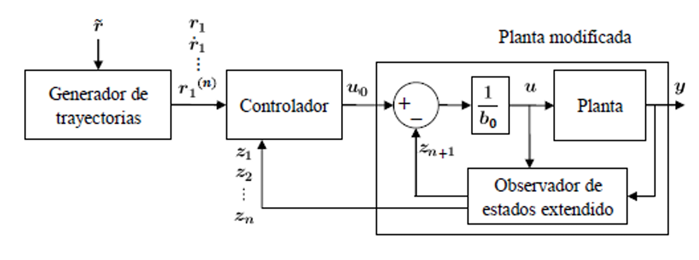
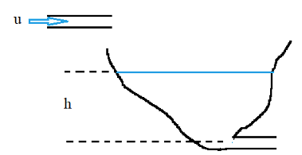
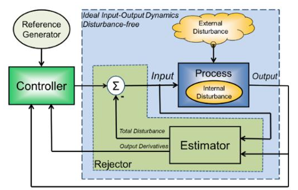
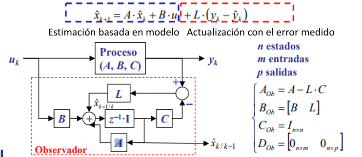

# ADRC
Esta clase se llevó a cabo el día 13 de Mayo de 2025, 

## 1. ADRC

>🔑 *ADRC:* es una técnica de control desarrollada para enfrentar una de las mayores limitaciones en el diseño de controladores, la cual es la necesidad de conocer de forma precisa el modelo matemático de la planta

ADRC se basa en el marco de espacio de estados, lo que le permite representar dinámicamente el comportamiento del sistema utilizando un conjunto de variables de estado, pero introduce un elemento innovador: el observador de estados extendido (ESO).

A diferencia de los observadores convencionales como el de Luenberger que solo estiman los estados internos del sistema, el ESO incorpora como estado adicional una representación de la "perturbación total". Esta perturbación total no es simplemente ruido externo, sino una combinación de múltiples factores: perturbaciones externas reales, errores de modelado, incertidumbre paramétrica, y sobre todo, dinámica no modelada (por ejemplo, no linealidades que no fueron incluidas en el modelo). El observador entonces estima esta perturbación total en tiempo real y la entrega al controlador para que pueda cancelarla activamente en su acción de control.

Desde el punto de vista conceptual, esto convierte al ADRC en un controlador adaptativo generalizado, ya que no necesita conocimiento exacto de las ecuaciones diferenciales del sistema. El diseño del controlador se reduce a conocer:

El orden del sistema, es decir, el número de derivadas necesarias para describir la dinámica de salida.

La ganancia estática (o ganancia crítica), que puede ser constante o incluso una función, pero que no necesita conocerse con precisión.

Por tanto, el ADRC externaliza la complejidad del sistema en el observador, lo que permite controlar sistemas lineales, no lineales, con parámetros variables e incluso con estructuras desconocidas de manera eficaz.


Figura 1. Gao Zhiqiang.

Zhiqiang Gao es un investigador clave en el desarrollo del Active Disturbance Rejection Control (ADRC), un enfoque de control que busca mejorar la estabilidad y precisión de sistemas dinámicos sin depender de modelos matemáticos exactos


### Principales características del ADRC


#### I. Independencia del modelo riguroso

El ADRC no requiere un modelo detallado de la planta. Solo necesita:

- El orden del sistema (número de derivadas de salida).
- La ganancia crítica o estática (relación entre entrada y salida).

Incluso si la ganancia es variable (como en sistemas no lineales), esta se integra como parte de la perturbación total.

#### II. Agrupación de perturbaciones y no linealidades

Todo lo desconocido del sistema se agrupa en una o dos variables de estado adicionales estimadas por el ESO. Esto incluye:

- Perturbaciones externas
- Modelado incompleto
- No linealidades

Este enfoque reduce significativamente la carga de modelado y facilita el control.

#### III. Comportamiento integrador natural del sistema

En el ADRC, el error de seguimiento es parte de la perturbación estimada, lo que significa que no se requiere acción integral explícita para eliminar el error permanente. El controlador se encarga automáticamente de este comportamiento gracias al diseño del observador.


### Importancia de ADRC

El ADRC responde a uno de los desafíos más persistentes del control automático: la incertidumbre del modelo. En muchos sistemas reales tales como robótica, procesos industriales,etc en donde modelar con precisión es costoso o inviable. El ADRC:

- Permite prescindir de modelos detallados, reduciendo costos de ingeniería.
- Compensa activamente cambios en la dinámica del sistema.
- Funciona bien bajo condiciones cambiantes o desconocidas.
- Tiene un diseño simple, con ganancias proporcionales y ubicación de polos.
- Se implementa fácilmente, lo cual lo hace ideal tanto en investigación como en la industria.


## Diferencias con otros métodos de control


| Aspecto                           | PID Tradicional                      | Control Basado en Modelo (LQR, MPC) | ADRC                                      |
|-----------------------------------|--------------------------------------|--------------------------------------|-------------------------------------------|
| **Dependencia del modelo**        | Alta                                 | Muy alta                             | Muy baja (solo orden y ganancia estimada) |
| **Gestión de perturbaciones**     | Reactiva (acción integral)           | Requiere modelarlas explícitamente  | Activa y en tiempo real                   |
| **Capacidad frente a no linealidades** | Limitada a un rango lineal         | Requiere linealización o modelos complejos | Naturalmente absorbidas por el observador |
| **Rechazo de incertidumbre**      | No explícito                         | Requiere robustez o adaptabilidad   | Sí, a través del ESO                       |
| **Diseño e implementación**       | Empírico, por prueba y error         | Matemáticamente complejo             | Sistemático y proporcional                |
| **Comportamiento integrador**     | Requiere término I                   | Según diseño                         | Surge naturalmente del modelo             |


## 2. Componentes ADRC




Figura 2. Componentes ADRC.


El diseño del controlador ADRC se fundamenta en tres componentes principales que trabajan de manera integrada para lograr un control robusto y adaptable. A pesar de la sofisticación conceptual de esta técnica, su estructura es modular y clara, lo que facilita su implementación práctica en diversos entornos. Estos tres bloques funcionales son:

### Generador de trayectorias

El generador de trayectorias es el encargado de definir los perfiles de movimiento deseados para el sistema. Se trata de una unidad que calcula referencias o *setpoints* en función del tiempo, considerando parámetros como posición, velocidad, aceleración y, en casos avanzados, derivadas superiores.

En esencia, este generador traduce los requerimientos de desempeño dinámico en señales de referencia que el controlador debe seguir. Aunque en aplicaciones simples este módulo puede reducirse a una señal de entrada directa (como una posición deseada), en sistemas más complejos como robótica o control de movimiento rápido puede incluir cálculos cinemáticos avanzados. En la referencia, se simplifica el sistema controlando directamente la posición como variable objetivo, omitiendo derivadas más altas para facilitar el análisis.

### Observador de Estados Extendido (ESO)

El observador es el núcleo del enfoque ADRC. El ESO (Extended State Observer) no solo estima las variables de estado convencionales de la planta, sino que también reconstruye una variable adicional que representa la perturbación total del sistema. Esta perturbación incluye:
- Perturbaciones externas no medidas,
- No linealidades dinámicas,
- Incertidumbres paramétricas,
- Y errores de modelado o seguimiento.

Esta variable extra, comúnmente denominada `z₊₁`, se introduce dentro del espacio de estados como si fuera una parte del sistema, permitiendo así su control y rechazo activo. El observador entrega todas estas estimaciones al controlador, lo cual minimiza la dependencia de un modelo matemático exacto y mejora la robustez frente a cambios dinámicos.

### Controlador proporcional por retroalimentación de estados

El controlador toma como insumo:
- Los valores de referencia generados por el generador de trayectorias,
- Los estados estimados (`Z`) proporcionados por el observador,
- Y la perturbación total estimada (`z₊₁`).

Con esta información, el controlador aplica una ley de control proporcional sobre los estados, buscando reducir el error de seguimiento. La acción de control se ajusta restando el efecto estimado de la perturbación antes de aplicar la señal al actuador.

Un punto clave del diseño es el uso de la ganancia estática del sistema (B₀), también llamada ganancia crítica. Esta se utiliza para normalizar la acción de control y cerrar adecuadamente el lazo de realimentación. La estructura general del controlador tiene una forma de lazo en cascada, donde el lazo externo sigue la trayectoria deseada y el lazo interno se encarga de compensar perturbaciones y dinámicas no modeladas.

💡**Ejemplo 1:**



Figura 3. Tanque ejemplo.


La imagen del tanque ilustra lo siguiente:

- El sistema se descompone en una parte lineal + parte no lineal.
- El control se aplica sobre la parte lineal.
- La parte no lineal se estima como una perturbación y se rechaza activamente por medio del ESO.
- Se sugiere una forma equivalente lineal del sistema:  
  $$\[\dot{h} = Ku + h\]$$

Esta forma es funcionalmente útil para implementar el controlador, aunque no represente una linealización exacta.


### Reducción de un modelo no lineal a un modelo equivalente lineal (ADRC)

Una de las fortalezas más distintivas del ADRC es su capacidad para tratar sistemas no lineales como si fueran lineales, sin necesidad de linealización matemática tradicional. Esto se logra reconfigurando la estructura del modelo, desplazando la complejidad de la dinámica no lineal hacia el observador de estados extendido (ESO), que se encarga de estimar y compensar la parte no modelada.


Consideremos un sistema físico con un tanque de forma irregular, cuya entrada es un flujo de líquido `u` y cuya salida depende del nivel del fluido `h`.

La ecuación de balance de masa para este sistema es:

$$\[\frac{d}{dt} \left( \int_0^h A(h) \, dh \right) = u - a\sqrt{2gh}\]$$

Aplicando el teorema fundamental del cálculo:

$$\[A(h) \cdot \dot{h} = u - a\sqrt{2gh}\]$$

Despejando la derivada del nivel `h`:

$$\[\dot{h} = \frac{1}{A(h)} \left( u - a\sqrt{2gh} \right)\]$$


## NADRC (No lineal)

El NADRC es una extensión del método ADRC que permite controlar sistemas no lineales y perturbados sin conocer explícitamente su dinámica interna. A continuación se describe el procedimiento completo paso a paso.


### 1. Modelo de partida

Se parte de una ecuación diferencial de segundo orden:

$$\[\ddot{y} = -a_1 \dot{y} - a_0 y + b u\]$$

Donde:
- $$\( y \)$$: salida del sistema  
- $$\( u \)$$: entrada de control  
- $$\( a_0, a_1 \)$$: parámetros físicos del sistema  
- $$\( b \)$$: ganancia del sistema


### 2. Representación en espacio de estados

Haciendo el cambio de variables:

$$\[x_1 = y, \quad x_2 = \dot{y}\]$$

El sistema queda:

$$
\[
\begin{cases}
\dot{x}_1 = x_2 \\
\dot{x}_2 = -a_0 x_1 - a_1 x_2 + b u + w \\
y = x_1
\end{cases}
\]$$

Donde $$\( w \)$$ representa perturbaciones externas o dinámicas no modeladas.


### 3. Agrupación de lo desconocido en una perturbación total `f`

Definimos:

$$\[f = -a_0 x_1 - a_1 x_2 + (b - b_0)u + w\]$$

Con esto, el modelo se reformula como:

$$
\[
\begin{cases}
\dot{x}_1 = x_2 \\
\dot{x}_2 = f + b_0 u \\
y = x_1
\end{cases}
\]$$


### 4. Modelo extendido: inclusión de `f` como nuevo estado

Dado que `f` es desconocida, se introduce como un nuevo estado:

$$\[x_3 = f, \quad \dot{x}_3 = h\]$$

El sistema extendido queda:

$$
\[
\begin{cases}
\dot{x}_1 = x_2 \\
\dot{x}_2 = x_3 + b_0 u \\
\dot{x}_3 = h \\
y = x_1
\end{cases}
\]$$


Donde `h` representa la dinámica (acotada o lenta) de la perturbación `f`.


### 5. Objetivo del NADRC

Una vez extendido el modelo:

- Se diseña un observador extendido de estados (ESO) que estima $$\( x_1, x_2, x_3 \)$$.
- Se diseña una ley de control proporcional que usa estas estimaciones para generar la señal de control $$\( u \)$$.

El observador estima la perturbación en tiempo real, y el controlador la compensa activamente, logrando seguimiento preciso incluso sin conocer la forma de `f` o `h`.


### Observador de estados extendido para NADRC

El Observador de Estados Extendido (ESO) es un componente fundamental del NADRC (Nonlinear Active Disturbance Rejection Control). Su propósito es estimar en tiempo real tanto los estados del sistema como las perturbaciones desconocidas (modeladas como un estado adicional), lo que permite que el controlador reaccione adecuadamente incluso en presencia de dinámicas no modeladas, incertidumbre o entradas perturbadoras.


###  ¿Para qué sirve el ESO?

- Estima los estados internos del sistema (por ejemplo: posición y velocidad),
- Estima la perturbación total (agrupación de no linealidades, errores de modelado, y perturbaciones externas),
- Provee información precisa al controlador NADRC sin requerir un modelo exacto del sistema.

Esto convierte al ESO en el componente que permite que el controlador trabaje independientemente del modelo físico exacto de la planta.


### Estructura del ESO (modelo generalizado):

El observador tiene la siguiente forma:

$$
\[
\begin{cases}
\dot{z}_1 = z_2 - \beta_1 \gamma_1(e) \\
\dot{z}_2 = z_3 + b_0 u - \beta_2 \gamma_2(e) \\
\dot{z}_3 = -\beta_3 \gamma_3(e) \\
e = z_1 - y
\end{cases}
\]$$

Donde:
- $$\( z_1 \)$$: estimación de la salida $$\( y \)$$.
- $$\( z_2 \)$$: estimación de $$\( \dot{y} \)$$.
- $$\( z_3 \)$$: estimación de la perturbación total $$\( f \)$$.
- $$\( \gamma_i(e) \)$$: funciones del error, posiblemente no lineales.
- $$\( \beta_i \)$$: ganancias del observador.
- $$\( e \)$$: error de estimación entre la salida real y su estimación.


### Ley de control del NADRC

Una vez estimados los estados y la perturbación, se aplica la siguiente ley de control:

$$\[u = \frac{u_0 - z_3}{b_0}\]$$

Donde:
- $$\( u_0 \)$$: acción de control deseada (proveniente del controlador externo),
- $$\( z_3 \)$$: estimación de la perturbación total,
- $$\( b_0 \)$$: ganancia estimada del sistema.

Este lazo interno cancela dinámicamente la perturbación, transformando el sistema en:

$$
\[
\begin{cases}
\dot{x}_1 = x_2 \\
\dot{x}_2 = u_0 \\
y = x_1
\end{cases}
\]$$


Este es un sistema ideal: libre de perturbaciones y con comportamiento integrador puro, lo cual simplifica enormemente el diseño del controlador externo.


### ¿Por qué usar un ESO?

- Permite desacoplar el controlador del modelo exacto.
- Hace que el sistema sea robusto ante incertidumbre y no linealidades.
- Reduce el impacto de perturbaciones externas.
- Es aplicable a sistemas rápidos y dinámicos, como convertidores de potencia o servomecanismos.


##  Funciones para la acción de control en NADRC no lineal

En el caso del NADRC (Nonlinear Active Disturbance Rejection Control), cuando se enfrenta un sistema fuertemente no lineal o con comportamientos extremos, la acción de control $$\( u_0 \)$$ no se diseña con funciones proporcionales lineales tradicionales. En su lugar, se utilizan funciones no lineales especiales conocidas como `fal` (Function with Adjustable Linearity), diseñadas para proporcionar transiciones suaves y robustas dependiendo del error y su magnitud.


### Estructura de la acción de control no lineal

La señal de control deseada $$\( u_0 \)$$ se construye como:


$$\[u_0 = k_1 \cdot fal(r_1 - z_1, \alpha_1, \delta) + k_2 \cdot fal(r_1 - z_2, \alpha_2, \delta)\]$$

Donde:

- $$\( r_1 \)$$: trayectoria deseada (posición).
- $$\( z_1 \), \( z_2 \)$$: estimaciones de los estados del sistema (posición y velocidad).
- $$\( k_1, k_2 \)$$: ganancias del controlador.
- $$\( \alpha_1, \alpha_2 \)$$: exponentes que determinan la forma no lineal de la función.
- $$\( \delta \)$$: umbral de transición entre linealidad y no linealidad.
- `fal`: función no lineal definida por partes.


###  Definición de la función `fal`

$$
\[
fal(\tilde{e}, \alpha, \delta) =
\begin{cases}
\frac{\tilde{e}}{\delta^{1 - \alpha}}, & |\tilde{e}| \leq \delta \\
|\tilde{e}|^\alpha \cdot \text{sign}(\tilde{e}), & |\tilde{e}| > \delta
\end{cases}
\]$$

Donde:
- $$\( \tilde{e} \)$$: error entre el setpoint y el estado estimado,
- $$\( \alpha \in (0, 1) \)$$: determina el grado de suavizado no lineal,
- $$\( \delta \)$$: valor umbral que separa el comportamiento cuasi-lineal (para errores pequeños) del comportamiento no lineal fuerte (para errores grandes).


###  Propósito de la función `fal`

La función `fal` permite:
- Suavizar la respuesta del controlador cerca del equilibrio (cuando $$\( |\tilde{e}| \)$$ es pequeño),
- Introducir una corrección fuerte y rápida cuando el error es grande,
- Garantizar robustez frente a ruido, evitando oscilaciones por errores pequeños,
- Adaptarse a sistemas no lineales donde las respuestas tradicionales no son suficientes.


### Consideraciones y complejidad

Como se menciona en la clase, el uso de esta versión no lineal del NADRC con funciones `fal` es complejo, porque:
- Requiere calcular valores específicos para $$\( \alpha_i \)$$, $$\( \delta \)$$, y las ganancias $$\( k_i \)$$.
- Necesita mayor conocimiento del modelo del sistema para definir correctamente estas funciones.
- Se aplica solo en casos extremos, cuando el modelo linealizado del sistema no es suficiente para lograr control aceptable.

En la práctica, la versión lineal del ADRC suele ser suficiente para la mayoría de las aplicaciones reales, por lo que esta formulación no lineal es más común en investigaciones avanzadas o entornos altamente exigentes.


## LADRC

### Observador de Estados Extendido Lineal

En el enfoque LADRC lineal, se parte de un observador extendido de estados (ESO) que estima tanto las variables internas del sistema como las perturbaciones externas no modeladas. Este observador sigue la siguiente forma:

```math
\begin{cases}
\dot{z}_1 = z_2 + L_1 e \\
\dot{z}_2 = z_3 + b_0 u + L_2 e \\
\dot{z}_3 = L_3 e \\
e = y - z_1
\end{cases}
```

Aquí:

- $$\( z_1 \)$$: estimación de la salida.  
- $$\( z_2 \)$$: estimación de su derivada.  
- $$\( z_3 \)$$: estimación de la perturbación generalizada.  
- $$\( e \)$$: error entre la salida real y la estimación.

En el caso lineal, las ganancias del observador son constantes: $$\( L_1, L_2, L_3 \)$$, a diferencia del caso no lineal donde podrían depender del estado.


### Modelo Extendido del Sistema

El modelo extendido que representa el sistema y sus perturbaciones está dado por:

```math
\begin{cases}
\dot{x}_1 = x_2 \\
\dot{x}_2 = x_3 + b_0 u \\
\dot{x}_3 = h \\
y = x_1
\end{cases}
```

Este modelo incorpora una tercera variable $$\( x_3 \)$$ que representa la perturbación generalizada $$\( h \)$$, que incluye no linealidades, incertidumbres del modelo y perturbaciones externas.


### Ley de Control Lineal

La ley de control propuesta es una retroalimentación lineal de estados observados:

```math
u_0 = k_1 (r - z_1) - k_2 z_2
```

Donde:

- $$\( r \)$$: señal de referencia  
- $$\( z_1 \)$$: estimación de la salida  
- $$\( z_2 \)$$: estimación de la derivada de la salida  
- $$\( k_1, k_2 \)$$: ganancias del controlador

Este control busca compensar las perturbaciones actuando sobre el error estimado y la derivada, de forma similar a una realimentación de estados clásica.


### Planteamiento General del LADRC

Finalmente, el planteamiento general del sistema controlado bajo LADRC se modela como:

```math
y^{(n)} = \kappa(x) u(t) + \xi(t)
```

Donde:

- $$\( y^{(n)} \)$$: derivada de orden $$\( n \)$$ de la salida  
- $$\( \kappa(x) \)$$: ganancia (constante en este caso, al tratarse de un modelo lineal)  
- $$\( \xi(t) \)$$: perturbación generalizada, que incluye todo lo desconocido del sistema

Este enfoque unifica modelado, estimación y control, encapsulando las incertidumbres del sistema en un único término $$\( \xi(t) \)$$, que es estimado en línea por el observador extendido.



Figura 4. Diagrama de bloques ADRC.


El enfoque LADRC lineal ofrece una poderosa técnica de control al estimar dinámicamente las perturbaciones y actuar sobre ellas sin necesidad de un modelo preciso del sistema. La simplicidad de las leyes de control lineal, junto con la estimación robusta del ESO, permite un diseño eficiente y adaptable frente a incertidumbres y perturbaciones externas.


## 3. Observador de Estados

En el marco del ADRC, el observador de estados cumple la función fundamental de estimar tanto las variables internas del sistema como las perturbaciones externas o no modeladas que afectan su comportamiento. A diferencia de los métodos clásicos que requieren un modelo matemático preciso del sistema, ADRC introduce un observador extendido que considera estas perturbaciones como un estado adicional. Esto permite al controlador actuar de manera anticipada y adaptativa, incluso en presencia de incertidumbres, variaciones dinámicas o ruidos externos, sin necesidad de conocer con exactitud la estructura del sistema. 
La relevancia del observador radica en que es el componente que permite que ADRC sea robusto y autónomo frente a condiciones cambiantes. Si el observador es capaz de seguir adecuadamente la evolución del sistema y las perturbaciones, el controlador puede compensarlas en tiempo real, manteniendo un desempeño deseado. Por ello, se diseña con una dinámica más rápida que la del sistema a controlar, asegurando que sus estimaciones sean oportunas y precisas. En esencia, el observador de estados convierte a ADRC en una estrategia eficaz y flexible, adecuada para aplicaciones donde el modelado exacto es difícil o inviable.


- Ecuacion de Estado:

$$
x_{k+1} = A \cdot x_k + B \cdot u_k
$$

- Ecuacion del observador



Figura 5. Ecuacion del Observador.


- Estimacion de Perturbaciones

$$
\begin{cases}
x_{k+1} = A \cdot x_k + B \cdot u_k + F \cdot d_k \\
y_k = C \cdot x_k
\end{cases}
$$

- Si la perturbación es constante \( d(k+1) = d(k) \), podemos añadirla como variable de estado:

$$
\begin{cases}
\begin{bmatrix}
x(k+1) \\
d(k+1)
\end{bmatrix}
= x_a(k+1) =
\begin{bmatrix}
A & F \\
0 & I
\end{bmatrix}
x_a(k) +
\begin{bmatrix}
B \\
0
\end{bmatrix}
u(k) \\
\\
y(k) = [C \quad 0] \cdot x_a(k)
\end{cases}
$$

- Para un sistema discreto con perturbación:

$$
\begin{cases}
x_{k+1} = A \cdot x_k + B \cdot u_k + F \cdot d_k \\
y_k = C \cdot x_k
\end{cases}
\quad
\Rightarrow
\quad
\begin{cases}
\begin{bmatrix}
x(k+1) \\
d(k+1)
\end{bmatrix}
= x_a(k+1) =
\begin{bmatrix}
A & F \\
0 & I
\end{bmatrix}
x_a(k) +
\begin{bmatrix}
B \\
0
\end{bmatrix}
u(k) \\
\\
y(k) = [C \quad 0] \cdot x_a(k)
\end{cases}
$$

- Representación en Espacio de Estados:

La ecuación diferencial:

$$
y^{(n)}(t) = u(t) + \xi(t)
$$

se puede representar en espacio de estados como:

$$\[\underbrace{
\begin{bmatrix}
\dot{x}_1 \\
\dot{x}_2 \\
\dot{x}_3 \\
\vdots \\
\dot{x}_{n-1} \\
\dot{x}_n
\end{bmatrix}
}_{\dot{x}} = \underbrace{\begin{bmatrix}
0 & 1 & 0 & \cdots & 0 & 0 \\
0 & 0 & 1 & \cdots & 0 & 0 \\
0 & 0 & 0 & \cdots & 0 & 0 \\
\vdots & \vdots & \vdots & \ddots & \vdots & \vdots \\
0 & 0 & 0 & \cdots & 0 & 1 \\
0 & 0 & 0 & \cdots & 0 & 0
\end{bmatrix}
}_{A}\begin{bmatrix}
x_1 \\
x_2 \\
x_3 \\
\vdots \\
x_{n-1} \\
x_n
\end{bmatrix}+\underbrace{\begin{bmatrix}
0 \\
0 \\
\vdots \\
0 \\
0 \\
1\end{bmatrix}}_{B}\left( u(t) + \xi(t) \right)\]$$

La salida es:

$$
y = 
\underbrace{
\begin{bmatrix}
1 & 0 & 0 & \cdots & 0 & 0
\end{bmatrix}
}_{C}
\cdot x
$$


💡**Ejemplo 2:**


## 5. Conclusiones


## 6. Referencias 

- [1] *E.P.2.Control digital y de Mov. Aulas Ecci. [2025]*
- [2] *Apuntes Clase - Martes 13 de Mayo. [2025]*
- [3] *Groover, M. P. Automation, Production Systems, and Computer-Integrated Manufacturing. 4th ed., Pearson, 2016*
- [4] *Jazar, Reza N. Theory of Applied Robotics: Kinematics, Dynamics, and Control. 2nd ed., Springer, 2010.*
- [5] *Craig, John J. Introduction to Robotics: Mechanics and Control. 4th ed., Pearson, 2017.*
- [6] *Manual de Diseño Mecánico. Bosch Rexroth AG. Ed. Técnica, 2018.*
- [7] *Mechatronics: Electronic Control Systems in Mechanical and Electrical Engineering. Bolton, W., 7th ed., Pearson, 2021.*
- [8] *Diseño de Elementos de Máquinas. Shigley, J., 10ª ed., McGraw-Hill, 2015.*
- [9] *Fundamentals of Machine Component Design. Juvinall, R., Marshek, K., 6th ed., Wiley, 2020.*
- [10] *Modeling and Control of Engineering Systems. Ogata, K., Prentice Hall, 2000*
