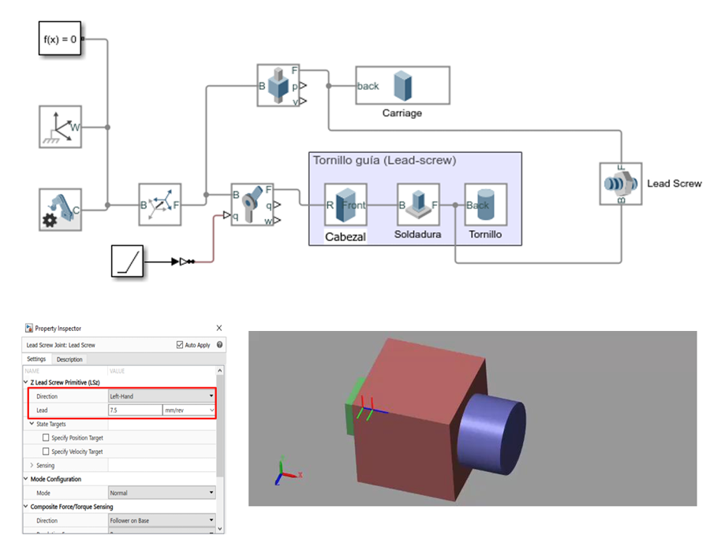
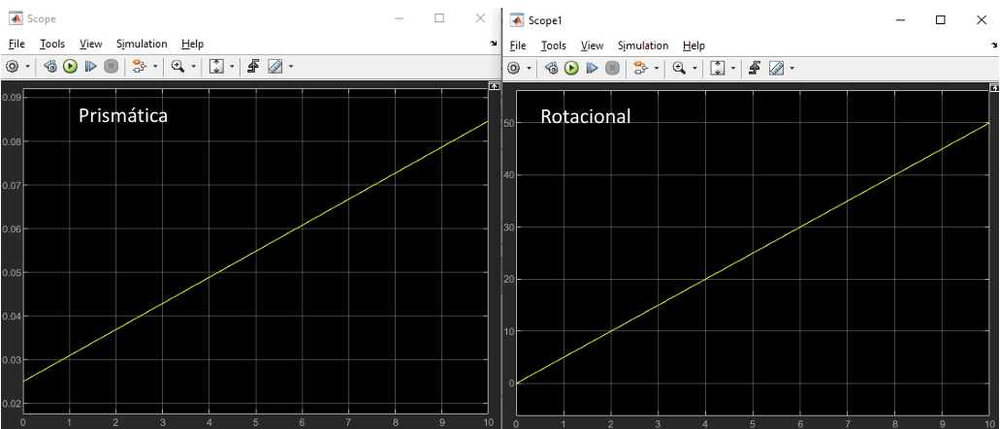
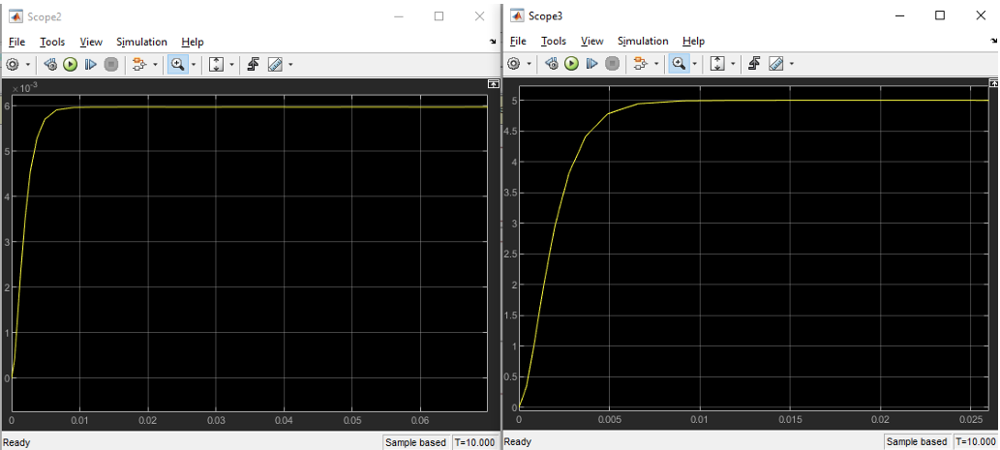
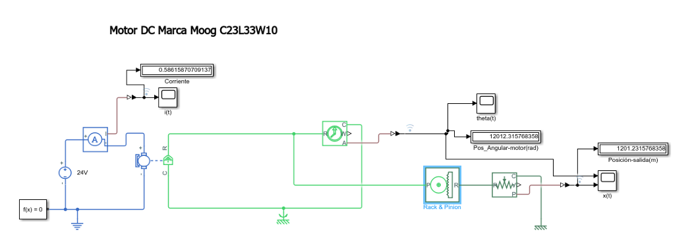
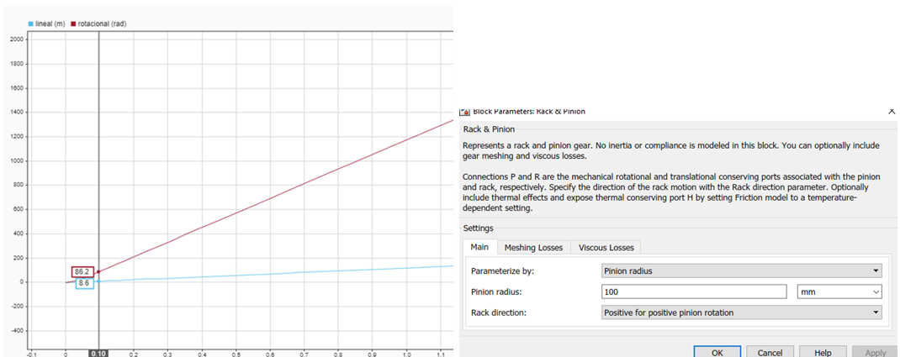
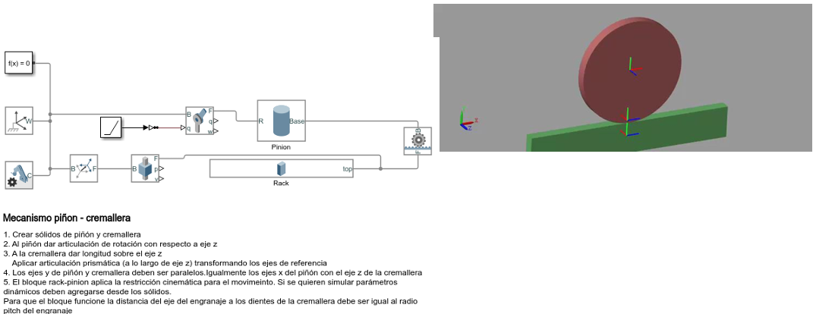
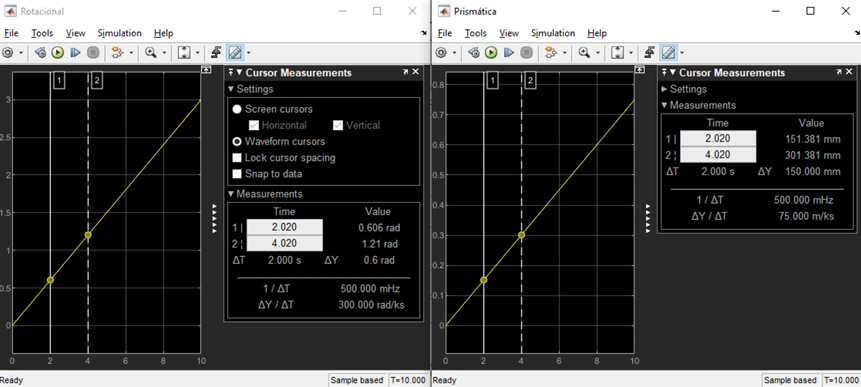
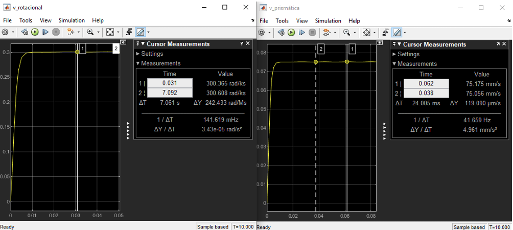
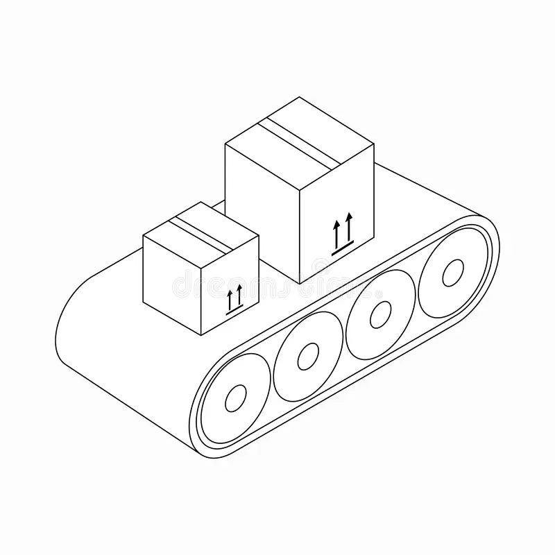
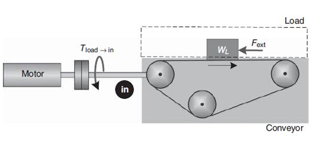

# Elementos de Transmisión Continuación 
Esta clase se llevó a cabo el día 24 de abril de 2025, la cual estuvo dirigida a comprender los sistemas de transmisión, abordando temas los conceptos de transmisión tales como el tornillo guía, así como los conceptos de inercia y torque reflejado, fundamentales para el análisis y optimización del movimiento en sistemas mecánicos.

## 1. Tornillo Guía

El mecanismo de tornillo sin fin es un sistema de transmisión de movimiento muy utilizado en aplicaciones donde se requiere precisión, control y reducción significativa de la velocidad. Está compuesto por dos elementos principales: el tornillo sin fin (una especie de tornillo helicoidal) y la rueda dentada o corona (un engranaje con dientes especialmente diseñados para acoplarse al tornillo). Cuando el tornillo gira, hace girar la corona, transmitiendo así el movimiento, pero con una relación de reducción muy alta. Esto significa que por muchas vueltas que dé el tornillo, la rueda gira solo una pequeña fracción.

Uno de los aspectos más importantes del tornillo sin fin es su capacidad de auto bloqueo. En muchos casos, la corona no puede mover al tornillo en sentido inverso, lo que lo hace ideal para aplicaciones donde se necesita mantener una posición fija sin consumo de energía adicional, como en actuadores o sistemas de elevación. Esta característica lo convierte en un elemento fundamental en perfiles de movimiento que requieren estabilidad y seguridad, como brazos robóticos, sistemas de posicionamiento de cámaras o mesas CNC.

En cuanto al control de movimiento, el tornillo sin fin permite lograr un desplazamiento suave y continuo, ideal para movimientos de precisión. Debido a su diseño, ofrece una gran reducción de velocidad y un incremento del par motor (torque), lo que se traduce en movimientos lentos pero muy controlados. Esta propiedad es especialmente útil en sistemas automatizados donde se necesita controlar la posición y la velocidad con exactitud, como en actuadores lineales, mesas de coordenadas o mecanismos de regulación fina.

Además, el perfil de movimiento generado por un tornillo sin fin es altamente repetible, lo cual es clave en tareas que requieren una alta fidelidad en el posicionamiento. Su uso combinado con motores paso a paso o servomotores mejora aún más el control del sistema, permitiendo integrar sensores y retroalimentación para crear sistemas de control en lazo cerrado. En resumen, el tornillo sin fin es una solución mecánica eficiente y confiable para perfiles de movimiento donde se priorizan precisión, control y seguridad.


Figura 1. Tornillo Guía


Existen varios tipos de tornillos sin fin, y su clasificación depende principalmente de la forma del tornillo y el número de entradas o principios que este posee. Cada tipo tiene propiedades distintas que lo hacen más adecuado para ciertas aplicaciones dentro del campo del movimiento y control de movimiento.

### Tipos según la forma del tornillo

#### Tornillo sin fin cilíndrico
Este es el tipo más común. Tiene una forma similar a un tornillo tradicional con filetes helicoidales que se acoplan con una rueda dentada (corona). Se utiliza principalmente para transmisiones donde se requiere una gran reducción de velocidad y donde el auto bloqueo es una ventaja.

#### Tornillo sin fin globoidal
En este tipo, el tornillo tiene una forma curva o globoidal que envuelve parcialmente la corona. Este diseño proporciona un mayor contacto entre las superficies, lo que mejora la eficiencia, permite mayores cargas y reduce el desgaste. Es muy utilizado en maquinaria de precisión o cuando se requiere mayor durabilidad.

### Tipos según el número de entradas

#### Tornillo sin fin de una entrada
Tiene solo un hilo. Cada vuelta del tornillo mueve la rueda un solo diente, lo que proporciona una gran reducción y un excelente auto bloqueo, pero con baja eficiencia. Ideal para mecanismos de ajuste fino o donde se requiere mantener una posición sin retroceso.

#### Tornillo sin fin de múltiples entradas 
Tiene dos o más hilos. Permite que la rueda avance más por cada vuelta del tornillo, aumentando la velocidad y la eficiencia del sistema, pero perdiendo el auto bloqueo. Es útil cuando se necesita mayor rapidez sin perder completamente el control.


| Tipo                          | Forma del tornillo | Nº de entradas | Ventajas principales                                  | Aplicaciones comunes                                 |
|-------------------------------|---------------------|----------------|--------------------------------------------------------|------------------------------------------------------|
| Cilíndrico, entrada simple    | Cilíndrica          | 1              | Alto par, auto bloqueo, gran reducción                | Sistemas de elevación, actuadores manuales           |
| Cilíndrico, entrada múltiple  | Cilíndrica          | 2 o más        | Mayor eficiencia y velocidad, menor auto bloqueo      | Transportadores, robots con control rápido           |
| Globoidal, entrada simple     | Globoidal           | 1              | Mayor área de contacto, buena resistencia al desgaste | Maquinaria pesada, automatización de precisión       |
| Globoidal, entrada múltiple   | Globoidal           | 2 o más        | Alta eficiencia y resistencia, menor retroceso        | Sistemas servoasistidos, control de movimiento CNC   |

Estos diferentes tipos permiten seleccionar el mecanismo más adecuado según las necesidades de velocidad, precisión, carga y seguridad en sistemas de movimiento y control.


Figura 2. Tipos de Tornillo Guía


### Relación de Transmisión en Tornillo Sin Fin

La relación de transmisión en un sistema con tornillo sin fin es fundamental para comprender cómo se traduce el movimiento rotacional del tornillo en un desplazamiento lineal de una carga (por ejemplo, una cápsula o carro). En la imagen proporcionada se destacan dos conceptos clave: el cabecero (pitch) y el paso (lead). Aunque en ocasiones se usan como sinónimos, en este contexto tienen diferencias importantes.

El cabecero (pitch) se refiere al número de vueltas que debe realizar el tornillo para que la cápsula se desplace una unidad de distancia (por ejemplo, 1 metro en sistema métrico o 1 pulgada en sistema inglés). En cambio, el paso (lead) indica la distancia lineal que recorre la cápsula por cada revolución del tornillo. Este valor depende de la geometría de la rosca del tornillo, y se mide en metros o pulgadas según el sistema utilizado.

Entonces:


$$
\Delta \theta = 2 \pi p \Delta x
$$

$$
\frac{\Delta \theta}{\Delta x} = 2\pi
$$

$$
\frac{\frac{\Delta \theta}{\Delta t}}{\frac{\Delta x}{\Delta t}} = \frac{\textit{Velocidad motor}}{\textit{Velocidad carga}} = \frac{\dot{\theta}}{\dot{x}} = 2\pi
$$


### Inercia Reflejada

La inercia reflejada es un concepto fundamental en la dinámica de sistemas mecánicos con transmisión, como reductores, engranajes o tornillos sin fin. Se refiere a la inercia aparente que un actuador (como un motor) "ve" desde su eje, considerando la masa o inercia real de la carga movida, pero transformada por la relación de transmisión. En otras palabras, aunque la carga tenga una cierta masa o inercia en su propio sistema de coordenadas (por ejemplo, lineal), al ser movida por un mecanismo rotativo, su efecto dinámico se refleja como una inercia rotacional equivalente en el eje del motor. Esta equivalencia se calcula tomando en cuenta factores como la relación de engranajes o el paso del tornillo sin fin.

La importancia de la inercia reflejada radica en su impacto directo sobre el desempeño y el diseño de los sistemas de control de movimiento. Un sistema con alta inercia reflejada requerirá más torque y tendrá una respuesta más lenta, lo que puede dificultar el cumplimiento de perfiles de velocidad y aceleración exigentes. Además, una incorrecta estimación de esta inercia puede llevar a diseños de control ineficientes o inestables, especialmente en aplicaciones de alta precisión como robots, CNC o servomecanismos. Por tanto, para garantizar un control preciso, eficiente y seguro, es esencial considerar adecuadamente la inercia reflejada durante la etapa de modelado y diseño del sistema de control.


$$
KE = \frac{1}{2} m \dot{x}^2
$$


$$
\frac{\dot{\theta}}{\dot{x}} = 2 \pi p
$$


$$
KE = \frac{1}{2} m \left( \frac{1}{(2\pi p)^2} \right) \dot{\theta}^2
$$


$$
J_{ref} = m \left( \frac{1}{(2\pi p)^2} \right) = J_{ref} = \frac{m}{\left(\frac{N}{S}\right)^2}
$$


### Inercia Reflejada Total

La inercia reflejada total en un sistema con tornillo sin fin es la suma de todas las inercias externas al motor (como la masa lineal de la carga y cualquier otra parte móvil del sistema), pero expresadas en el eje del motor. Esto se logra a través de una conversión basada en la relación de transmisión del tornillo sin fin. Dado que el tornillo convierte el movimiento rotacional del motor en movimiento lineal, la masa de la carga genera una resistencia al cambio de velocidad rotacional que se refleja como una inercia equivalente, denominada inercia reflejada. Esta inercia reflejada total es clave para modelar correctamente la dinámica del sistema.


Figura 3. Inercia reflejada total tornillo sin fin

$$
m = \frac{W_L + W_C}{g}
$$

Donde:
- m = Masa Total
- $$W_C$$ = Cama

$$
J_{\text{ref}}^{\text{trans}} = J_{\text{screw}} + J_{\text{load} \rightarrow \text{in}} + J_{\text{carriage} \rightarrow \text{in}} = J_{\text{screw}} + \frac{1}{\eta N_S^2} \left( \frac{W_L + W_C}{g} \right)
$$


$$
J_{\text{ref}}^{\text{trans}} = J_{\text{screw}} + \frac{1}{\eta N_S^2} \left( \frac{W_L + W_C}{g} \right)
$$


En el diseño de sistemas de control de movimiento, conocer la inercia reflejada total es crucial. Este parámetro influye directamente en el comportamiento dinámico del sistema, afectando la aceleración, la respuesta del motor y la precisión del control. Una inercia reflejada alta implica que el motor necesita aplicar más torque para cambiar la velocidad, lo cual puede reducir la eficiencia o generar problemas como vibraciones o sobrecargas. Por eso, una estimación precisa de esta inercia permite diseñar controladores más robustos, mejorar la estabilidad del sistema y garantizar un funcionamiento suave y eficiente, especialmente en aplicaciones que requieren alta precisión como robótica, CNC o automatización industrial


### Torque de carga


Figura 4. Torque de carga tornillo sin fin


$$
F_{\text{ext}} = F_f + F_g + F_p
$$


$$
F_{\text{ext}} = F_p + (W_L + W_C)(\sin \beta + \mu \cos \beta)
$$

Si el sistema se encuentra en posición horizontal, entonces $$\(F_g = 0\)$$.


Desde la rotación:

$$
\text{Work} = F_{\text{ext}} \cdot \frac{1}{2\pi p} \cdot \Delta \theta
$$

Desde el desplazamiento lineal:

$$
\text{Work} = F_{\text{ext}} \cdot \Delta x
$$


$$
\text{Work} = T_{\text{load} \rightarrow \text{in}} \cdot \Delta \theta
$$

Por lo tanto, el torque reflejado al motor es:

$$
T_{\text{load} \rightarrow \text{in}} = \frac{F_{\text{ext}}}{N_S}
$$

Si se considera la eficiencia del sistema:

$$
T_{\text{load} \rightarrow \text{in}} = \frac{F_{\text{ext}}}{\eta N_S}
$$


💡**Ejemplo 2:**

**Cálculo de la inercia reflejada en un sistema con tornillo esferado**

Una carga de **50 kg** debe ser posicionada mediante un tornillo esferado de acero. Las características del sistema son las siguientes:

- **Densidad del tornillo**: 0.14 kg/cm³  
- **Diámetro del tornillo**: 0.182 cm  
- **Longitud del tornillo**: 36 cm  
- **Paso del tornillo**: 0.75 cm/rev  
- **Eficiencia del sistema**: 90%  
- **Peso del carro (carriage)**: 0.23 kg  

Con esta información, se busca calcular la **inercia reflejada** hacia el eje de entrada del sistema.


**Fórmula general para la inercia reflejada**

La inercia total reflejada hacia el eje del actuador es la suma de:

$$
J_{\text{ref}}^{\text{trans}} = J_{\text{screw}} + J_{\text{load} \rightarrow \text{in}} + J_{\text{carriage} \rightarrow \text{in}}
$$

Donde:

$$
J_{\text{ref}}^{\text{trans}} = J_{\text{screw}} + \frac{1}{\eta N_S^2} \left( \frac{W_L + W_C}{g} \right)
$$


**Relación de transmisión**

La relación de transmisión se calcula como:

$$
N_S = 2 \pi p
$$

Sustituyendo el valor del paso \( p = \frac{1}{0.75} \):

$$
N_S = 2\pi \left( \frac{1}{0.75} \right) = 8.38
$$


**Cálculo del momento de inercia del tornillo**

Asumiendo que el tornillo es un cilindro alargado, el momento de inercia es:

**En sistema métrico:**

$$
J_{\text{screw}} = \frac{\pi L \rho D^4}{32g}
$$

**En sistema inglés (sin gravedad):**

$$
J_{\text{screw}} = \frac{\pi L \rho D^4}{32}
$$

Sustituyendo los valores:

$$
J_{\text{screw}} = \frac{\pi \cdot 0.36 \cdot 140000 \cdot (0.00182)^4}{32} = 5.42 \times 10^{-8} \ \text{Kgm}
$$


**Sustitución final**

Sustituyendo en la fórmula de \( J_{\text{ref}}^{\text{trans}} \):

$$
J_{\text{ref}}^{\text{trans}} = 5.42 \times 10^{-8} + \frac{1}{0.9 \cdot 8.38^2} \left( \frac{50 + 0.23}{9.89} \right)
$$

**Resultado final:**

```text
J_ref ≈ 8.1 Kgm


**Simulación Simscape Multibody:**



Figura 6. Simulación Ejemplo 2.


**Resultados Posición:**



Figura 7. Simulación Posición Ejemplo 2.


**Resultados Velocidad:**



Figura 8. Simulación Velocidad Ejemplo 2.


## 2. Conceptos de Transmisión Piñon - Cremallera

Un mecanismo piñón-cremallera es un sistema que transforma movimiento rotativo en movimiento lineal, y viceversa, mediante el engrane de un piñón con una cremallera. Este mecanismo es ampliamente utilizado en sistemas mecatrónicos por su simplicidad y precisión al generar desplazamientos lineales a partir de motores rotativos, facilitando así la integración con actuadores eléctricos. Su capacidad de convertir la rotación continua del motor en un movimiento lineal controlado lo hace ideal para aplicaciones como ejes de máquinas CNC, brazos robóticos o sistemas de dirección asistida.


Figura 9. Mecanismo Piñon-Cremallera.

El piñón-cremallera permite implementar trayectorias lineales suaves y predecibles, esenciales para lograr movimientos tipo trapezoidal o tipo S, comunes en el diseño de perfiles de velocidad, aceleración y posición. Al vincularse con sistemas de control (como servomotores o controladores PID), se puede garantizar que el movimiento lineal responda con precisión a las órdenes del sistema, cumpliendo requisitos de tiempo, exactitud y dinámica del proceso.


### Relación de Transmisión

La relación de transmisión en un mecanismo piñón-cremallera describe cómo se convierte el movimiento rotacional del piñón en movimiento lineal de la cremallera. Específicamente, esta relación se determina por el radio del piñón: a mayor radio, mayor desplazamiento lineal por cada vuelta del piñón. Matemáticamente, se expresa como: $$N_{RP} = \frac{1}{r_{\text{pinion}}}$$ cuando se trabaja con velocidades angulares en radianes por segundo. Esta relación es fundamental en sistemas mecatrónicos, ya que permite diseñar perfiles de movimiento lineal precisos a partir del control de velocidad rotacional del actuador (motor).


$$
N = \frac{\text{Velocidad motor}}{\text{Velocidad carga}}
$$

$$
V_{\text{rack}} = r_{\text{pinion}} \, \omega_{\text{pinion}}
$$

$$
N_{RP} = \frac{1}{r_{\text{pinion}}}
$$

💡**Ejemplo 3:**

**Simulación Simulink:**



Figura 10. Mecanismo Piñon-Cremallera Simulink.


**Resultados:**



Figura 10. Resultados mecanismo Piñon-Cremallera Simulink.


### Inercia Reflejada

La inercia reflejada en un sistema piñón-cremallera es la inercia equivalente que el motor siente debido a las masas que está moviendo, una vez que se toma en cuenta la conversión del movimiento rotacional a lineal. Es decir, no solo se considera la inercia del piñón que gira, sino también cómo las masas lineales (como la carga o el carro) afectan el esfuerzo que debe hacer el motor, ajustadas por la relación de transmisión del sistema.

La inercia reflejada al motor se calcula como:

$$
J_{\text{ref}}^{\text{trans}} = J_{\text{pinion}} + J_{\text{load} \rightarrow \text{in}} + J_{\text{carriage} \rightarrow \text{in}}
$$

Reemplazando los términos, se tiene:

$$
J_{\text{ref}}^{\text{trans}} = J_{\text{pinion}} + \frac{1}{\eta N_{\text{RP}}^2} \left( \frac{W_L + W_C}{g} \right)
$$

Su importancia radica en que esta inercia reflejada impacta directamente en el rendimiento del sistema de control del motor. Si no se considera correctamente, el sistema puede volverse lento, inestable o impreciso. Al calcularla adecuadamente, se pueden seleccionar motores y controladores más eficientes, diseñar perfiles de movimiento óptimos y evitar problemas como vibraciones, sobrecargas o errores de posicionamiento. En mecatrónica, especialmente en aplicaciones de automatización y robótica, conocer la inercia reflejada es esencial para lograr movimientos suaves, rápidos y precisos.

### Torque de Carga


- La fuerza externa total aplicada sobre el sistema es la suma de:

$$
F_{\text{ext}} = F_f + F_g + F_p
$$


El torque reflejado al motor debido a esta fuerza externa es:

$$
T_{\text{load} \rightarrow \text{in}} = \frac{F_{\text{ext}}}{\eta N_{\text{RP}}}
$$

Donde:
- $$\( \eta \)$$: eficiencia del sistema  
- $$\( N_{\text{RP}} \)$$: relación de transmisión del sistema piñón-cremallera


💡**Ejemplo 4:**

**Simulación Simscape Multibody:**



Figura 11. Mecanismo Piñon-Cremallera Simscape.


**Resultados de Posición:**



Figura 12. Resultados Posición mecanismo Piñon-Cremallera Simscape.


**Resultados de Velocidad:**



Figura 13. Resultados Velocidad mecanismo Piñon-Cremallera Simscape.

## 3. Conceptos de Transmisión Banda Transportadora

La transmisión por banda en sistemas de transportadoras es un mecanismo muy utilizado para convertir el movimiento rotacional de un motor en movimiento lineal continuo, permitiendo el desplazamiento eficiente de objetos a lo largo de un trayecto. Este tipo de transmisión emplea una banda (de caucho, poliuretano u otros materiales) que se mueve sobre poleas, impulsada por un motor, logrando trasladar cargas con suavidad, precisión y bajo mantenimiento.



Figura 14. Mecanismo Banda transportadora.

Su importancia en la mecatrónica y la automatización industrial radica en su capacidad para integrar el transporte de materiales en procesos secuenciales, como ensamblado, empaque o clasificación. Al ser compatible con sensores, actuadores y controladores, la transmisión por banda facilita la sincronización de operaciones, mejora la eficiencia del sistema y reduce tiempos muertos en líneas de producción automatizadas.

### Relación de transmisión banda transportafdora 2 rodillos

La relación de transmisión se define como:

$$
N = \frac{\text{Velocidad motor}}{\text{Velocidad carga}}
$$

La velocidad lineal de la banda está dada por:

$$
V_{\text{belt}} = r_{\text{ip}} \, \omega_{\text{ip}}
$$

Y la relación de transmisión específica para sistemas con polea impulsora es:

$$
N_{\text{BD}} = \frac{1}{r_{\text{ip}}}
$$

Donde:
- $$\( r_{\text{ip}} \)$$: radio de la polea impulsora  
- $$\( \omega_{\text{ip}} \)$$: velocidad angular de la polea impulsora  

### Inercia Reflejada:

La inercia reflejada en una banda transportadora es la inercia equivalente que el motor experimenta debido a las masas que está moviendo a través del sistema de transmisión por banda. Aunque la carga se desplaza linealmente, su efecto dinámico se traduce en el eje del motor como una resistencia rotacional, dependiendo del radio de la polea impulsora y la relación de transmisión. Esta inercia reflejada influye directamente en la aceleración, el torque requerido y la respuesta del sistema de control, por lo que es un parámetro clave al dimensionar motores y diseñar perfiles de movimiento en sistemas automatizados.


- La inercia reflejada total al eje del motor en un sistema con banda transportadora es:

$$
J_{\text{ref}}^{\text{trans}} = J_{\text{IP}} + J_{\text{load} \rightarrow \text{in}} + J_{\text{carriage} \rightarrow \text{in}} + J_{\text{belt} \rightarrow \text{in}} + J_{\text{LP}}
$$

- Dado que $$\( J_{\text{IP}} = J_{\text{LP}} = J_p \)$$, la expresión se simplifica a:

$$
J_{\text{ref}}^{\text{trans}} = 2J_p + \frac{1}{\eta N_{\text{BD}}^2} \left( \frac{W_L + W_C + W_{\text{belt}}}{g} \right)
$$

- La ecuación del torque reflejado al motor por la carga externa es:

$$
T_{\text{load} \rightarrow \text{in}} = \frac{F_{\text{ext}}}{\eta N_{\text{BD}}}
$$

Donde:
- $$\( J_p \)$$: inercia de la polea  
- $$\( N_{\text{BD}} \)$$: relación de transmisión de la banda  
- $$\( \eta \)$$: eficiencia del sistema  
- $$\( W_L, W_C, W_{\text{belt}} \)$$: peso de la carga, el carro y la banda  
- $$\( g \)$$: aceleración gravitacional  

### Relación de transmisión e inercia reflejada banda transportadora inclinada

En los sistemas de transporte por banda, es común encontrar configuraciones que incluyen uno o varios rodillos locos, es decir, rodillos que no están conectados directamente al motor y que giran libremente. Estos rodillos permiten guiar, tensar o soportar mejor la banda a lo largo de su trayectoria. La presencia de rodillos locos implica que la longitud total de la banda aumenta, lo cual puede impactar en la dinámica del sistema, pero también permite distribuir mejor la carga y mantener la tensión adecuada. Como resultado, este tipo de configuración suele emplearse con cargas más ligeras, ya que una banda más larga con muchos puntos de soporte no está diseñada para transportar pesos elevados sin deformarse o comprometer la eficiencia del movimiento.

### Relación entre rodillos en bandas transportadoras inclinada

- La relación de transmisión entre el motor y el rodillo conductor (DR) se define como:

$$
N_{CV} = \frac{1}{r_{DR}}
$$

- La inercia reflejada de un rodillo intermedio hacia el eje del motor se calcula mediante:

$$
J_{ID \rightarrow in} = \frac{J_{ID}}{\eta \left( \frac{r_{ID}}{r_{DR}} \right)^2}
$$

- La inercia total reflejada al eje del motor se expresa como:

$$
J_{ref}^{trans} = J_{DR} + J_{load \rightarrow in} + J_{belt \rightarrow in} + J_{ID \rightarrow in} + J_{BR \rightarrow in}
$$

- Reemplazando los términos, se tiene:

$$
J_{ref}^{trans} = J_{DR} + \frac{1}{\eta N_{CV}^2} \left( \frac{W_L + W_{belt}}{g} \right) + \frac{J_{ID}}{\eta \left( \frac{r_{ID}}{r_{DR}} \right)^2} + \frac{J_{BR}}{\eta \left( \frac{r_{BR}}{r_{DR}} \right)^2}
$$

### Torque de Carga de bandas transportadoras inclinadas:




Figura 15. Mecanismo Banda transportadora inclinada.


- Cuando se aplica el caso general en el que la banda transportadora se encuentra inclinada, la fuerza externa se determina como:

$$
F_{ext} = F_p + (W_L + W_{belt})(\sin \beta + \mu \cos \beta)
$$

- Luego, el torque reflejado en el eje del motor se calcula mediante:

$$
T_{load \rightarrow in} = \frac{F_{ext}}{\eta N_{CV}}
$$

Aplicando caso general donde la banda tiene un ángulo.


## 4. Ejercicios

### 📚Ejercicio 1:


## 5. Conclusiones


## 6. Referencias  

- [1] *E.P.2.Control digital y de Mov. Aulas Ecci. [2025]*
- [2] *Apuntes Clase - Jueves 24 de Abril. [2025]*

