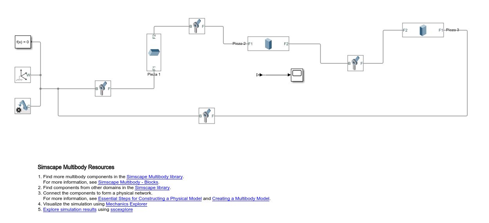
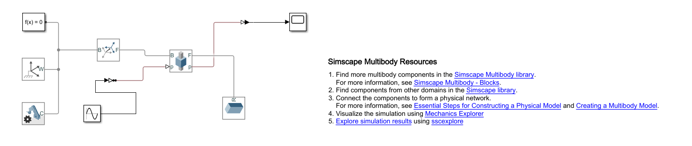
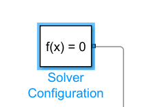

# Elementos de Transmisión Continuación 
Para esta clase se abordó el estudio de los sistemas de transmisión, profundizando en conceptos clave como el tornillo guía, la inercia y el torque reflejado. A través de estos temas, se analizaron su impacto en el movimiento de sistemas mecánicos y su relevancia para la optimización de procesos. Durante la sesión, se presentaron ejemplos y ejercicios que permitieron explorar la aplicación de estos principios en distintos escenarios, facilitando la comprensión de su importancia en el diseño y funcionamiento de mecanismos.

## 1. Tornillo Guía

El mecanismo de tornillo sin fin es un sistema de transmisión de movimiento muy utilizado en aplicaciones donde se requiere precisión, control y reducción significativa de la velocidad. Está compuesto por dos elementos principales: el tornillo sin fin (una especie de tornillo helicoidal) y la rueda dentada o corona (un engranaje con dientes especialmente diseñados para acoplarse al tornillo). Cuando el tornillo gira, hace girar la corona, transmitiendo así el movimiento, pero con una relación de reducción muy alta. Esto significa que por muchas vueltas que dé el tornillo, la rueda gira solo una pequeña fracción.

Uno de los aspectos más importantes del tornillo sin fin es su capacidad de auto bloqueo. En muchos casos, la corona no puede mover al tornillo en sentido inverso, lo que lo hace ideal para aplicaciones donde se necesita mantener una posición fija sin consumo de energía adicional, como en actuadores o sistemas de elevación. Esta característica lo convierte en un elemento fundamental en perfiles de movimiento que requieren estabilidad y seguridad, como brazos robóticos, sistemas de posicionamiento de cámaras o mesas CNC.

En cuanto al control de movimiento, el tornillo sin fin permite lograr un desplazamiento suave y continuo, ideal para movimientos de precisión. Debido a su diseño, ofrece una gran reducción de velocidad y un incremento del par motor (torque), lo que se traduce en movimientos lentos pero muy controlados. Esta propiedad es especialmente útil en sistemas automatizados donde se necesita controlar la posición y la velocidad con exactitud, como en actuadores lineales, mesas de coordenadas o mecanismos de regulación fina.

Además, el perfil de movimiento generado por un tornillo sin fin es altamente repetible, lo cual es clave en tareas que requieren una alta fidelidad en el posicionamiento. Su uso combinado con motores paso a paso o servomotores mejora aún más el control del sistema, permitiendo integrar sensores y retroalimentación para crear sistemas de control en lazo cerrado. En resumen, el tornillo sin fin es una solución mecánica eficiente y confiable para perfiles de movimiento donde se priorizan precisión, control y seguridad.

Figura 1. Tornillo Guía

Existen varios tipos de tornillos sin fin, y su clasificación depende principalmente de la forma del tornillo y el número de entradas o principios que este posee. Cada tipo tiene propiedades distintas que lo hacen más adecuado para ciertas aplicaciones dentro del campo del movimiento y control de movimiento.

### Tipos según la forma del tornillo

#### Tornillo sin fin cilíndrico
Este es el tipo más común. Tiene una forma similar a un tornillo tradicional con filetes helicoidales que se acoplan con una rueda dentada (corona). Se utiliza principalmente para transmisiones donde se requiere una gran reducción de velocidad y donde el auto bloqueo es una ventaja.

#### Tornillo sin fin globoidal
En este tipo, el tornillo tiene una forma curva o globoidal que envuelve parcialmente la corona. Este diseño proporciona un mayor contacto entre las superficies, lo que mejora la eficiencia, permite mayores cargas y reduce el desgaste. Es muy utilizado en maquinaria de precisión o cuando se requiere mayor durabilidad.

### Tipos según el número de entradas

#### Tornillo sin fin de una entrada
Tiene solo un hilo. Cada vuelta del tornillo mueve la rueda un solo diente, lo que proporciona una gran reducción y un excelente auto bloqueo, pero con baja eficiencia. Ideal para mecanismos de ajuste fino o donde se requiere mantener una posición sin retroceso.

#### Tornillo sin fin de múltiples entradas 
Tiene dos o más hilos. Permite que la rueda avance más por cada vuelta del tornillo, aumentando la velocidad y la eficiencia del sistema, pero perdiendo el auto bloqueo. Es útil cuando se necesita mayor rapidez sin perder completamente el control.

| Tipo                          | Forma del tornillo | Nº de entradas | Ventajas principales                                  | Aplicaciones comunes                                 |
|-------------------------------|---------------------|----------------|--------------------------------------------------------|------------------------------------------------------|
| Cilíndrico, entrada simple    | Cilíndrica          | 1              | Alto par, auto bloqueo, gran reducción                | Sistemas de elevación, actuadores manuales           |
| Cilíndrico, entrada múltiple  | Cilíndrica          | 2 o más        | Mayor eficiencia y velocidad, menor auto bloqueo      | Transportadores, robots con control rápido           |
| Globoidal, entrada simple     | Globoidal           | 1              | Mayor área de contacto, buena resistencia al desgaste | Maquinaria pesada, automatización de precisión       |
| Globoidal, entrada múltiple   | Globoidal           | 2 o más        | Alta eficiencia y resistencia, menor retroceso        | Sistemas servoasistidos, control de movimiento CNC   |

Estos diferentes tipos permiten seleccionar el mecanismo más adecuado según las necesidades de velocidad, precisión, carga y seguridad en sistemas de movimiento y control.

Figura 2. Tipos de Tornillo Guía

### Relación de Transmisión en Tornillo Sin Fin

La relación de transmisión en un sistema con tornillo sin fin es fundamental para comprender cómo se traduce el movimiento rotacional del tornillo en un desplazamiento lineal de una carga (por ejemplo, una cápsula o carro). En la imagen proporcionada se destacan dos conceptos clave: el cabecero (pitch) y el paso (lead). Aunque en ocasiones se usan como sinónimos, en este contexto tienen diferencias importantes.

El cabecero (pitch) se refiere al número de vueltas que debe realizar el tornillo para que la cápsula se desplace una unidad de distancia (por , 1 metro en sistema métrico o 1 pulgada en sistema inglés). En cambio, el paso (lead) indica la distancia lineal que recorre la cápsula por cada revolución del tornillo. Este valor depende de la geometría de la rosca del tornillo, y se mide en metros o pulgadas según el sistema utilizado.

Entonces:

$$
\Delta \theta = 2 \pi p \Delta x
$$

$$
\frac{\Delta \theta}{\Delta x} = 2\pi
$$

$$
\frac{\frac{\Delta \theta}{\Delta t}}{\frac{\Delta x}{\Delta t}} = \frac{\textit{Velocidad motor}}{\textit{Velocidad carga}} = \frac{\dot{\theta}}{\dot{x}} = 2\pi
$$

### Inercia Reflejada

La inercia reflejada es un concepto fundamental en la dinámica de sistemas mecánicos con transmisión, como reductores, engranajes o tornillos sin fin. Se refiere a la inercia aparente que un actuador (como un motor) "ve" desde su eje, considerando la masa o inercia real de la carga movida, pero transformada por la relación de transmisión. En otras palabras, aunque la carga tenga una cierta masa o inercia en su propio sistema de coordenadas (por ejemplo, lineal), al ser movida por un mecanismo rotativo, su efecto dinámico se refleja como una inercia rotacional equivalente en el eje del motor. Esta equivalencia se calcula tomando en cuenta factores como la relación de engranajes o el paso del tornillo sin fin.

La importancia de la inercia reflejada radica en su impacto directo sobre el desempeño y el diseño de los sistemas de control de movimiento. Un sistema con alta inercia reflejada requerirá más torque y tendrá una respuesta más lenta, lo que puede dificultar el cumplimiento de perfiles de velocidad y aceleración exigentes. Además, una incorrecta estimación de esta inercia puede llevar a diseños de control ineficientes o inestables, especialmente en aplicaciones de alta precisión como robots, CNC o servomecanismos. Por tanto, para garantizar un control preciso, eficiente y seguro, es esencial considerar adecuadamente la inercia reflejada durante la etapa de modelado y diseño del sistema de control.

$$
KE = \frac{1}{2} m \dot{x}^2
$$

$$
\frac{\dot{\theta}}{\dot{x}} = 2 \pi p
$$

$$
KE = \frac{1}{2} m \left( \frac{1}{(2\pi p)^2} \right) \dot{\theta}^2
$$

$$
J_{ref} = m \left( \frac{1}{(2\pi p)^2} \right) = J_{ref} = \frac{m}{\left(\frac{N}{S}\right)^2}
$$

### Inercia Reflejada Total

La inercia reflejada total en un sistema con tornillo sin fin es la suma de todas las inercias externas al motor (como la masa lineal de la carga y cualquier otra parte móvil del sistema), pero expresadas en el eje del motor. Esto se logra a través de una conversión basada en la relación de transmisión del tornillo sin fin. Dado que el tornillo convierte el movimiento rotacional del motor en movimiento lineal, la masa de la carga genera una resistencia al cambio de velocidad rotacional que se refleja como una inercia equivalente, denominada inercia reflejada. Esta inercia reflejada total es clave para modelar correctamente la dinámica del sistema.

Figura 3. Inercia reflejada total tornillo sin fin

$$
m = \frac{W_L + W_C}{g}
$$

Donde:
- m = Masa Total
- $$W_C$$ = Cama

$$
J_{\text{ref}}^{\text{trans}} = J_{\text{screw}} + J_{\text{load} \rightarrow \text{in}} + J_{\text{carriage} \rightarrow \text{in}} = J_{\text{screw}} + \frac{1}{\eta N_S^2} \left( \frac{W_L + W_C}{g} \right)
$$

$$
J_{\text{ref}}^{\text{trans}} = J_{\text{screw}} + \frac{1}{\eta N_S^2} \left( \frac{W_L + W_C}{g} \right)
$$

En el diseño de sistemas de control de movimiento, conocer la inercia reflejada total es crucial. Este parámetro influye directamente en el comportamiento dinámico del sistema, afectando la aceleración, la respuesta del motor y la precisión del control. Una inercia reflejada alta implica que el motor necesita aplicar más torque para cambiar la velocidad, lo cual puede reducir la eficiencia o generar problemas como vibraciones o sobrecargas. Por eso, una estimación precisa de esta inercia permite diseñar controladores más robustos, mejorar la estabilidad del sistema y garantizar un funcionamiento suave y eficiente, especialmente en aplicaciones que requieren alta precisión como robótica, CNC o automatización industrial

### Torque de carga

Figura 4. Torque de carga tornillo sin fin

$$
F_{\text{ext}} = F_f + F_g + F_p
$$

$$
F_{\text{ext}} = F_p + (W_L + W_C)(\sin \beta + \mu \cos \beta)
$$

Si el sistema se encuentra en posición horizontal, entonces $$\(F_g = 0\)$$.

Desde la rotación:

$$
\text{Work} = F_{\text{ext}} \cdot \frac{1}{2\pi p} \cdot \Delta \theta
$$

Desde el desplazamiento lineal:

$$
\text{Work} = F_{\text{ext}} \cdot \Delta x
$$

$$
\text{Work} = T_{\text{load} \rightarrow \text{in}} \cdot \Delta \theta
$$

Por lo tanto, el torque reflejado al motor es:

$$
T_{\text{load} \rightarrow \text{in}} = \frac{F_{\text{ext}}}{N_S}
$$

Si se considera la eficiencia del sistema:

$$
T_{\text{load} \rightarrow \text{in}} = \frac{F_{\text{ext}}}{\eta N_S}
$$

💡**Ejemplo 1:**

**Cálculo de la inercia reflejada en un sistema con tornillo esferado**

Una carga de **50 kg** debe ser posicionada mediante un tornillo esferado de acero. Las características del sistema son las siguientes:

- **Densidad del tornillo**: 0.14 kg/cm³  
- **Diámetro del tornillo**: 0.182 cm  
- **Longitud del tornillo**: 36 cm  
- **Paso del tornillo**: 0.75 cm/rev  
- **Eficiencia del sistema**: 90%  
- **Peso del carro (carriage)**: 0.23 kg  

Con esta información, se busca calcular la **inercia reflejada** hacia el eje de entrada del sistema.

**Fórmula general para la inercia reflejada**

La inercia total reflejada hacia el eje del actuador es la suma de:

$$
J_{\text{ref}}^{\text{trans}} = J_{\text{screw}} + J_{\text{load} \rightarrow \text{in}} + J_{\text{carriage} \rightarrow \text{in}}
$$

Donde:

$$
J_{\text{ref}}^{\text{trans}} = J_{\text{screw}} + \frac{1}{\eta N_S^2} \left( \frac{W_L + W_C}{g} \right)
$$

**Relación de transmisión**

La relación de transmisión se calcula como:

$$
N_S = 2 \pi p
$$

Sustituyendo el valor del paso \( p = \frac{1}{0.75} \):

$$
N_S = 2\pi \left( \frac{1}{0.75} \right) = 8.38
$$

**Cálculo del momento de inercia del tornillo**

Asumiendo que el tornillo es un cilindro alargado, el momento de inercia es:

**En sistema métrico:**

$$
J_{\text{screw}} = \frac{\pi L \rho D^4}{32g}
$$

**En sistema inglés (sin gravedad):**

$$
J_{\text{screw}} = \frac{\pi L \rho D^4}{32}
$$

Sustituyendo los valores:

$$
J_{\text{screw}} = \frac{\pi \cdot 0.36 \cdot 140000 \cdot (0.00182)^4}{32} = 5.42 \times 10^{-8} \ \text{Kgm}
$$

**Sustitución final**

Sustituyendo en la fórmula de $$\( J_{\text{ref}}^{\text{trans}} \)$$:

$$
J_{\text{ref}}^{\text{trans}} = 5.42 \times 10^{-8} + \frac{1}{0.9 \cdot 8.38^2} \left( \frac{50 + 0.23}{9.89} \right)
$$

**Resultado final:**

$$J_ref ≈ 8.1 Kgm$$

## 2. Piñon - Cremallera

El mecanismo piñón-cremallera es un sistema mecánico que convierte el movimiento rotatorio de un engranaje (piñón) en movimiento lineal mediante una barra dentada (cremallera). Ambos elementos engranan perfectamente, permitiendo que al girar el piñón, la cremallera se desplace en línea recta. Este sistema es muy usado en aplicaciones como la dirección de automóviles, maquinaria industrial, puertas automáticas y sistemas CNC.

Su funcionamiento se basa en una transmisión directa, sin deslizamientos, lo que lo hace muy preciso. La velocidad lineal de la cremallera depende del tamaño del piñón y su velocidad de giro. Para un buen rendimiento, es importante mantener una buena lubricación, usar materiales resistentes al desgaste y controlar el juego entre dientes (backlash).

Figura 5. Piñon cremallera

### Ventajas y Desventajas

| Ventajas                                                                 | Desventajas                                                                   |
|--------------------------------------------------------------------------|--------------------------------------------------------------------------------|
| Transforma movimiento rotativo en lineal con precisión.                 | Longitud de carrera limitada al tamaño de la cremallera.                      |
| Soporta cargas más altas que sistemas con correa o husillo.             | Necesita lubricación frecuente para evitar desgaste.                          |
| Transmisión directa, sin deslizamiento.                                 | Puede tener juego mecánico si no está bien ajustado.                          |
| Fácil de construir y mantener.                                          | Puede generar ruido o vibraciones si está mal alineado.                       |
| Funciona bien con motores paso a paso o servomotores.                   | Menor precisión en recorridos muy largos sin guías adicionales.               |

### Relación de Transmisión

En el mecanismo piñón-cremallera, el piñón (engranaje circular) transmite su movimiento rotacional a la cremallera (barra dentada), produciendo un desplazamiento lineal. A diferencia de un sistema de engranajes rotativos, donde ambos elementos giran, aquí el piñón gira y la cremallera se traslada linealmente.

**Fórmulas relevantes**

1. **Relación de transmisión (general):**
   
   $$N = \frac{\text{Velocidad motor}}{\text{Velocidad carga}}$$

2. **Velocidad lineal de la cremallera (rack):**
   
   $$V_{\text{rack}} = r_{\text{pinion}} \cdot \omega_{\text{pinion}}$$

   
   Donde:
   - $$\( V_{\text{rack}} \)$$: velocidad lineal de la cremallera (m/s)
   - $$\( r_{\text{pinion}} \)$$: radio del piñón (m)
   - $$\( \omega_{\text{pinion}} \)$$: velocidad angular del piñón (rad/s)

3. **Relación piñón-cremallera (inversa del radio):**

   
   $$N_{RP} = \frac{1}{r_{\text{pinion}}}$$

Esta fórmula es válida para velocidades en rad/s y muestra que a menor radio del piñón, mayor será la relación de transmisión y, por tanto, mayor precisión pero menor desplazamiento lineal por cada vuelta.

**Interpretación**

- Si un motor gira a una velocidad angular $$\( \omega_{\text{pinion}} \)$$, la cremallera se desplazará a una velocidad proporcional al radio del piñón.
- La relación de transmisión $$\( N \)$$ indica cuántas veces gira el motor para lograr un cierto desplazamiento de la carga (en este caso, la cremallera).
- En lugar de una velocidad angular de salida (como en engranajes clásicos), aquí la "velocidad de carga" es lineal.
- A menor tamaño del piñón (menor $$\( r_{\text{pinion}} \)$$), mayor será la relación $$\( N_{RP} \)$$, permitiendo más control y fuerza, pero menor avance lineal por revolución.

**Aplicación**

Este análisis es clave al diseñar mecanismos donde se requiere precisión en el desplazamiento lineal, como en máquinas CNC o actuadores lineales, ya que permite seleccionar el piñón adecuado según la velocidad deseada y el recorrido de la cremallera.

### Inercia Reflejada

En los sistemas mecánicos impulsados por motores, como el mecanismo piñón-cremallera, es fundamental considerar la **inercia reflejada** o **inercia equivalente**, ya que afecta directamente la dinámica del sistema y el dimensionamiento del motor. La **inercia reflejada al eje del motor** es la manera de expresar cómo la masa lineal (en este caso, la de la cremallera y la carga asociada) se "traduce" a una **inercia rotacional equivalente** que el motor debe vencer para acelerar. Esto es clave al diseñar sistemas de control o seleccionar motores, ya que influye en la aceleración, torque requerido y estabilidad.

Figura 6. Inercia reflejada Piñon cremallera

La inercia reflejada al motor se calcula como:

$$
J_{\text{ref}}^{\text{trans}} = J_{\text{pinion}} + J_{\text{load} \rightarrow \text{in}} + J_{\text{carriage} \rightarrow \text{in}}
$$

$$
J_{\text{ref}}^{\text{trans}} = J_{\text{pinion}} + \frac{1}{\eta N_{\text{RP}}^2} \left( \frac{W_L + W_C}{g} \right)
$$

**Interpretación**

- Cuanto **mayor sea la masa lineal**, mayor será la inercia reflejada.
- Cuanto **mayor sea el radio del piñón**, mayor será el efecto de esa masa sobre el motor (ya que \( r^2 \) amplifica el valor).
- Una **alta inercia reflejada** implica que el motor necesitará más torque para lograr una determinada aceleración angular.
- En aplicaciones de alta dinámica (por ejemplo, CNC o robótica), minimizar la inercia reflejada mejora el control y la eficiencia del sistema.

Al seleccionar el tamaño del piñón y el motor, se debe buscar un equilibrio entre:
- Precisión del movimiento lineal
- Fuerza transmitida
- Inercia reflejada (para evitar sobredimensionar el motor)

Este análisis es esencial para un diseño mecánico eficiente y un sistema de control estable.

### Torque de Carga

En un sistema piñón-cremallera, el **torque de carga reflejado al eje del motor** se origina a partir de las fuerzas externas que actúan sobre la cremallera. Estas fuerzas incluyen:

- **Fuerza de fricción** $$\( F_f \)$$
- **Fuerza gravitacional** $$\( F_g \)$$
- **Fuerza productiva o útil** $$\( F_p \)$$

La **fuerza total externa** se define como:

$$
F_{\text{ext}} = F_f + F_g + F_p
$$

Esta fuerza representa toda la resistencia que debe vencer el sistema para mover la carga linealmente. Para convertir esta fuerza lineal en un torque equivalente en el eje del motor, se usa la relación de transmisión piñón-cremallera:

$$
N_{\text{RP}} = \frac{1}{r_{\text{pinion}}}
$$

Además, se incluye la **eficiencia mecánica del sistema** $$\( \eta \)$$, que considera pérdidas por fricción y deformaciones. El **torque reflejado** al motor debido a la carga es:

$$
T_{\text{load} \rightarrow \text{in}} = \frac{F_{\text{ext}}}{\eta N_{\text{RP}}}
$$

Este torque es fundamental para seleccionar correctamente el motor y su controlador, ya que determina el esfuerzo que el sistema debe ejercer para mover la carga de forma segura y eficiente. Si el cálculo de $$\( T_{\text{load} \rightarrow \text{in}} \)$$ se subestima, pueden ocurrir problemas como pérdida de precisión, sobrecalentamiento del motor o fallos por sobrecarga. Por eso, siempre debe considerarse tanto la condición estática como la dinámica (si hay aceleraciones) en el análisis del torque de carga reflejado.

## 3. Banda Transportadora

Las bandas transportadoras son sistemas mecánicos diseñados para mover materiales de manera eficiente en diversas industrias. Funcionan mediante una cinta continua que se desplaza sobre rodillos o una superficie plana, impulsada por motores eléctricos. Su principal función es trasladar productos de un punto a otro, optimizando tiempos de producción y reduciendo esfuerzos manuales. Además, pueden adaptarse a diferentes necesidades mediante el ajuste de velocidad y la integración con sensores de control, lo que permite una operación automatizada y precisa.

En el ámbito del control de movimiento, las bandas transportadoras desempeñan un papel fundamental, ya que su velocidad y dirección pueden ser reguladas para sincronizar con otros procesos productivos. Mediante perfiles de movimiento programados, es posible establecer aceleraciones y desaceleraciones que eviten impactos o daños en los materiales transportados. Esta capacidad de ajuste es esencial en líneas de ensamblaje, donde el flujo de trabajo debe mantenerse constante y coordinado con otras máquinas y operarios. La combinación de bandas transportadoras con tecnología avanzada mejora la eficiencia y seguridad en la manipulación de productos. Este tipo de mecanismo es ampliamente utilizado en procesos industriales, logísticos y de manufactura, permitiendo un transporte continuo, controlado y eficiente.

Figura 7. Inercia reflejada Piñon cremallera

**Aplicaciones Comunes:**

- Sistemas de empaque y ensamblaje industrial  
- Clasificación y distribución de productos  
- Líneas de producción en fábricas  
- Transporte de alimentos o materiales pesados

### Relación de Transmisión y Movimiento

El movimiento de la banda está relacionado directamente con el giro de un rodillo motriz, y la velocidad lineal de la banda se puede determinar a partir del radio del rodillo y la velocidad angular del motor:

$$
N = \frac{\text{Velocidad motor}}{\text{Velocidad carga}}
$$

- **Velocidad de la banda (\(V_{\text{belt}}\)):**

$$
V_{\text{belt}} = r_{\text{ip}} \cdot \omega_{\text{ip}}
$$

Donde:  
- $$\(r_{\text{ip}}\)$$: Radio del tambor motriz [m]  
- $$\(\omega_{\text{ip}}\)$$: Velocidad angular del tambor [rad/s]

- **Relación de transmisión específica para banda $$(\(N_{\text{BD}}\))$$:**

$$
N_{\text{BD}} = \frac{1}{r_{\text{ip}}}
$$

### Torque de Carga Reflejado

En una banda transportadora, el torque que el motor necesita entregar está determinado por la suma de fuerzas que se oponen al movimiento. Estas incluyen la fricción de la banda, la fuerza gravitacional si hay pendiente, y la fuerza necesaria para transportar la carga. La fuerza total se define como:

$$
F_{\text{ext}} = F_f + F_g + F_p
$$

Donde:  
- $$\(F_f\)$$: Fuerza de fricción  
- $$\(F_g\)$$: Fuerza gravitacional (por inclinación o elevación)  
- $$\(F_p\)$$: Fuerza productiva útil (para desplazar la carga)

El **torque reflejado al motor** se calcula como:

$$
T_{\text{load} \rightarrow \text{in}} = \frac{F_{\text{ext}}}{\eta N_{\text{BD}}}
$$

Donde:  
- $$\(\eta\)$$: Eficiencia mecánica total del sistema (típicamente entre 0.85 y 0.95)

Este torque es esencial para dimensionar adecuadamente el motor y asegurar que el sistema funcione con fiabilidad, evitando sobrecalentamientos, fallas o pérdida de velocidad bajo carga.

**Ventajas y Desventajas**

| Ventajas                                           | Desventajas                                              |
|----------------------------------------------------|-----------------------------------------------------------|
| Permite transporte continuo y automatizado         | Puede requerir mantenimiento frecuente (limpieza, ajuste) |
| Bajo consumo energético en trayectos horizontales  | Menor eficiencia en inclinaciones pronunciadas            |
| Adaptable a diferentes formas y longitudes         | Ocupa espacio físico considerable                         |
| Reducción de tiempos de transporte en línea        | Posibilidad de desalineación o desgaste de la banda       |
| Facilita procesos logísticos y de producción        | La carga máxima es limitada por el motor y fricción       |

## 5. Conclusiones

- El control de movimiento, basado en perfiles como trapezoidal y S-curve, impacta directamente en el desgaste y la eficiencia de mecanismos como tornillo sin fin y piñón-cremallera, pues perfiles más suaves reducen picos de torque y esfuerzos dinámicos que afectan la vida útil.

- Los mecanismos con alta inercia reflejada, como el tornillo sin fin, requieren un diseño cuidadoso de perfiles de aceleración para evitar sobrecargas y lograr una respuesta dinámica óptima, evidenciando la necesidad de un control adaptativo que minimice vibraciones y errores de posicionamiento.

- La elección del perfil de movimiento influye en el torque dinámico requerido, que a su vez condiciona el dimensionamiento del motor y la transmisión, por lo que la integración entre el control de movimiento y el diseño mecánico es clave para sistemas mecatrónicos eficientes y robustos.

- Los sistemas de banda transportadora y piñón-cremallera, debido a su naturaleza de movimiento continuo y lineal respectivamente, se benefician de perfiles de movimiento que optimizan la sincronización y minimizan impactos, asegurando estabilidad y precisión en la operación.

- La modelación de la inercia reflejada en el dominio rotacional o lineal facilita la implementación de controladores predictivos que ajustan en tiempo real las aceleraciones, maximizando el desempeño de los mecanismos y prolongando su vida útil mediante la reducción de esfuerzos mecánicos.

## Referencias

1. Shigley, J. E., & Mischke, C. R. (2001). *Mechanical Engineering Design* (7th ed.). McGraw-Hill.  
   - Referencia clásica para análisis de mecanismos, torque, inercia y transmisión.

2. Norton, R. L. (2011). *Design of Machinery* (5th ed.). McGraw-Hill.  
   - Excelente texto para el estudio de mecanismos como piñón-cremallera y bandas transportadoras.

3. Hamrock, B. J., Schmid, S. R., & Jacobson, B. O. (2004). *Fundamentals of Machine Elements* (2nd ed.). McGraw-Hill.  
   - Explicaciones detalladas sobre transmisión de potencia y cálculo de torque.

4. Spotts, M. F., & Shoup, T. E. (1998). *Mechanical Design of Machines*. Pearson Prentice Hall.  
   - Guía práctica para cálculo de cargas, inercia reflejada y selección de motores.

5. Ambekar, A. G. (2014). *Mechanics of Materials and Machine Design*. Wiley.  
   - Incluye análisis avanzado de sistemas de transmisión y mecanismos lineales como la banda transportadora.

